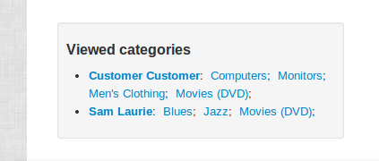

************************
Advanced Add-on Tutorial
************************

This tutorial demonstrates some advanced techniques in add-on development, like using *hooks* and *post-controllers*.

.. note::

    Hooking is a very powerful technique, and we use it a lot in CS-Cart. PHP hooks can be used to perform additional pre- and post-processing of data, or to override default processing routines. TPL hooks are used to handle data on rendering, e.g. to display additional data with no need to modify the original template.

    A pre- or post-controller is a special PHP file which (depending on its name and location in the add-on directory structure) are called before or after a particular standard controller is executed.

In this tutorial, we will create an add-on, which will utilize both PHP and TPL hooks.

The add-on will collect information about the categories being shown to a signed in user and store it in the database. This data will be then shown on the admin panel dashboard as a table of users and according number of viewed categories.

Requirements
============

You will need an installed and functioning CS-Cart store to be able to follow this tutorial. You can `download CS-Cart <https://www.cs-cart.com/download-cs-cart.html>`_ from our site and use it in the Free mode.

Basic knowledge of PHP, Smarty, and getting familiarized with the CS-Cart add-on directory structure is required. It is recommended that you follow the :doc:`Hello World tutorial <hello_world>` before proceeding with this one.

Add-on Initialization: *addon.xml*, *init.php*
==============================================

Go to the directory *addons* in your CS-Cart installation root directory and create the *advanced_addon* subdirectory. In this directory, create the file *addon.xml* with the following content (:download:`download <files/addon.xml>`):

    *addons/advanced_addon/addon.xml*

    .. literalinclude:: files/addon.xml
        :language: xml
        :linenos:

In the same directory, create the file *init.php* with the following content (:download:`download <files/init.php>`):

    *addons/advanced_addon/init.php*

    .. literalinclude:: files/init.php
        :linenos:

.. hint:: 

    Function names are usually self-explanatory in CS-Cart (e.g. ``get_products`` to get products). Hooks are normally named after the function they are placed in, with the  ``_pre`` or ``_post`` suffix for a pre- and post-processing hook accordingly (e.g. ``get_products_pre`` and ``get_products_post``).

In this file, we declare that we are going to connect to the hook ``get_category_data_pre``, which is called before getting category data by a certain query. You can find the information about this and other hooks in our `Hook base <http://www.cs-cart.com/api>`_.

Getting Data: *func.php*
========================

In the add-on folder (*addons/advanced_addon*) create the file *func.php*. It will contain the actual function to be embedded to the hook (:download:`download <files/func.php>`):

    *addons/advanced_addon/func.php*

    .. literalinclude:: files/func.php
        :linenos:

The function ``fn_advanced_addon_get_category_data_pre`` will get the currently displayed categories and store this data to the database linked with the user who is browsing the store.

.. important::

    It is essential to follow the naming convention: ``fn_`` + *[addon id]* + ``_`` + *[hook name]*.
    
    A function named out ot this convention will be ignored.

Showing Data in the Admin Panel: *extra.tpl*, *index.post.php*
==============================================================

In order to show the collected data in the admin panel we are going to use the TPL hook ``extra`` in the admin panel dashboard template (*skins/basic/admin/views/index.tpl*).

Go to the directory *skins/basic/admin/addons* and create a directory named *advanced_addon*. In this directory, create a subdirectory *hooks* and inside it another subdirectory *index*. 

In this directory, create the file *extra.pre.tpl* with the following content (:download:`download <files/extra.pre.tpl>`):

    *skins/basic/admin/addons/advanced_addon/hooks/index/extra.pre.tpl*

    .. literalinclude:: files/extra.pre.tpl
        :language: smarty
        :linenos:

.. important::

    Unlike PHP hooks, TPL hooks should not be explicitly declared. It is sufficient to just place a properly named template in the properly named directory. 
    
    The location and naming convention is as follows: *skins/[skin name]/[admin|customer]/addons/[addon id]/hooks/[template name]/[hook name].[pre|post].tpl.*

The template cannot gather data from the database itself, this is performed by a post-controller for the *index.php* controller.

Go to the directory *addons/advanced_addon* and create the subdirectories *controllers/admin*. Switch to this directory and create the file *index.post.php* with the following content (:download:`download <files/index.post.php>`):

    *addons/advanced_addon/controllers/admin/index.post.php*

    .. literalinclude:: files/index.post.php
        :linenos:

Double check all the file paths, names, and file contents to guarantee that the add-on will work properly.

The Result
==========

To see the add-on in action, install it first. To do that, go to *Administration ? Add-ons* in the CS-Cart admin panel (by default, at *[your_domain]/admin.php*). Find the item **Advanced Add-on** and click **Install** near the title. You should see a successful installation notification.

Now switch to the dashboard and scroll down under the Latest orders section. You should see a new section looking similar to this:

.. image:: img/advanced_viewed_categories_empty.png
    :align: center
    :alt: Advanced Add-on, Viewed Categories, empty

As you see, there are no data so far, but the section is shown properly.

Switch to the customer area, log in and surf a bit around the store. Just go over some random categories. You can also try browsing under several different accounts.

Refresh the dashboard page of the admin panel and check the state of the *Viewed categories* section:

The section should now indicate the categories you have just surfed through, which is exactly as planned.