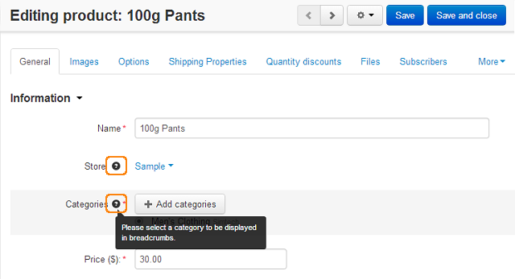
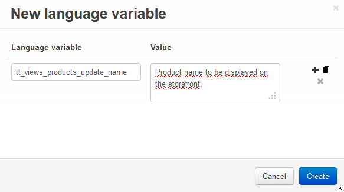

********
Tooltips
********

What is a tooltip
=================

A tooltip is an interface element that provides extended information on a page. The user hovers a pointer over an item, without clicking it, and a tooltip appears—a small box with information about this item.

Usage
=====

In CS-Cart tooltips are used to add a box with explanation to the form fields in the administration panel.

How to add a tooltip
====================

Tooltips for common form fields and add-ons are defined in different ways. So, further we will describe these cases separately.

Adding tooltips to common form fields
+++++++++++++++++++++++++++++++++++++

These tooltips are added by defining special language variables. Such tooltip variables can be of two types:

*	Including only the name of the variable, for which we add this tooltip.
*	Including the name of the variable, for which we add this tooltip, and the template, where this variable is used.

Tooltips including only the variable name
"""""""""""""""""""""""""""""""""""""""""

They have the following structure: *ttc_LANGVAR_NAME*. Where *LANGVAR_NAME* is the name of the variable, for which we add this tooltip. If we define such a tooltip variable, the tooltip will be displayed in **ALL** forms, where *LANGVAR_NAME* is used.

Tooltips including the variable name and the template
"""""""""""""""""""""""""""""""""""""""""""""""""""""

They have the following structure: *tt_TEMPLATE_NAME_LANGVAR_NAME*. Where *LANGVAR_NAME* is the name of the variable, for which we add this tooltip and *TEMPLATE_NAME* is the template, where this variable is used. This tooltip will be displayed only in the defined template. This helps to prevent displaying the same tooltips to the identical field names on different pages.

This is an example of how a tooltip variable is formed:

*tt_views_products_update_list_price = tt_ + TEMPLATE_NAME + _ + LANGVAR_NAME = tt_ + views_products_update + _ + list_price*

Displaying language variables for tooltips
""""""""""""""""""""""""""""""""""""""""""

It is possible to display all language variables for tooltips directly on the desired page. To display them, add the following parameters to the selected page URL: ``stt`` - to display tooltips or ``сtpl`` - to clear cache.

For example, to display all tooltips on the following page:

*http://example.com/admin.php?dispatch=products.update&product_id=180*

open the URL:

*http://example.com/admin.php?dispatch=products.update&product_id=180&stt&ctpl*

The pop-up boxes with two language variables will be displayed for each form field. If the variable value is already defined, it will be also displayed in the same pop-up box.

.. image:: img/tooltip1.png
    :align: center
    :alt: Tooltip Variables

To disable the variable displaying mode, clear the cache on a page:

*http://example.com/admin.php?dispatch=products.update&product_id=180&ctpl*

Example
"""""""

As an exampe let's add a tootip that will be displayed only in the chosen template to the **Name** field on the product detailes page:

*http://example.com/admin.php?dispatch=products.update&product_id=180*

*	Open the page and add ``&stt&ctpl`` to the end of URL. This is how it looks like:

*http://example.com/admin.php?dispatch=products.update&product_id=180&stt&ctpl*

*	Hower the mouse pointer over the desired field name (the **Name** field in this example) and copy the language variable with the ``tt_`` prefix: 

*tt_views_products_update_name*

*	Go to *Administrtation > Languages > Translations* and click **+** to add the new language variable. In the **Language variable** input field enter the variable from the previous step (*tt_views_products_update_name*), in the **Value** field enter the text of the tooltip. Click **Create**.

*	Open the product detailes page to make sure that the tooltip is displayed correctly.

.. image:: img/tooltip3.png
    :align: center
    :alt: New Tooltip

.. Adding tooltips for settings

.. ++++++++++++++++++++++++++++

Adding tooltips for add-on settings
+++++++++++++++++++++++++++++++++++

Tooltips for add-ons are defined in the *addon.xml* file (*/app/addons/add-on_name*).

To add a tooltip for a setting, you should simply define its value in the <tooltip> tag. The tooltip translation is defined in the <tt_translations> tag:

.. code-block:: xml

	<tooltip>Tooltip text</tooltip>
	<tt_translations>
		<item lang="es">Tooltip translation</item>
	</tt_translations>

For example, the code of the the **Anti Fraud** add-on when we add the *Hello* tooltip to its *Maxmind license key* setting will look like this:

.. code-block:: xml

 ...
	<settings>
		<sections>
			<section id="general">
            	<name>General</name>
                	<items>
                   		<item id="anti_fraud_key">
                       		<name>Maxmind license key</name>
                        	<type>input</type>
                        	<default_value/>
                       		<translations>
                            	<item lang="es">Clave de licencia de MaxMind</item>
                            	<item lang="fr">Clé de licence Maxmind</item>
                            	<item lang="da">Maxmind licens nøglen</item>
                            	<item lang="el">Αριθμός-κλειδί Maxmind</item>
                            	<item lang="ro">Liciență cheie Maxmind</item>
                            	<item lang="ru">Лицензионный ключ Maxmind</item>
                            	<item lang="sl">Maxmind licenčni ključ</item>
                            	<item lang="zh">Maxmind 许可证钥匙</item>
                        	</translations>
	                    	<tooltip>Hello</tooltip>
							<tt_translations>
								<item lang="es">Hola</item>
							</tt_translations>
						</item>
                     ...

