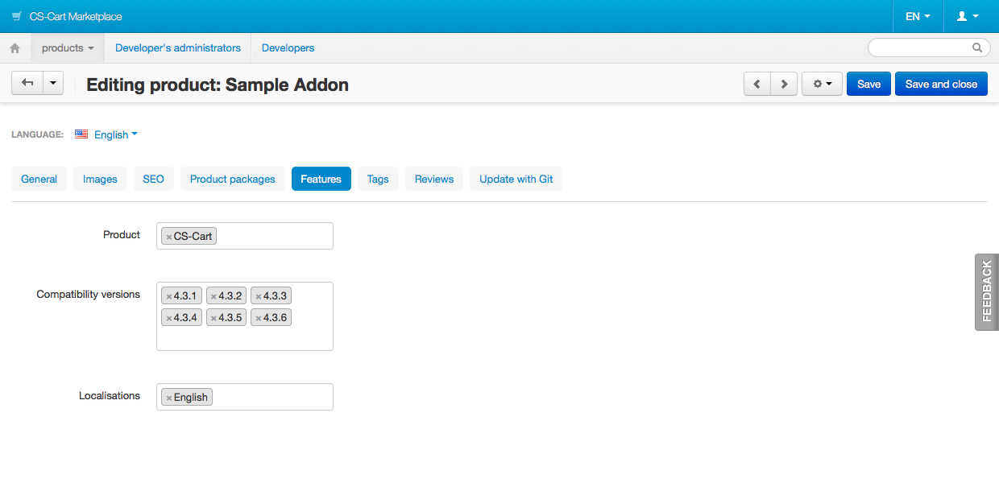
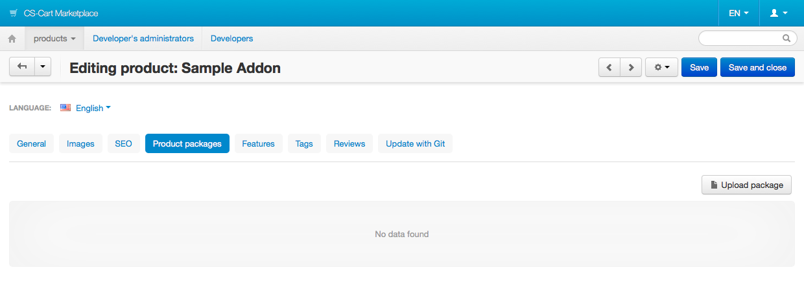

***********************************************
Preparing an Add-on Package for the Marketplace
***********************************************

You can enable your customers to :doc:`download your add-ons and upgrades directly from the Marketplace <../../../user_guide/addons/marketplace_addons>`. This article describes how to make the add-on and upgrade packages and upload them to the Marketplace.

===========================
Preparing the Add-on Scheme
===========================

1. :doc:`Use Scheme 3.0 <../scheme/scheme3.0_structure>` when you create the **addon.xml** file for you add-on.

2. `Follow Semantic Versioning <http://semver.org/>`_ when you specify the version of the add-on:

 .. code-block:: xml

    <version>1.1.0</version>

3. If this version of the add-on is compatible only with CS-Cart or with Multi-Vendor, specify it in the ``<core_edition>`` element of the ``<compatibility>`` section.

 * **CS-Cart:**

   .. code-block:: xml

      <compatibility>
         <core_edition>ULTIMATE</core_edition>
      </compatibility>

 * **Multivendor:**

   .. code-block:: xml

      <compatibility>
         <core_edition>MULTIVENDOR</core_edition>
      </compatibility>

 You can’t specify both ULTIMATE and MULTIVENDOR in the ``<core_edition>`` element. If the add-on is compatible both with CS-Cart and Multi-Vendor, don’t put ``<core_edition>`` into the ``<compatibility>`` section.

 .. important::

    If you don’t specify ``<core_edition>``, the Marketplace will display compatible editions depending on what you specify in the **Product** field on the **Features** tab of the add-on editing page.

4. Please do set the minimum and maximum supported versions of CS-Cart/Multi-Vendor in the ``<core_version>`` element of the ``<compatibility>`` section:

 .. code-block:: xml

    <compatibility>
       <core_version>
           <min>4.3.2</min>
           <max>4.3.6</max>
       </core_version>
    </compatibility>

==================================
Preparing for Upgrade Distribution
==================================

1. If you plan to :doc:`distribute upgrades for the add-on via the Marketplace <addon_upgrade>`, add the ``marketplace_license_number`` setting to the add-on scheme:

 .. code-block:: xml

    <settings>
      <sections>
          <section id="general">
              <items>
                  <item id="marketplace_license_number">
                      <type>input</type>
                  </item>
              </items>
          </section>
      </sections>
    </settings>

2. Add the translation for ``marketplace_license_number`` to the add-on’s **.po** file:

 .. code-block:: po

    msgctxt "SettingsOptions::sample_addon::marketplace_license_number"
    msgid "Marketplace license number"
    msgstr "Marketplace license number"

===============================
Building a Distribution Package
===============================

A distribution package is an archive that contains all the files of an add-on. This package can later be uploaded to the Marketplace. The customers then download the archive and :doc:`install the add-on <../../../user_guide/addons/1manage_addons>`.
 
1. Use `cscart-sdk <https://github.com/cscart/sdk>`_ to export the files of the current version of the add-on:

 .. code-block:: bash

    $ cscart-sdk addon:export addon_name /path/to/addon_directory /path/to/cscart

 .. note::

    You can use ``addon:export`` and some other **cscart-sdk** commands to :doc:`develop your addon in a separate repository <../tutorials/organizing_git_workflow>`.

2. Go to the directory where the add-on was exported:

 .. code-block:: bash

    $ cd /path/to/addon_directory

3. Create an archive:

 .. code-block:: bash

    $ tar -czf addon_name.tgz *

===============================================
Uploading a Distribution Package to Marketplace
===============================================

1. Open the add-on editing page on the Marketplace.

2. Switch to the Features tab and update the **Product**, **Compatible versions**, and **Localisations** fields.

   If the package you’re uploading is compatible with the versions that are not specified here, add those versions in those fields.

3. Click **Save**.

4. Switch to the **Product packages** tab.

5. Click **Upload package**.

6. Use the **File** field to select the archive you created.

7. (Optional step) Enter the **License agreement** and **Package description**.

8. Click **Create**.

.. image:: img/upload_package.png
	:align: center
	:alt: You can specify the description and license agreement for the package.

The version of the uploaded package is taken from the ``<version>`` element of **addon.xml**. If you haven’t specified compatibility information in **addon.xml**, it will be taken from the **Features** tab.

If the **Compatibility** section of the newly uploaded package is empty, go to the **Features** tab and update the **Product**, **Compatible versions**, and **Localisations** fields, save your changes and reupload the add-on package.

.. image:: img/edit_package.png
	:align: center
	:alt: You can edit the packages that you upload to the Marketplace.

Once you upload the distribution package, its **addon.xml** file will be checked for errors. If there are no errors, the package will appear on the **Product packages** tab. If the status of the package is *Active*, customers will be able to :doc:`download it from the Marketplace <../../../user_guide/addons/marketplace_addons>`.

.. note::

    You can also :doc:`deliver add-ons and upgrades to the Marketplace from your Git repository <git_delivery>`.
