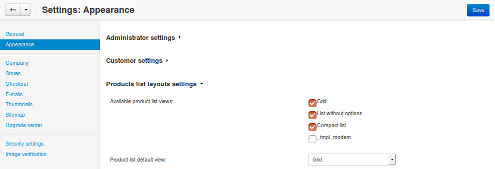
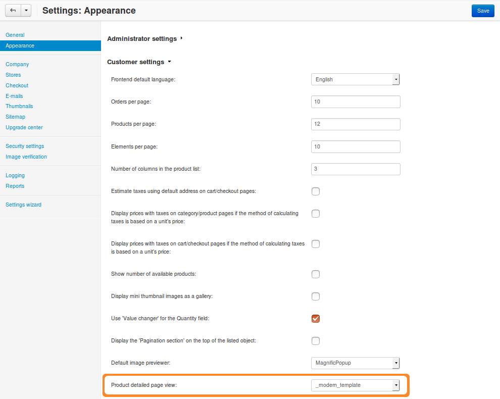

************************************************************************
How To: Create Custom Templates for Product List and Product Detail Page
************************************************************************

This article describes how to create custom templates for the product list and product detail page. We’ll make those custom templates a part of the :doc:`My Changes <../../../user_guide/addons/my_changes/index>` add-on. Storing custom templates in the folders of the **My Changes** add-on has two advantages:

* It’s easier to keep track of the template files you create or modify.

* You won’t have to reapply your changes after the upgrade.

.. note::

    You can work in the *design* or *var/themes_repository* folders. Before you proceed, you might want to :ref:`learn the difference between these folders <design-and-themes-repository>`.

=============================
Template for the Product List
=============================

By default, CS-Cart & Multi-Vendor have 3 template types for the product list:

* Grid (*products_multicolumns.tpl*)

* List without options (*products_without_options.tpl*)

* Compact list (*short_list.tpl*)

To set one of those templates as default, open the Administration panel and go to **Settings → Appearance → Products list layouts settings**.

To add a custom template for the product list via the **My Changes** add-on, create a file with the template settings for our custom product list, and the file of the template itself.

-------------------------
Structure of the Template
-------------------------

.. code-block:: none

    templates/
     |
     └─ addons/
         |
         └─ my_changes/
             |
             └─ blocks/
                 |
                 ├─ list_templates/
                 |   |
                 |   └─ modern_list.tpl — the template of the product list
                 |
                 └─ product_list_templates/
                     |
                     └─ products_modern_list.tpl — the template settings file

The file with the settings describes the template that we’re adding, as well as its settings.

It’s better to copy one of the existing product list templates from *templates/blocks/list_templates* to *templates/addons/my_changes/blocks/list_templates* and then rename the template.

.. hint::

    We suggest you copy the file of an existing template is to minimize the risk of syntax errors.

-------------------------------------
Example of the Template Settings File
-------------------------------------

.. code-block:: smarty

    {** template-description:tmpl_modern **}
    {* The line above means that the name of the template will be stored 
    in the language variable called _tmpl_modern *}
  
    {* Below are the location and settings of the template. *}
    {include file="addons/my_changes/blocks/list_templates/modern_list.tpl" 
    show_name=true
    show_sku=false
    show_rating=true
    show_features=true
    show_prod_descr=true
    show_old_price=true
    show_price=true
    show_clean_price=true
    show_list_discount=true
    show_discount_label=true
    show_product_amount=true
    show_product_edp=true
    show_add_to_cart=true
    show_list_buttons=true
    show_descr=true }

--------------------------------------
Brief Description of Template Settings
--------------------------------------

.. list-table::
    :header-rows: 1
    :stub-columns: 1
    :widths: 10 12 28

    *   -   Name
        -   Type
        -   Description
    *   -   show_name
        -   *Boolean (true / false)*
        -   Show product names.
    *   -   show_sku
        -   *Boolean (true / false)*
        -   Show the (`stock keeping unit <https://en.wikipedia.org/wiki/Stock_keeping_unit>`_ (the **CODE** field from the product editing page).
    *   -   show_rating
        -   *Boolean (true / false)*
        -   Show :doc:`product ratings <../../../user_guide/addons/comments_and_reviews/index>`.
    *   -   show_features
        -   *Boolean (true / false)*
        -   Show :doc:`product features <../../../user_guide/manage_products/features/index>`.
    *   -   show_old_price
        -   *Boolean (true / false)*
        -   Show the old prices of the products.
    *   -   show_price
        -   *Boolean (true / false)*
        -   Show product prices.
    *   -   show_clean_price
        -   *Boolean (true / false)*
        -   Show the prices with the tax included.
    *   -   show_discount_label
        -   *Boolean (true / false)*
        -   Show the size of the discount.
    *   -   show_product_amount
        -   *Boolean (true / false)*
        -   Show the amount of products in stock.
    *   -   show_add_to_cart
        -   *Boolean (true / false)*
        -   Show **Add to Cart** buttons.
    *   -   show_list_buttons
        -   *Boolean (true / false)*
        -   Show the list buttons (**Add to wishlist**, **Add to comparison list**, etc.).
    *   -   show_descr
        -   *Boolean (true / false)*
        -   Show product descriptions..
    *   -   but_role
        -   Text
        -   | The way the buttons are displayed in the template. Choose one of the available roles:
            | ``Action``, ``Text``, ``Delete``, ``Big``, ``Tool``

If everything is done right, you’ll find a new template in the Administration panel under **Settings → Appearance**.

.. hint::

    If your custom template doesn’t appear, go to **Add-ons → Manage Add-ons** and make sure that the **My Changes** add-on is active.

.. important::

    If you worked in *var/themes_repository/templates/addons/my_changes*, you'll need to uninstall the **My Changes** add-on and install it again.

As you can see in the image above, we also need to add a :doc:`language variable <../../core/language_variables>` for our custom product list into the :doc:`files with the add-on’s translations <../language_variables_in_addon>`. The name of the language variable depends on how you called the product list in the template settings file. 

In our case we need to add the following code to *var/langs/en/addons/my_changes.po*:

.. code-block:: po

    msgctxt "Languages::tmpl_modern"
    msgid "Modern list"
    msgstr "Modern list"

If we enable our template of the product list, it will appear on the storefront on the category page. However, you’ll notice that our template has no icon.

.. image:: img/no_icon.png
    :align: center
    :alt: A custom template also needs an icon on the storefront.

The name of the icon is taken from the name of the template. For example, if the name of the template settings file is **products-modern-list**, then the name of the icon will be **ty-icon-products-modern-list**. We just need to add an icon with this name :doc:`as described in the Designer Guide <../../../designer_guide/media>`.

Congratulations! You now have a new custom template for the product list.

====================================
Template for the Product Detail Page
====================================

By default, CS-Cart & Multi-Vendor have 2 template types for the product detail page:

* Default template (*default_template.tpl*)

* Big picture (*bigpicture_template.tpl*)

To set one of those templates as default, open the Administration panel and go to **Settings → Appearance → Customer settings**.

To create a custom template for the product detail page via the **My Changes** add-on, you need to  create a **.tpl** file in the *templates/addons/my_changes/blocks/product_templates directory*.

-------------------------
Structure of the Template
-------------------------

.. code-block:: none

    templates/
     |
     └─ addons/
         |
         └─ my_changes/
             |
             └─ blocks/
                 |
                 └─ product_templates/
                     |
                     └─ modern_template.tpl

We recommend copying one of the existing template from *templates/blocks/product_templates*. Let’s call our copied file **modern_template.tpl**.

Again, we need to add a :doc:`language variable <../../core/language_variables>` for our custom product list into the :doc:`files with the add-on’s translations <../language_variables_in_addon>`. The name of the language variable is the same as the name of the template file. In our case it's **modern_template**.

We need to add the following code to *var/langs/en/addons/my_changes.po*:

.. code-block:: po

    msgctxt "Languages::modern_template"
    msgid "Modern Product"
    msgstr "Modern Product"
