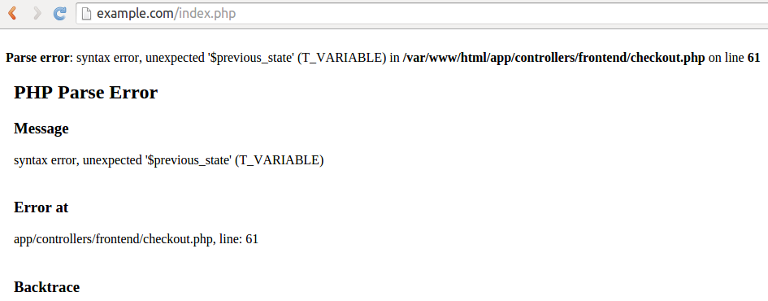

*********
Debugging
*********

============================
Debugging with fn_print_r();
============================

You can use the ``fn_print_r();`` function to debug your PHP code. This function displays the information about the variables you specify in it.

.. note::

    You can also ``fn_print_die();`` function—it also displays the information about the variables, but interrupts the program.

-------------------
In a PHP Controller
-------------------

Let's display the information about the administrators under **Customers →  Administrators**. The URL of this page is *http://example.com/admin.php?dispatch=profiles.manage&user_type=A*.

According to the **dispatch** parameter in the URL, we should look for the controller called **profiles.php**. It is located in the **app/controllers/backend** directory of the store. We're looking for a section beginning with ``$mode == 'manage'``.

Let's find the following code:

::

    list($users, $search) = fn_get_users($_REQUEST, $auth, Registry::get('settings.Appearance.admin_elements_per_page'));

If we add ``fn_print_r($users);`` in the next line, we'll see the information from the ``$users`` array:

.. image:: img/fn_print_r.png
    :align: center
    :alt: If you add fn_print_r() to a controller, you will see the attribute of the function on the corresponding page.

--------------------
In a Smarty Template
--------------------

You can use ``fn_print_r();`` in **.tpl** files (templates), but the syntax is different: ``{$an_array_or_a_variable|@fn_print_r}``.

Let's modify the template of the **Customers →  Administrators** page to display the information about administrators. 

The file we're looking for is **manage.tpl**. It is located in the **design/backend/templates/view/profiles** directory. Add the following code at the very beginning of the file:

::

  {$users|@fn_print_r}

It will achieve the same result as adding ``fn_print_r($users);`` to the PHP controller.

==============
Debugging AJAX
==============

.. important::

    :doc:`Enable the development mode and error notifications <configuring_cscart>` to debug AJAX.

Unlike PHP, Smarty and SQL query errors, AJAX errors don’t show up, even with error notifications and the development mode on. The only evidence of the error is that something doesn’t work as intended.

To see the error message, you have to disable AJAX. Inspect the code of the buggy element in your browser and remove/modify any occurrence of ``cm-ajax``—for example, change it to ``cm-ajax1``.

Suppose the **Add to Cart** button on a product page in the customer area doesn’t work for some reason. If you use the code inspector, you’ll see that this button is a part of a form. Change ``cm-ajax`` to ``cm-ajax1`` in the highlighted area.

.. image:: img/ajax_form.png
    :align: center
    :alt: Delete or modify any occurence of cm-ajax to disable AJAX.

If you click the **Add to Cart** button after that, you will see an error page with the name of the file and the number of the line where the error was encountered.

