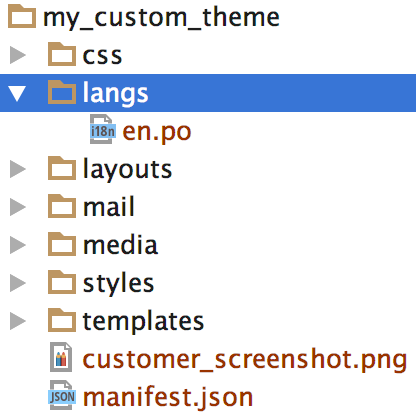

****************************
Language Variables in Themes
****************************

.. note::

    This functionality was't available until **CS-Cart and Multi-Vendor 4.4.1**.

:doc:`Language variables <../developer_guide/core/language_variables>` and translations can be added via a theme. Translation files must be located in the *langs* subdirectory of the theme’s directory and must be named like this: ``[language_code].po`` (for example, **en.po**).

.. important::

    The language variables of a theme are added to the database when the theme is installed.

You can specify your theme’s default language. It will be used to provide translations for all languages the theme is not translated to. To specify the theme's default language, use the ``default_language`` field in the theme's **manifest.json**::

  "default_language": "en"

When no ``default_language`` is specified, there are two possible scenarios:

* If the *langs* directory contains the PO file for the store's default language, it will be used as the default language.

* If the langs directory doesn’t contain the PO file for the store’s default language, then the first PO file in the directory will be used to provide default translations.

.. note::

    The store’s default language is determined by the Backend default language setting in **Settings → Appearance**.
