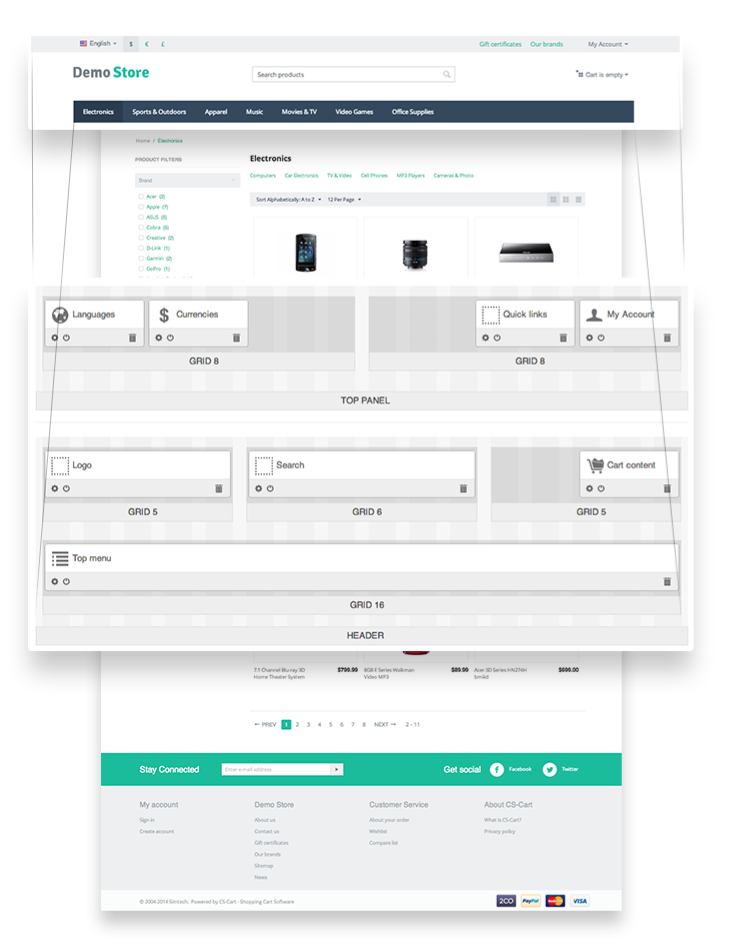
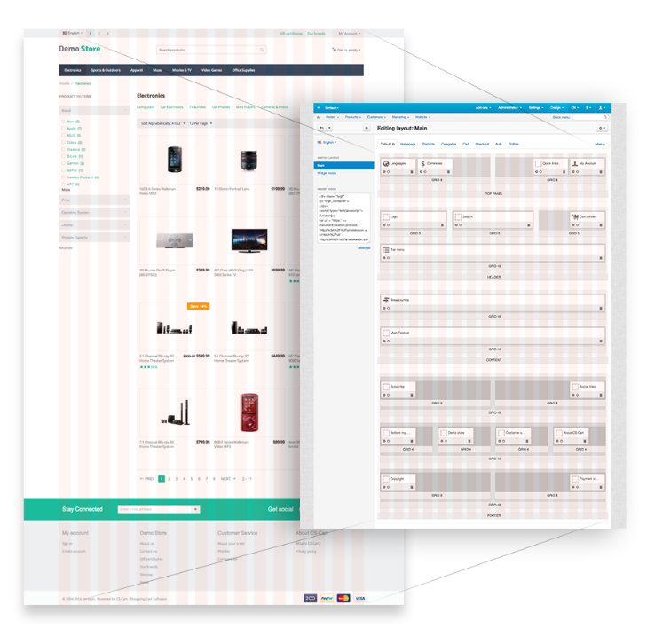

******
Layout
******

A **layout** is a powerful tool for customizing the look and feel of your store. You can change the position of certain information on the page by simply dragging and dropping information blocks. Layouts are available under **Design → Layouts** in the CS-Cart/Multi-Vendor Administration panel.

.. note::

    The layout grid is based on the **Bootsrap 2.3** framework. Learn more about the Bootstrap framework at the `Bootstrap official site <http://getbootstrap.com/2.3.2/scaffolding.html#gridSystem>`_.

===============
Layout Settings
===============

Layout has the following settings:

* **Grid columns**—the number of columns in a grid (12 or 16). The 16-column grid is preferable and is used by default. This grid allows to build more column combinations because the width of each column is smaller, so, totally there are more columns in a grid.

  In Bootstrap the 12-column grid is used as default, and there is a big number of templates based on it. You better use this grid if your have the complete layout based on it and you need to move it to CS-Cart.

  .. important::

      If you have the 16-column grid and want to change it to 12-column grid, the grid width values will be changed asymmetrically in the Administration panel. In the customer area the grid width will not be changed, but the whole site width will be changed instead. You will have to change the grid width value for each grid separately.

* **Layout width**—choose the *Fixed*, *Fluid*, or *Full width* layout.

  * With the **Fixed** layout you can define the column width in pixels (px). The widths of a column and a gutter between columns are defined in the *css/tygh/grid.less* file. They are defined with the LESS variables: ``@gridColumnWidth`` and ``@gridGutterWidth``. By default, the widths are 40px and 20px. 

  * For the **Fluid** layout you can define the minimum and maximum site width. The column width is defined in percents (%). The widths of a column and gutter are defined proportionally according to the values of the variables used for the **Fixed** layout.

  .. note::

      Find out the maximum site width with the following equation: *(@gridColumns * @gridColumnWidth) + ((@gridGutterWidth * (@gridColumns - 1)*. By default, the maximum width is 1175px.

  * With the **Full width** layout the site will be adapted to the full screen width.

You can also use **Media queries** to change the blocks width depending on the screen width.

===============
Layout includes
===============

---------
Locations
---------

Location defines the certain page appearance. When adding a location, set:

* **Name**—location name.

* **Dispatch**—specific page or page type that the location is associated with. The **dispatch** parameter has the following format: ``[controller_name].[mode_name]``

  * ``[controller_name]``—the name of the controller.

  * ``[mode_name]``—the mode in which the controller works. 

  The value of **dispatch** is added to the ``index.php?dispatch=`` part of the page and points to a specific location. For example:

  * ``index.php?dispatch=checkout.cart`` points to the cart contents page.

  * ``index.php?dispatch=checkout.checkout`` points to the checkout page.

  You can choose the predefined values from the drop-down list.

Such elements of the site as header and footer are usually identical for every page. Use the **Default** location so as not to duplicate this content for each page.

The **Default** location is not attached to any specific page, but defines the appearance common for all the locations. The Default location must be always defined. To make a location default, choose the **Default** checkbox in the location settings.

----------
Containers
----------

Location layout consists of 4 containers: **top panel**, **header**, **content**, and **footer**.

The **top panel**, **header**, and **footer** containers are defined only for the **Default** location.

In Bootstrap, containers have the following structure:

* **For the Fixed layout**::

	
...

* **For the Fluid layout**::

	
...

-----
Grids
-----

Grids are placed in containers. In Bootstrap a grid includes *.span* and *.row*. By default, the 16-column grid is used in CS-Cart.

You can define the following parameters for a grid:

* **Width**—the number of columns used in the container. For child containers, this number cannot exceed the the length of the root container. This setting defines *.span* to be used for a block (``.span1``—``.span16``).

* **Content alignment**—the position of the container inside the root (or parent) container: 

  * **Right** (adds the ``ty-float-right`` class).

  * **Left** (adds the ``ty-float-left`` class).

  * **Full Length**.

* **Offset**—adds the block shift from the left side. Uses the same values as *.span*. The ``.offset`` class is added for grid.

* **User-defined CSS-class**—adds a CSS class.

------
Blocks
------

A **block** is a separate box which represents a particular storefront component. Blocks are added to grids.

Blocks are created based on **schemas**. A schema is a file where all the blocks, their settings and templates are defined. This is the path to the blocks schema file: *app/schemas/block_manager/blocks.php*

Block settings:

* **Name**—the name of the block.  

* **Template**—the template (.tpl) defined for a block. Block templates are stored in the *templates/blocks/* directory. 

* **Wrapper**—the template that will include content. Wrappers are stored in the */templates/blocks/wrappers/* directory.

* **User-defined CSS-class**—used to add a CSS-class.

.. hint::

    If you need to place a block in the top panel, header, or footer (containers that are used only in the **Default** location) for a certain page, use the **HTML block with Smarty support**. In this block use the ``$runtime.controller`` and ``$runtime.mode`` variables to define the current page.

**Example:**

To display some text in the header of the **Categories** page:

* Create **HTML block with Smarty support** in the header container.

* In the block write the following code:

  .. code-block:: html+smarty

	{if $runtime.controller == "categories" && $runtime.mode == "view"}
		
Categories page

	{/if}

====================
Layout Export/Import
====================

You can export a layout to a file, or import a previously created layout:

1. In the Administration panel, go to **Design → Layouts**.
2. Click the **gear** button in the right upper corner of the page. 
3. Choose the desired action.

When creating the new theme, export layout to the *layouts* directory after adjusting blocks (remove the old files previously). This layout will be authomatacally enabled when installing a theme.

The export/import file includes:

* Layout settings.

* The structure and settings of containers, grids, and blocks.

* The content of the blocks. It is defined on the **Content** tab and depends on the block type. But not all the blocks have content.

  For example, for the **HTML block** and **HTML block with Smarty support** the content is the text included in the text area.

  In the block of the **Products** type the content is the criteria for displaying products (i.e. newest, recently viewed).

.. warning::

    A layout is installed only when you install a theme. If you install a theme and then switch to another one, the layout of the latest installed theme will be active.

====================
Layout Compatibility
====================

When you develop a theme, you can specify whether the layout works with CS-Cart, Multi-Vendor, or both. To do that:

1. Export the layout.

2. Open the exported file.

3. Add the ``edition`` attribute for the ``Layout`` element. For example::

     <?xml version="1.0"?>
     <block_scheme scheme="1.0">
         <settings>
             <default_language>en</default_language>
         </settings>
         <layout edition="MULTIVENDOR">
             <name>Main</name>
             <is_default>1</is_default>
             <width>16</width>
             <layout_width>fluid</layout_width>
             <min_width>280</min_width>
             <max_width>1200</max_width>
             <style_id>Modern</style_id>
         </layout>
     </block_scheme>

Here are the possible values of ``edition``:

* ULTIMATE—the layout works only with CS-Cart.

* MULTIVENDOR—the layout works only with Multi-Vendor.

* ULTIMATE/MULTIVENDOR—the layout works with both CS-Cart and Multi-Vendor.

When a theme is installed, all the layouts with the matching ``edition`` will be installed from the *layouts* directory.

==================
Layouts of Add-ons
==================

Add-ons can add their own layouts. This is done via the **layouts.xml** file located in the add-on's folder: *app/addons/[addon_name]/layouts.xml*.

Themes can redefine the layouts of add-ons. If the theme's directory has *layouts/addons/[addon_name]/layouts.xml* in it, then those layouts will be used instead of the layouts that come with the add-on.
