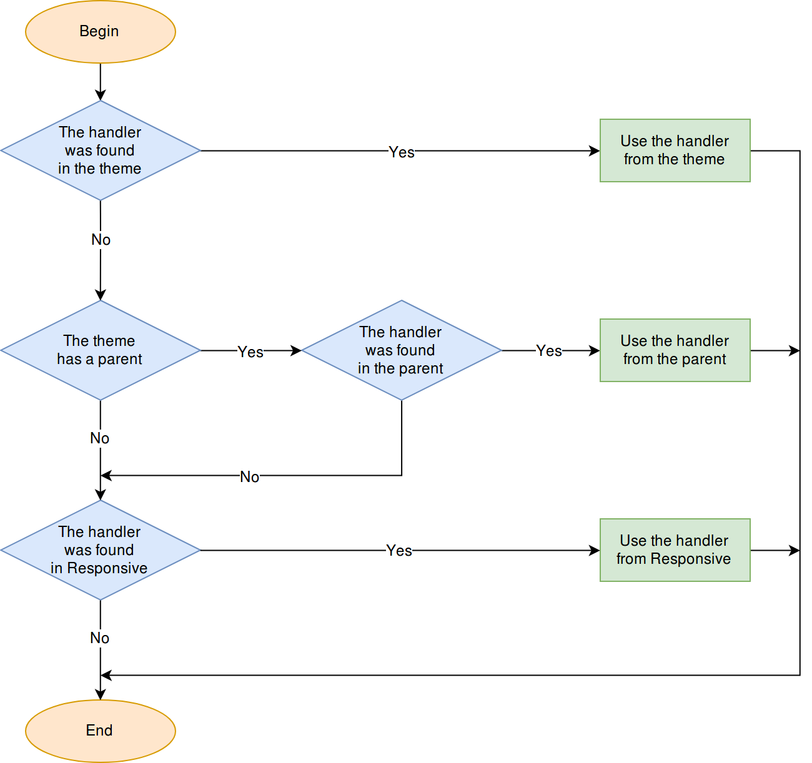

*************
Parent Themes
*************

.. note::

    Most of the described behavior was :doc:`first introduced in version 4.4.1. <../developer_guide/addons/compatibility/adapting_4310_to_441>`

===================
General Information
===================

If theme *X* has theme *Y* specified in the ``parent_theme`` field of the **manifest.json** file, then we say that theme *X* is the **dependent theme** (otherwise called **child theme**), and theme *Y* is the **parent theme**.

The dependent theme contains only the files that differ from the files of the parent theme. Dependent themes use the content (templates, logos, etc.) of the parent theme, when necessary.

* The *css*, *media*, and *templates* folders of the parent and the dependent theme are be merged in runtime:

  * If a file is missing in the dependent theme, the corresponding file from the parent theme will be used instead.

  * If the dependent theme has files that are missing in the parent theme (for example, product and product list templates, block wrappers, static templates), they will be listed together with the files of the parent theme.

  * If a file is present both in the dependent theme and in the parent theme, the file of the dependent theme will be preferred.

* The *layouts* and *styles* folders of the themes aren't merged.

  * If the dependent theme has its own layouts, only they will be used. Otherwise, the layouts of the parent theme will be used.

  * The dependent theme always uses its own styles.

* Images can be loaded from the parent theme by using the ``$images_dir`` variable.

  * If a theme has a parent, using ``$images_dir`` in Smarty templates will point to the *media/images* directory of the parent theme.

  * If a theme has no parent, ``$images_dir`` will point to the theme’s own *media/images* directory.

.. note::

    You can use the ``$self_images_dir`` variable in Smarty templates to point to the theme’s own *media/images* directory.

==============
Cloning Themes
==============

* If the source theme has no parent, its files won’t be copied to the clone theme’s directory.

  The clone theme will contain only the **manifest.json** file and the */media/images/* directory with theme logos. The name of the source theme will be specified as ``parent_theme`` in the **manifest.json** file of the clone theme.

* If the source theme has a parent, the whole content of source theme will be copied to the directory of the clone theme.

=================
Installing Themes
=================

Files of the parent theme won’t be merged with the files of the dependent theme during the installation of the dependent theme. Only the files of the dependent theme will be copied from *var/themes_repository* to *design/themes*.

=====================
Upgrading Theme Files
=====================

The Upgrade Center doesn’t upgrade the files of custom themes. Only the **Responsive** and **Basic** themes will be affected when upgrading a store.

=======================
Installing Add-on Files
=======================

Theme-related files (such as styles, templates, etc.) from add-ons are installed only for the theme they are created for, and not for themes that depend on it.

For example, the content of *var/themes_repository/responsive/templates/addons/[addon]* will be copied only to *design/themes/responsive/templates/addons/[addon]*.

Add-ons that provide template files only for the **Basic** theme will be usable only in the **Basic** theme and the themes that depend on it. CS-Cart will not fall back to the templates of the **Basic** theme when the required templates are missing in the current theme.

=====================================
Using TPL Hooks from Responsive Theme
=====================================

Every theme can use the handlers of :doc:`template hooks </developer_guide/addons/hooking/tpl_hooks>` from the Responsive theme, even if Responsive isn't the theme's parent. That way add-ons that provide templates only for the Responsive theme can work with other themes to some extent.

Let's assume we have the following structure of files and directories:

.. code-block:: none

    design
    └── themes
        ├── child
        │   └── templates
        │       └── addons
        │           └── styles_fixer
        │               └── hooks
        │                   └── index
        │                       └── styles.post.tpl
        ├── parent
        │   └── templates
        │       └── addons
        │           └── styles_fixer
        │               └── hooks
        │                   └── index
        │                       └── styles.post.tpl
        └── responsive
            └── templates
                └── addons
                    └── styles_fixer
                        └── hooks
                            └── index
                                └── styles.post.tpl

The active theme is **child**, and it depends on the **parent** theme. In this case CS-Cart/Multi-Vendor will search for the handler of the ``index:styles`` in themes in the following order: **child → parent → responsive**. The first found handler will be used.

.. note::

    If the Responsive theme isn't installed in the store, the search for TPL hook handlers won't be performed in Responsive.

.. meta::
   :description: Learn how parent and child themes work in CS-Cart and Multi-Vendor, what files they share, and how to make a custom theme more compatible with other addons.
