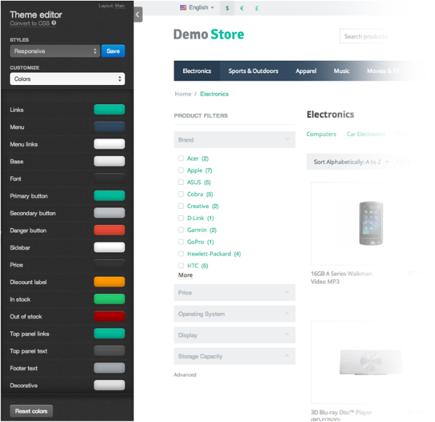

***********************
Styles and Theme Editor
***********************

Theme Editor
************

CS-Cart **Theme Editor** is a helpful tool for editing store appearance that has a very simple and user-friendly interface. 

For example, if you want to change the background or buttons color, there is no need to edit CSS. You can just open Theme Editor and choose the desired color for corresponding element.

Depending on the developer, theme in CS-Cart may contain Theme Editor or not. But customers will definitely be very glad to have such a powerful tool as the Theme Editor in their supply. It is much better that editing CSS manually.

To open the Theme Editor in the administration panel go to the **Design → Themes** section and click the **Theme Editor** button.

.. note::

    Before **version 4.3.6** the button was called **Visual Editor**.

Styles
******

There is a set of pre-installed **Styles** in the Theme Editor for each theme.

For example, if you have the **my_theme** theme, you can create different styles for its appearance. For Halloween you may paint your store in dark colors and name this style *Halloween*. And in the right day all you will need to do - just pick this style from the list. 

All Styles created with the Theme Editor are stored in the following directory: *design/themes/[your_theme_name]/styles/*.

The *styles* directory includes **1 directory** and **2 files**.

The *data/* directory contains *.less*, *.css*, and *.png* files. In these files the edited data and user's styles are stored.

.. important::

    **Starting with version 4.3.7**, the *styles* directory isn't required. You'll need it only if you want your theme to support the Theme Editor and multiple styles.

If the theme's directory doesn't have the *styles* directory in it, the Theme Editor won't work for the theme. When you go to **Design → Themes**, the **Theme editor** button will be grayed out, and if you hover over it, you'll see the following tooltip: "This theme doesn’t support theme editor."

Manifest.json
+++++++++++++

The **manifest.json** file contains data about styles in the *json* format.

	*	``default_style`` - the default style.
	*	``names`` - styles names. For example, you have created a style with the *example_style* name and want to rename it to *Cool Style*, than you have to add the following key-value pair:

	.. code-block:: none

	 "names": { "example_style": "Cool Style" }

	*	``default`` - default styles (it will be impossible to remove them with the Theme Editor).

schema.json
+++++++++++

The **schema.json** file contains all available fields for editing in the Theme Editor in the *json* format. With this file you can add custom fields for editing.

**schema.json** is divided into 4 parts:

*	``general`` - contains the **General** section settings:

	*	``fields`` - a list of fields available for editing.

		*	``variable_name`` - name of a variable that will be available in the *less* file. You can define any name.

			*	``description`` - field description (the language variable name).
			*	``type`` - field type (checkbox, for example).
			*	``true`` - values that checkbox can take when enabled.
			*	``false`` - values that checkbox can take when disabled.

----------------------------------------------------------------------------------------------------------------------------------------------------------------

*	``colors`` - contains the **Colors** section settings:

	*	``fields`` - a list of fields available for editing.
	
		*	``variable_name`` - name of a variable that will be available in the *less* file. You can define any name.

			*	``description`` - field description (the language variable name).

-----------------------------------------------------------------------------------------------------------------------------------------------------------------

*	``fonts`` - contains the **Fonts** section settings:

	*	``families`` - a list of fonts available by default (system fonts).
	*	``fields`` - a list of fields available for editing.

		*	``variable_name`` - name of a variable that will be available in the *less* file. 
		*	``description`` - field description (the language variable name).

			*	``properties`` - fonts settings, for example, variants of size.

				*	``size`` - font size settings.

					*	``match`` - name of the variable where the chosen value will be saved. This variable will be available in the *less* file.
					*	``unit`` - font size value unit: *px*, *em*, *%*, etc.
					*	``values`` - array with the available size values. [8,9,10,11] means that it is possible to choose among 4 available sizes.
				*	``style`` - font style settings (*bold* or *italic*, for example).

					*	``U`` - setting name will be displayed in the Theme Editor (``U`` - underlined, ``B`` - bold, and ``I`` - italic).

						*	``match`` - name of the variable where the chosen value will be saved. This variable will be available in the *less* file.
						*	``property`` - property value (``U`` for underlined).
						*	``default`` - default value.

----------------------------------------------------------------------------------------------------------------------------------------------------------------

*	``backgrounds`` - contains the **Backgrounds** section settings:

	*	``fields`` - a list of fields available for editing.

		*	``variable_name`` - name of the variable that will be available in the *less* file.

			*	``description`` - field description (the language variable name).
			*	``properties`` - background properties settings.

				*	``color`` - background color settings.

					*	``match`` - name of the variable where the chosen value will be saved.
				*	``pattern`` - if value is a *string*, it is possible to use an image as the background. String is used as a variable name.
				*	``position`` - background position. Can be: *top*, *right*, *left*, *bottom*. String is used as a variable name.
				*	``repeat`` - defines the method of the background image repeat. Can be: *repeat*, *no-repeat*, *repeat-x*, *repeat-y*. String is used as a variable name.
				*	``attachment`` - defines whether the background image will be scrolled together with contents. String is used as a variable name.
			*	``full_width`` - defines whether the background image will be spread to the full content width or just to the container.

				*	``description`` - field description (the language variable name).
				*	``type`` - field type (checkbox in this case).
				*	``true`` - values that checkbox can take when enabled.
				*	``false`` - values that checkbox can take when disabled.
			*	``transparent`` - defines whether the background will be transparent.

				*	``match`` - name of the variable where the chosen value will be saved.
			*	``gradient`` - defines whether the background will be gradient. The value from the color section is used as the first color.
			
				*	``match`` - name of the variable where the chosen value will be saved.

Example
+++++++

To add the custom field with the **my_custom_field_name** name to the **Colors** section of the Theme Editor:

In the **schema.json** file find the **colors** section and add the following code to the end::

	------------------------------------------------------------------------
	"my_custom_field_name": {
 	     "description": "theme_editor.my_custom_field_color"
	}
	------------------------------------------------------------------------

``my_custom_field_name`` - name of the variable that will be available in the *less* files.
``description`` - field description (the language variable name).

After that you can use the ``@my_custom_field_name`` variable in your *less* files. More information about the *less* variables you can read `here <http://lesscss.org/features/#variables-feature>`_.

Example of the code in the less files::

	.my_class {
	color: @my_custom_field_name;
	}
