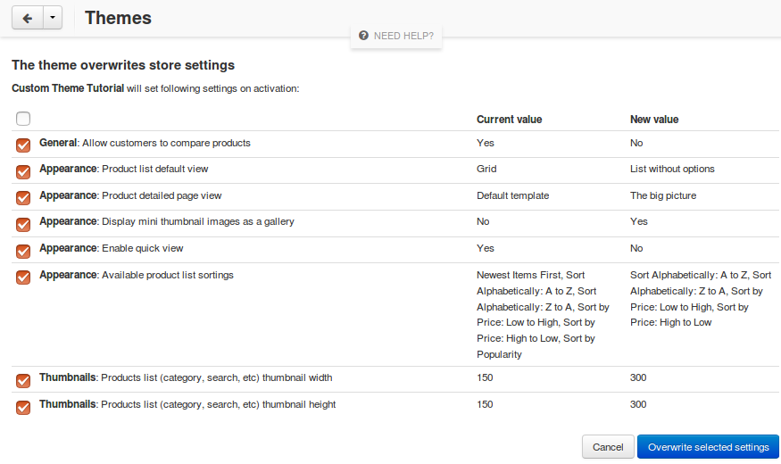
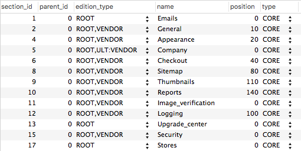

************************************
Changing Store Settings with a Theme
************************************

.. note::

    This functionality was not available until **CS-Cart and Multi-Vendor 4.3.6**.

A theme may be designed with specific store settings in mind, such as thumbnail size, the number of columns in lists, and the specific product list template. When your theme is activated, it can change the settings accordingly.

============================
What Administrators Will See
============================

When an administrator activates a theme that changes some settings, the list of those settings and their new values will appear.

To allow these changes, the administrator must tick the checkboxes in the **Overwrite** column and then click **Overwrite selected settings**. Only the ticked settings will be changed. If not all the settings are ticked, the looks and functioning of the theme may be affected.

==========================
How to Change the Settings
==========================

To specify the settings that a theme should change, add a new section called ``settings_overrides`` to the theme’s **manifest.json**::

  "Settings_section_name": {  // a section of settings
    "setting_name": value     // setting: value
    ...
  }

The list of sections can be found in the **name** field of the ``cscart_settings_sections`` table:

The settings and their values can be found in the **name** and **value** fields of the ``cscart_settings_objects`` table:

.. image:: img/cscart_settings_objects.png
    :align: center
    :alt: The list of CS-Cart settings in the cscart_settings_objects table.

Some settings are represented by checkboxes, for example, **Appearance → Enable quick view**. To tick a checkbox, specify ``true`` in the schema; to untick a checkbox, specify ``false`` as shown in the example below.

Here’s the example of settings_overrides from `manifest.json of our tutorial theme <https://github.com/cscart/custom-theme-tutorial/blob/master/manifest.json>`_::

  "settings_overrides": {
    "General": {
      "enable_compare_products": false
    },
    "Appearance": {
      "default_products_view": "products_without_options",
      "default_product_details_view": "bigpicture_template",
      "thumbnails_gallery": true,
      "enable_quick_view": false,
      "available_product_list_sortings": [
        "product-asc",
        "product-desc",
        "price-asc",
        "price-desc"
      ]
    },
    "Thumbnails": {
      "product_lists_thumbnail_width": 300,
      "product_lists_thumbnail_height": 300
    }
  }

When activated, a theme that has this code in **manifest.json** will do the following things:

* Disable product comparison.

  *(General → Allow customers to compare products)*

* Set **List without options** as the product list template.

  *(Appearance →  Product list default view)*

* Set **The big picture** as the product page template.

  *(Appearance →  Product detailed page view)*

* Enable mini-thumbnail gallery.

  *(Appearance → Display mini thumbnail images as a gallery)*

* Disable **Quick View**.

  *(Appearance → Enable quick view)*

* Select *Sort Alphabetically: A to Z*, *Sort Alphabetically: Z to A*, *Sort by Price: Low to High*, and *Sort by Price: High to Low* as the only available product list sortings.

  *(Appearance → Available product list sortings)*

* Set the width and height of thumbnails on the product list to 300 px.

  *(Thumbnails → Products list (category, search, etc) thumbnail width)*

  *(Thumbnails → Products list (category, search, etc) thumbnail height)*
