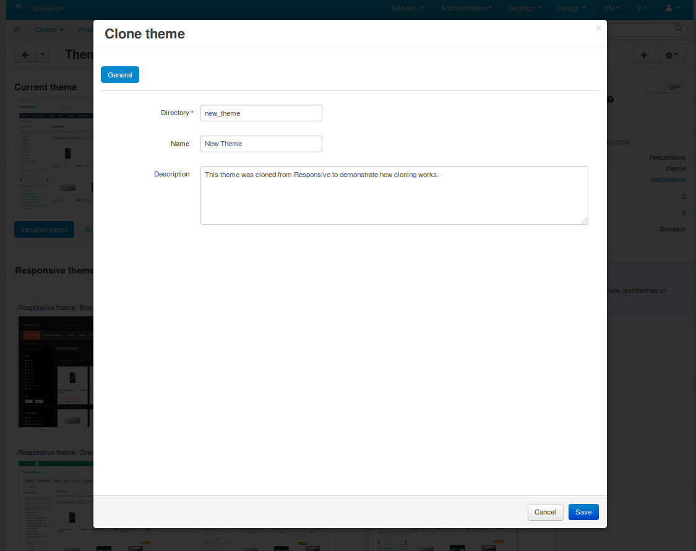

***************
Cloning a Theme
***************

To start developing your own theme, clone the **Responsive** theme, which comes with CS-Cart and Multi-Vendor by default.

#. In the Administration panel go to **Design → Themes**.

#. Click the **gear** button in the top right corner and choose **Clone theme**.

   .. note::

       This will clone the theme that is currently active in your store. If your active theme is not **Responsive**, then activate **Responsive** before attempting to clone the theme.

  .. image:: img/clone_a_theme.png
      :align: center
      :alt: Cloning a theme in the Administration panel.

#. A popup window will open. Enter the details of your new cloned theme:

   * **Directory**—the name of the new theme’s directory in *design/themes*.

     .. important::

         If you want your theme to work properly, please specify the name of the directory in lowercase and use ``_`` (underscore) instead of spaces. A good example would be ``new_theme``.

   * **Name**—the name of your new theme as it appears in the Administration panel. For example, let’s call it *New Theme*.

   * **Description**—the description of your new theme.

#. Once you’ve entered the details, click **Save**.
 
This will create a clone theme called **New Theme**, which will have **Responsive** as its :doc:`parent theme. <../parent_themes>` A new folder named just like you specified in the **Directory** field will appear in the *design/themes* directory. 

Now the new theme is ready to be customized. In the next tutorial we’ll customize the layout via the Administration panel and arrange the blocks to match the intended design.

.. note::

    The clone theme won’t be activated automatically after creation. You’ll need to activate it manually under **Design → Themes**.

