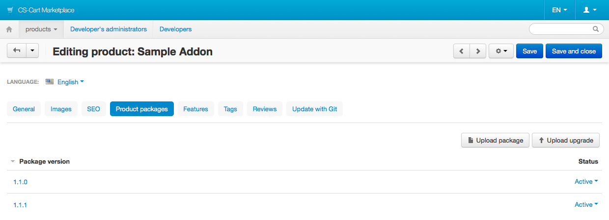
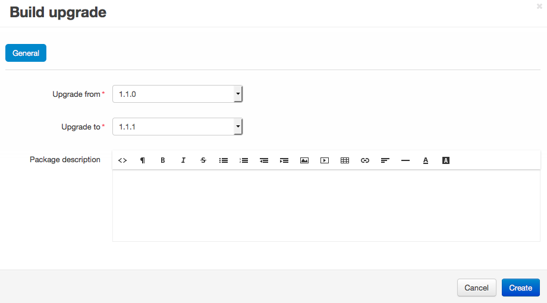
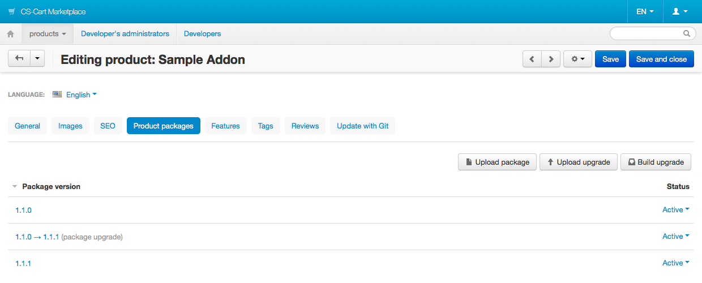
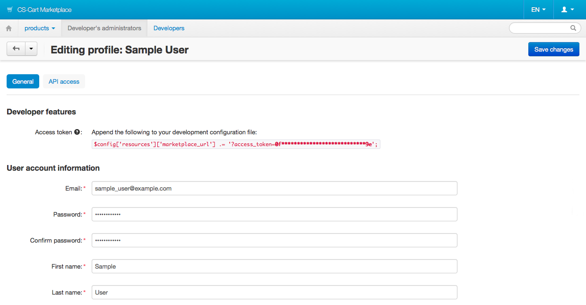

************************************************
Distributing Add-on Upgrades via the Marketplace
************************************************

An upgrade package is an archive that contains all the files necessary to upgrade a customer’s add-on automatically. Normally this archive includes:

* Files that were changed or added in the new version.

* Files with the new language variables.

* Validators that check conditions before installing the upgrade.

* Migrations that change the structure and data of the database.

Upgrade packages can be installed in the Upgrade Center in one of the ways:

* Specify the location of the upgrade package on a local machine or via a URL.

* Retrieve the packages from the upgrade server with the Upgrade Center.

This article tells how add-on developers can create upgrade packages for their add-ons.

===========================================
Preface: Recommended Structure of an Add-on
===========================================

.. _marketplace-addon-structure:

If you want to build upgrade packages via the Marketplace, please follow this structure when developing an add-on:

.. code::

    ├── app
    │   └── addons
    │       └── [sample_addon]
    │           ├── addon.xml
    │           ├── config.php
    │           ├── func.php
    │           └── upgrades
    │               ├── [version1]
    │               │   ├── migrations
    │               │   │   ├── 467676233_migration1.php
    │               │   │   └── 467676233_migration2.php
    │               │   │
    │               │   ├── validators
    │               │   │   ├── validator1.php
    │               │   │   └── validator2.php
    │               │   │
    │               │   ├── scripts
    │               │   │   ├── pre_script.php
    │               │   │   └── post_script.php
    │               │   │
    │               │   ├── extra_files
    │               │   │   ├── extra_file1.php
    │               │   │   └── extra_file2.php
    │               │   │
    │               │   └── extra
    │               │       └── extra.php
    │               │
    │               ├── [version2]
    │                   │   ├── migrations
    │                   │   │   ├── 467676233_migration1.php
    │                   │   │   └── 467676233_migration2.php
    │                   │   │
    │                   │   ├── validators
    │                   │   │   ├── validator1.php
    │                   │   │   └── validator2.php
    │                   │   │
    │                   │   ├── scripts
    │                   │   │   ├── pre_script.php
    │                   │   │   └── post_script.php
    │                   │   │
    │                   │   ├── extra_files
    │                   │   │   ├── extra_file1.php
    │                   │   │   └── extra_file2.php
    │                   │   │
    │                   │   ├── extra
    │                   │   │   └── extra.php
    ...

* **[sample_addon]**—the name of the add-on.

* **[version1]**—a version, for example 1.1.0.

* **[version2]**—a version, for example 1.1.1.

* **app/addons/[sample_addon]/upgrades/[version]/migrations**—a folder with the migrations to be performed when upgrading to this [version].

* **app/addons/[sample_addon]/upgrades/[version]/validators**—a folder with the validators which must run their checks before upgrading to this [version].

* **app/addons/[sample_addon]/upgrades/[version]/scripts**—a folder with pre/post scripts to be executed before and after upgrading to this [version].

* **app/addons/[sample_addon]/upgrades/[version]/extra_files**—a folder with the extra files that are used only during the upgrade and aren't added to CS-Cart/Multi-Vendor.
 
* **app/addons/[sample_addon]/upgrades/[version]/extra/extra.php**—a file for extending **package.json** of the upgrade package.

Files and folders in *app/addons/[sample_addon]/upgrades/[version]* aren't required. For example, if the new version has no changes in the database, there's no need to create a folder with migrations.

.. hint::

    Learn more about the components of an upgrade package :ref:`here <upgrade-package-structure>`.

===============================
Build an Add-on Upgrade Package
===============================

----------------------------------------
Way 1. Build an Upgrade Package Manually
----------------------------------------

""""""""""""""""""""""""""""""""""
Step 1. Create the Upgrade Package
""""""""""""""""""""""""""""""""""

Create an upgrade package as described :doc:`in this article <../../../upgrade/upgrade_addon>`. Instead of creating an upgrade connector you’ll need a Marketplace connector. It must be located in the *app/addons/[addon_name]/Tygh/UpgradeCenter/Connectors/[AddonName]/Connector.php* and have the following content:

.. important::

    In this example the connector is located in *app/addons/sample_addon/Tygh/UpgradeCenter/Connectors/SampleAddon/Connector.php*. Replace **sample_addon** and **SampleAddon** with the name of your add-on both in the path and in the connector code. ``ADDON_IDENTIFIER`` is what you have in the ``<id>`` section of **addon.xml**. The identifier must be the same as the name of your add-on's folder.

.. code-block:: php

    <?php

    namespace Tygh\UpgradeCenter\Connectors\SampleAddon;
    use Tygh\Addons\SchemesManager;
    use Tygh\Registry;
    use Tygh\UpgradeCenter\Connectors\BaseAddonConnector;

    /**
     * Marketplace add-on upgrade connector
     */
    class Connector extends BaseAddonConnector
    {
        /**
         * Put your add-on identifier here
         */
        const ADDON_IDENTIFIER = 'sample_addon';

        /**
         * @var string Version of product addon runs in
         */
        protected $environment_version;

        /**
         * Prepares request data for request to Upgrade server (Check for the new upgrades)
         *
         * @return array Prepared request information
         */
        public function getConnectionData()
        {
            $request_data = parent::getConnectionData();
            $request_data['url'] = $this->updates_server;
            $request_data['data']['product_id'] = $this->addon_id;
            $request_data['data']['dispatch'] = 'product_packages.get_upgrades';
            // "ver" is used for addon version
            // while "product_version" is for environment version
            $request_data['data']['product_version'] = $this->environment_version;

            return $request_data;
        }

        /**
         * Downloads upgrade package from the Upgade server
         *
         * @param  array  $schema       Package schema
         * @param  string $package_path Path where the upgrade pack must be saved
         * @return bool   True if upgrade package was successfully downloaded, false otherwise
         */
        public function downloadPackage($schema, $package_path)
        {
            $package_url = fn_url(
                $this->updates_server . (strpos($this->updates_server,  '?') !== false ? '&' : '?') .
                http_build_query(array(
                    'dispatch' => 'product_packages.get_package',
                    'package_id' => $schema['package_id'],
                    'product_id' => $this->addon_id,
                    'license_number' => $this->license_number
                ))
            );
            $data = fn_get_contents($package_url);

            if (!empty($data)) {
                fn_put_contents($package_path, $data);
                $result = array(true, '');
            } else {
                $result = array(false, __('text_uc_cant_download_package'));
            }

            return $result;
        }

        /**
         * Gets Marketplace product identifier from addon.xml scheme
         */
        public static function getMarketplaceProductId()
        {
            $scheme_path = Registry::get('config.dir.addons') . self::ADDON_IDENTIFIER . '/addon.xml';
            if (file_exists($scheme_path)) {
                $scheme = @simplexml_load_file($scheme_path);
                // <marketplace_product_id> is automatically added into addon.xml by Marketplace
                if (isset($scheme->marketplace_product_id)) {
                    return (int) $scheme->marketplace_product_id;
                }
            }

            return 0;
        }

        public function __construct()
        {
            parent::__construct();

            // Initial settings
            $this->addon_id = self::getMarketplaceProductId();

            $addon_scheme = SchemesManager::getScheme(self::ADDON_IDENTIFIER);

            $this->updates_server = Registry::get('config.resources.marketplace_url');

            $this->product_name        = $addon_scheme->getName();
            $this->product_version     = $addon_scheme->getVersion();
            $this->environment_version = PRODUCT_VERSION;
            $this->product_edition     = PRODUCT_EDITION;

            $this->license_number = Registry::get('addons.' . self::ADDON_IDENTIFIER . '.marketplace_license_number');
        }
    }

.. note::

    The Marketplace connector will be built in CS-Cart & Multi-Vendor starting with version 4.4.1. That means you won’t have to create upgrade connectors for these versions.

"""""""""""""""""""""""""""""""""""""""""""""
Step 2. Upload the Package to the Marketplace
"""""""""""""""""""""""""""""""""""""""""""""

1. Open the add-on editing page on the Marketplace.

2. Go to the **Product packages** tab.

3. Click **Upload upgrade**.

4. Use the **File** field to select the archive you created.

5. Specify the versions in the **Upgrade from** and **Upgrade to** fields.

6. (Optional) Enter **Package description**.

7. Click **Create**.

.. image:: img/upload_upgrade.png
	:align: center
	:alt: When you upload an upgrade to the Marketplace,  you specify from and to which versions the add-on is upgraded.

---------------------------------------------------
Way 2. Build an Upgrade Package via the Marketplace
---------------------------------------------------

.. important::

    To be able to build upgrade packages via the Marketplace, please follow the :ref:`recommended structure of an add-on <marketplace-addon-structure>`.

1. Open the add-on editing page on the Marketplace.

2. Switch to the **Product packages** tab.

3. Click **Build upgrade**.

4. Specify the versions in the **Upgrade from** and **Upgrade to** fields.

5. (Optional) Enter **Package description**.

6. Click **Create**.

.. _test-addon-package:

===================================
View and Test Your Upgrade Packages
===================================

The list of upgrade packages is available on the **Product packages** tab of your add-on:

A manually-uploaded upgrade package has the *Active* status by default, i.e. it is available to customers. Upgrades built with the Marketplace have the *Disabled* status by default, i.e. they are not available to customers.

Customers who :doc:`downloaded an add-on from the Marketplace <../../../user_guide/addons/marketplace_addons>`, installed it, and specified the marketplace license number, will see the active upgrades in the Upgrade Center.

If you want to test a disabled upgrade package, add the following line to your store’s :doc:`local_conf.php <../../getting_started/configuring_cscart>`:

.. code-block:: php

    $config['resources']['marketplace_url'] .= '?access_token=/*your token here*/';

You'll find the access token on your profile editing page in the Marketplace:

