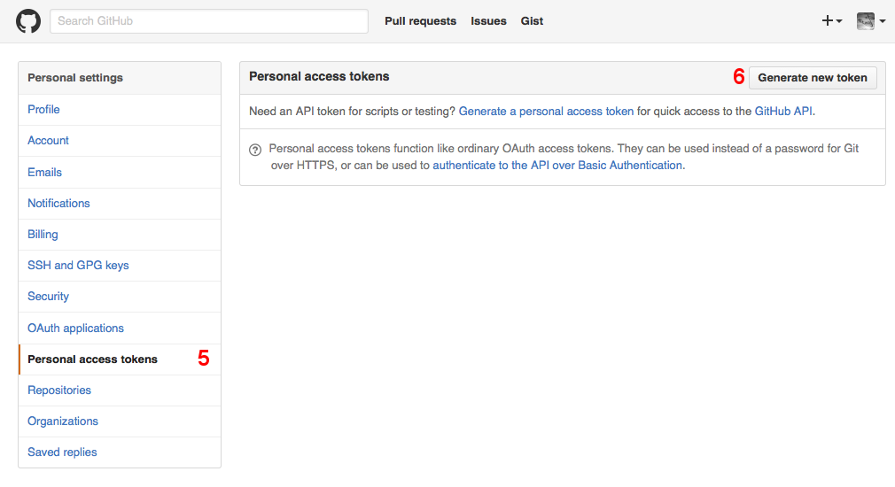
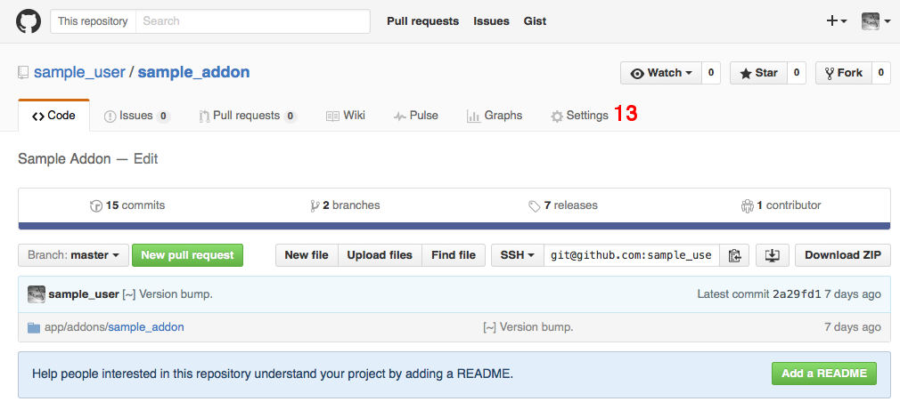
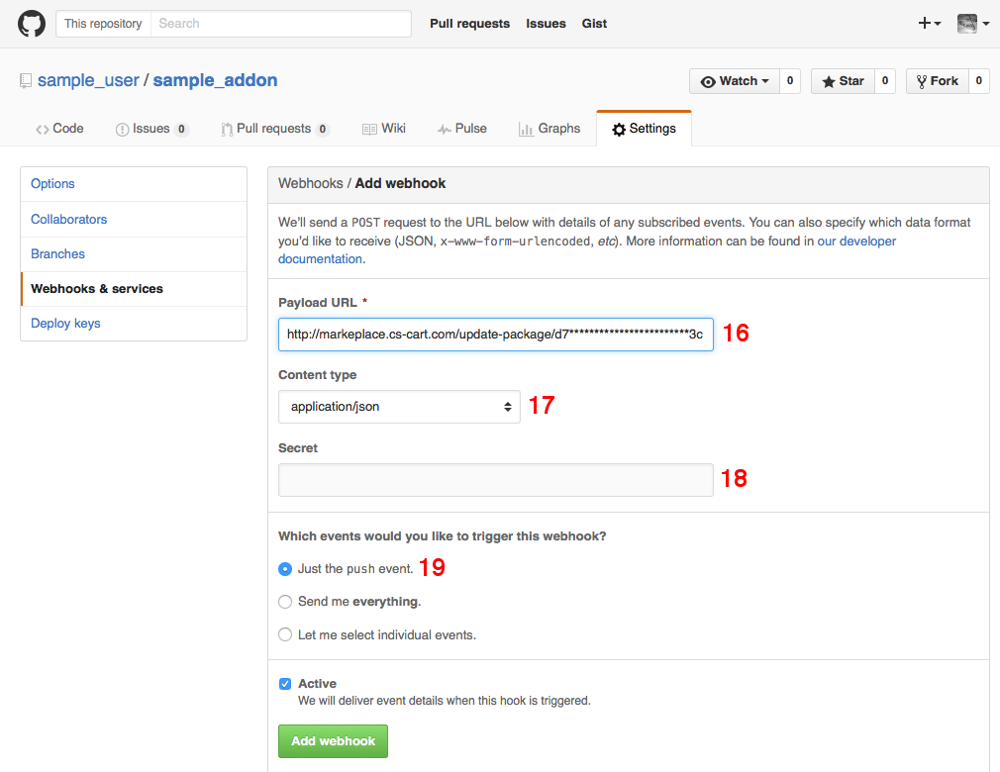
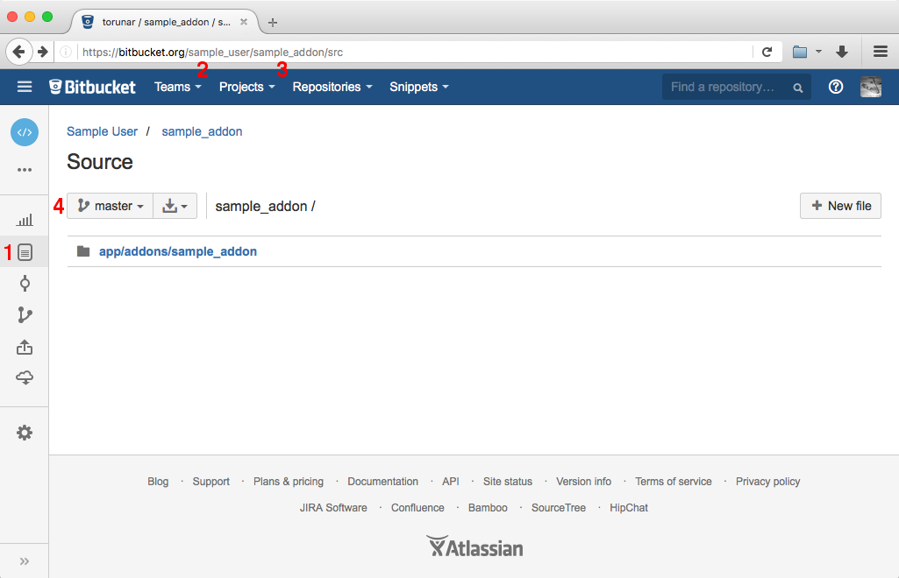
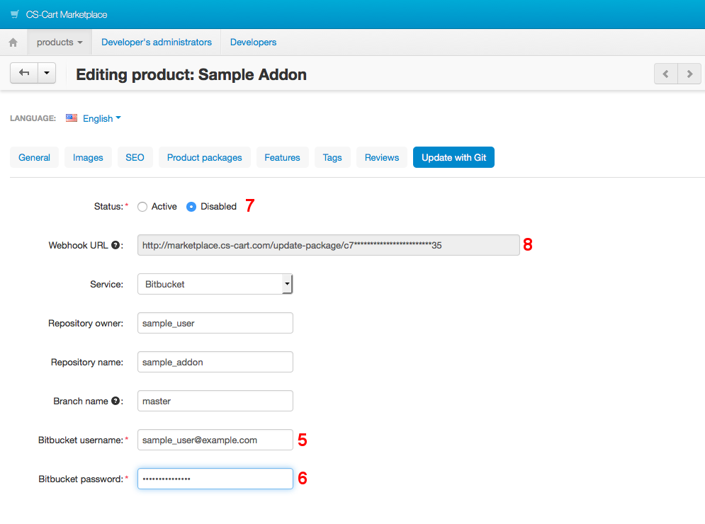
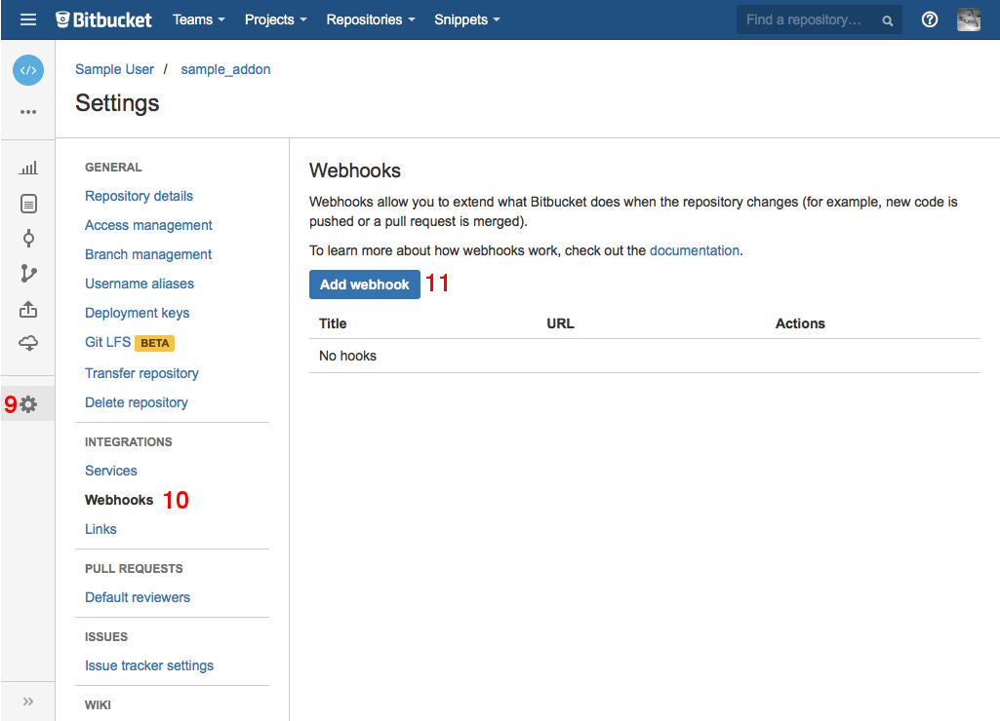
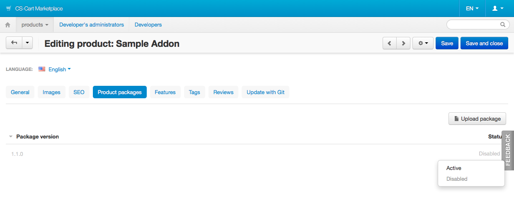
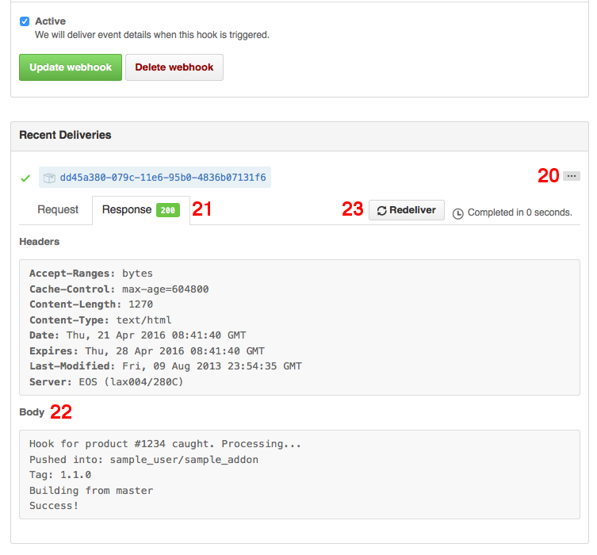
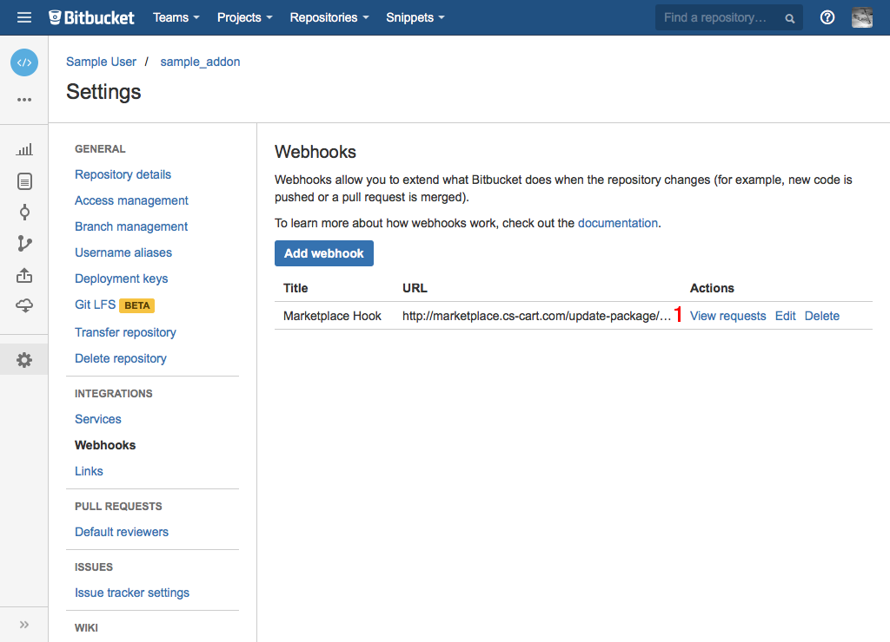

******************************************************
Delivering Add-on Releases to the Marketplace with Git
******************************************************

We recommend developing add-ons in Git repositories—this facilitates collaboration and testing. There are :doc:`instructions on organizing your Git workflow <../tutorials/organizing_git_workflow>`, that can make add-on development more convenient for you.

There is one more reason to use Git—you can deliver add-on releases from GitHub to the Marketplace automatically. This article shows how to do that.

========================================
Connecting Repository to the Marketplace
========================================

.. important::

    Before you begin, you’ll need to add your add-on to the Marketplace. The add-on must follow :doc:`these rules <addon_package>`.

1. Open the add-on editing page and switch to the **Update with Git** tab.

2. Configure the settings for the **Service** you selected.

.. image:: img/update_with_git.png
	:align: center
	:alt: You can upload upgrade packages to the Marketplace directly from your Git repository.

------
GitHub
------

1. Go to the repository of the add-on on GitHub to find out where to get the values for the settings in the Marketplace:

   * **Repository owner**—the username [1].

   * **Repository name**—the name of the repository [2].

   * **Branch name**—one of the branches of the repository [3].

2. Open the drop-down menu of the profile and go to **Settings** [4].

.. image:: img/repository_and_branch.png
	:align: center
	:alt: Specify GitHub username, as well as the name and branch of the repository.

3. Go to **Personal access tokens** [5].

4. Click **Generate new token** [6].

5. Specify the description for the new token [7].

6. Select the **repo** scope [8].

7. Create the token.

.. image:: img/token_settings.png
	:align: center
	:alt: Enter token description and set repo as scope.

8. You now have a token [9]. You can return to the Marketplace and specify it as the **Personal access token**.

.. image:: img/token_for_marketplace.png
	:align: center
	:alt: Copy the token from GitHub and specify it on the Marketplace.

9. Set **Status** to *Active* [10].

10. Enter **Webhook secret** [11].

11. Save your changes.

12. Copy the URL from the **Webhook URL** field [12].

.. image:: img/token_and_webhook.png
	:align: center
	:alt: Enter your personal access token, come up with webhook secret, then copy webhook URL.

13. Go back to the GitHub repository and switch to the **Settings** tab [13].

14. Choose **Webhooks & services** [14] and click **Add webhook** [15].

.. image:: img/add_webhook.png
	:align: center
	:alt: Switch to the Settings tab in your GitHub repository.

15. Configure the webhook:

    * **Payload URL** [16]—enter *Webhook URL* from step 12.

    * **Content type** [17]—select *application/json*.

    * **Secret** [18]—enter *Webhook secret* that you specified in step 10.

    * **Which events would you like to trigger this webhook?** [19]— choose *Just the push event*.

16. Click **Add webhook**.

---------
Bitbucket
---------

1. Go to the repository of the add-on on Bitbucket and switch to the **Source** tab [1] to find out where to get the values for the settings in the Marketplace:

   * **Repository owner**—enter the username from the URL [2].

   * **Repository name**—enter the name of the repository from the URL [3].

   * **Branch name**—enter one of the branches that exist in the repository [4].

2. Specify other settings:

   * **Bitbucket username**—your Bitbucket login [5].

   * **Bitbucket password**—your Bitbucket password [6].

   * **Status**—*Active* [7].

3. Save your changes, then copy the URL from the **Webhook URL** field [8].

4. Open your Bitbucket repository.

5. Go to **Settings** [9]. 

6. Switch to **Webhooks** [10].

7. Click **Add webhook** [11].

8. Configure your new webhook:

   * **Title** [12]—webhook name.

   * **URL** [13]—the value of **Webhook URL** from [8].

   * **Status** [14]—*Active*.

   * **Triggers**—*Repository push* [15].

9. Save your webhook [16].

.. image:: img/bitbucket_webhook_settings.png
	:align: center
	:alt: Configure your webhook and save it.

=====================================
Creating Add-on Releases via Git Tags
=====================================

Once you have made some changes in your repository and are ready to roll out a new release, follow these steps:

1. Commit your changes:

 .. code-block:: bash

    $ git add .
    $ git commit -m "Functionality added."

2. Add a tag that conforms to `Semantic Versioning <http://semver.org/>`_:

 .. code-block:: bash

    $ git tag 1.1.0

3. Push the changes in the branch to the remote repository:

 .. code-block:: bash

    $ git push origin master

4. Push the tag to the remote repository:

 .. code-block:: bash

    $ git push origin 1.1.0

5. Once the webhook is processed, the package will appear on the **Product packages** tab of the add-on editing page in the Marketplace.

6. By default, the package is *Disabled*, i.e. unavailable to customers. That way you can :ref:`test the package <test-addon-package>` before release. Once you’re ready to distribute the package, change its status to *Active*:

===============================
Monitoring the Package Building
===============================

------
GitHub
------

1. Open the editing page of the webhook you created.

2. Expand the delivery event [1].

3. Switch to the **Response** tab [2].

4. The response from the server about the building process appears in the **Body** section [3].

5. To process the webhook again if there are any errors, click **Redeliver** [4].

---------
Bitbucket
---------

1. Go to your repository on Bitbucket.

2. Switch to **Settings**, then to **Webhooks**.

3. Click **View requests** next to the webhook you created [1].

4. Click **View details** next to an event [2].

.. image:: img/bitbucket_log_details.png
	:align: center
	:alt: View the details of an event by clicking the corresponding link.

5. You can find the response of the server in the **Response from http://marketplace.cs-cart.com/update-package/… > Body** section [3].

6. To process the webhook again in case of errors, click **Resend request** [4].

.. image:: img/bitbucket_resend_request.png
	:align: center
	:alt: View the response of the server and resend the request, if there are any errors.

==============
Error Messages
==============

.. list-table::
    :header-rows: 1
    :stub-columns: 1
    :widths: 10 20

    *   -   Error Text
        -   Possible Reasons
    *   -   Hook has been skipped
        -   | Updating with Git is disabled for the add-on.
            |
            | The webhook uses a wrong *Webhook URL*.
    *   -   Invalid payload
        -   | The service has sent the data with the invalid structure.
            |
            | The *Webhook secret* on the Marketplace or in the service is incorrect.
    *   -   Unknown payload source
        -   The service that is used isn’t supported.
    *   -   Not a push. Skipped
        -   An action other than ``git push`` was performed with the repository.
    *   -   Not a tag. Skipped
        -   It wasn’t a tag that was sent to the repository.
    *   -   Tag is not in the Semantic Versioning format. Skipped
        -   The tag doesn’t follow `Semantic Versioning <http://semver.org/>`_.
    *   -   Wrong owner/repository. Skipped
        -   | The wrong *Repository owner/Repository name* has been specified in the Marketplace.
            |
            | The webhook uses a wrong *Webhook URL*.
    *   -   Tagged commit is not in the branch {Branch name}. Skipped
        -   The commit that was tagged isn’t a part of the branch that is specified as the *Branch name* in the Marketplace.
