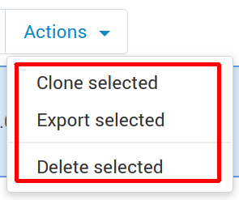
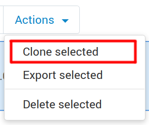
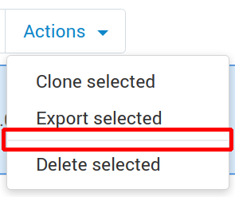
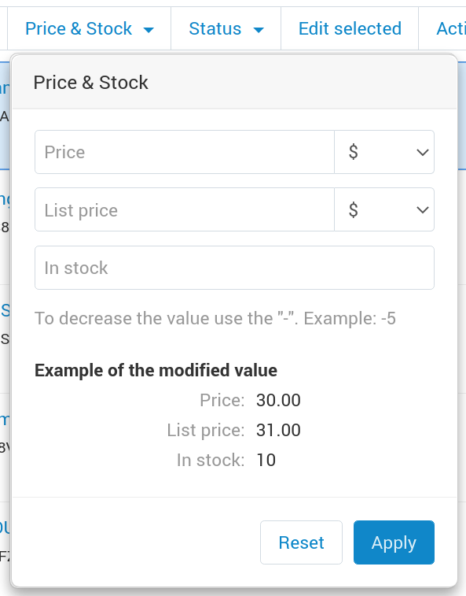

************
Context menu
************

CS-Cart has a **context menu**—a mechanism for performing actions on entities in bulk. It allows you to select objects from the list and perform actions on all of them at once. To see how the context menu works, just go to the list of products in the admin panel and select one of them. All actions on the products in the list must be implemented via the context menu.

To implement the context menu:

#. Create the schema for the entity.

#. Adapt the table that shows the list of the objects of this entity.

#. Implement the back end for bulk actions (deletion, status change, etc.).

You can find the examples of context menus in *app/schemas/context_menu*.

.. contents::
   :backlinks: none
   :local:

===================
Context Menu Schema
===================

The schema has the following structure:

::

 [   
    // The list of statuses for selecting the elements.
   'selectable_statuses' => array<string, string>
   // The list of context menu elements.
   'items'               => [                                                                                                 
       // Identifier of the element.
       'status'  => [                                       
           // Element name.                                                               
           'name'              => ['template' => 'status'],                                                                   
           // Element type (ActionItem/GroupItem/ComponentItem).
           'type'              => GroupItem::class,                                                                           
           // Data to be passed to the template. Use $data in the template to refer to the data.
           'data'              => [                                                                                           
               // menu_item_attributes, menu_item_class, action_attributes, action_class - used in the common templates.
    // menu_item_attributes, menu_item_class - add the attributes or classes to the menu elements. For example, cm-no-hide-input or mobile-hide to hide the element on mobile devices
    // action_attributes, action_class - add the attributes or classes to action elements (for example, cm-ajax, cm-post, cm-confirm) or change the action link by specifying an element with a href key and link in the action_attributes array.
              // cm-no-hide-input - leaves the input tags active if the form has the cm-hide-input class
               'menu_item_class' => 'cm-no-hide-input',         
               ...
           ],
           // The list of nested elements in GroupItem.
           'items'             => [                                                                                           
               // A link element
               'm_activate' => [                                                                                              
                   'name'          => [
                       'template' => 'change_to_status',
                       'params'   => [
                           '[status]' => __('active'),
                           ...
                       ],
                   ],
                    // The dispatch to which the identifiers of the selected elements will go; the dispatch is also used when checking if the element is available to the current user.
                   'dispatch' => 'profiles.m_activate',                                                                      
                   // The position of the element in the list
                   'position' => 10,                                                                                          
               ],
               // A separator element.
               'actions_divider'   => [                                                                                       
                    // The type of the element nested into GroupItem (GroupActionItem/ComponentItem/DividerItem). By default, the type is GroupActionItem.
                   'type'     => DividerItem::class,                                                                          
                   'position' => 20,
               ],
               // An element with its own template.
               'notify_checkboxes' => [                                                                                       
                   'type'          => ComponentItem::class,
                   // The template of the ComponentItem element.
                   'template'      => 'views/profiles/components/context_menu/notify_checkboxes.tpl',                         
                   // A callback function for forming the data to be passed to the template. To refer to that data in the template, use $data.
                   'data_provider' => static function () {                                                                    
                       return [
                           'param1' => 'value2',
                           ...
                       ];
                   },
                   'position'      => 30,
               ],
               ...
           ],
           // A callback function to check the availability of the element.
           'permission_callback' => static function ($request, $auth, $runtime) {                                             
               return !(
                   UserTypes::isVendor($auth['user_type'])
                   && UserTypes::isCustomer($request['user_type'])
                   && fn_check_permissions('profiles', 'm_activate', 'admin', 'POST', ['user_type' => $request['user_type']])
                   && fn_check_permissions('profiles', 'm_disable', 'admin', 'POST', ['user_type' => $request['user_type']])
               );
           },
           'position'            => 20,
       ],
       ...
   ],
 ]

.. list-table::
   :header-rows: 1
   :widths: 15, 15, 30

   * - Parameter
     - Required / optional
     - Description
   * - items
     - required
     - The array with elements of the context menu.
   * - selectable_statuses
     - optional
     - The array of statuses that can be used for selecting the elements. The keys of the array are the codes of the statuses. The values are the descriptions of statuses in the necessary language, fetched with function ``__()``.

=====================
Context Menu Elements
=====================

A context menu can contain elements like ActionItem, GroupItem, and ComponentItem.

----------
ActionItem
----------

A button in the context menu for a single action on the selected elements, without the need for a dropdown list or a popup next to the menu:

.. list-table::
   :header-rows: 1
   :widths: 15, 15, 30

   * - Parameter
     - Required / optional
     - Description
   * - type
     - required
     - ActionItem::class
   * - dispatch
     - required
     - A dispatch (for example, ``protucts.update``); it also determines availability to the current user.
   * - name
     - optional
     - An array of two elements: template and params. template—the name of the language variable; params—an optional array of :ref:`placeholders <langvar-placeholders>`.
   * - data
     - optional
     - An array with data.
   * - position
     - optional
     - The position of the element in the menu.
   * - permission_callback
     - optional
     - A function to check the availability of the element to the user; must return a boolean value; works together with dispatch.

---------
GroupItem
---------

A dropdown list with actions:

.. list-table::
   :header-rows: 1
   :widths: 15, 15, 30

   * - Parameter
     - Required / optional
     - Description
   * - type
     - required
     - ActionItem::class
   * - items
     - required
     - An array of other elements of the context menu.
   * - name
     - optional
     - An array of two elements: template and params. template—the name of the language variable; params—an optional array of :ref:`placeholders <langvar-placeholders>`.
   * - data
     - optional
     - An array with data; it will be available in the templates via $data.
   * - position
     - optional
     - The position of the element in the menu.
   * - permission_callback
     - optional
     - A function to check the availability of the element to the user; must return a boolean value; works together with dispatch.

---------------
GroupActionItem
---------------

An action in the GroupItem:

.. list-table::
   :header-rows: 1
   :widths: 15, 15, 30

   * - Parameter
     - Required / optional
     - Description
   * - dispatch
     - required
     - A dispatch (for example, ``protucts.update``); it also determines availability to the current user.
   * - name
     - optional
     - An array of two elements: template and params. template—the name of the language variable; params—an optional array of :ref:`placeholders <langvar-placeholders>`.
   * - type
     - optional
     - GroupActionItem::class
   * - data
     - optional
     - An array with data.
   * - position
     - optional
     - The position of the element in the menu.
   * - permission_callback
     - optional
     - A function to check the availability of the element to the user; must return a boolean value; works together with dispatch.

-----------
DividerItem
-----------

A divider between elements in the GroupItem:

.. list-table::
   :header-rows: 1
   :widths: 15, 15, 30

   * - Parameter
     - Required / optional
     - Description
   * - type
     - required
     - DividerItem::class
   * - position
     - optional
     - The position of the element in the menu.

-------------
ComponentItem
-------------

A custom component that appears and acts as you wanted to. For example, we use this component to change prices and quantity in bulk on the product list:

.. list-table::
   :header-rows: 1
   :widths: 15, 15, 30

   * - Parameter
     - Required / optional
     - Description
   * - type
     - required
     - ComponentItem::class
   * - template
     - required
     - The path to the connected template.
   * - name
     - optional
     - An array of two elements: template and params. template—the name of the language variable; params—an optional array of :ref:`placeholders <langvar-placeholders>`.
   * - data
     - optional
     - An array with data.
   * - data_provider
     - optional
     - The function that returns the data used in the connected template.
   * - position
     - optional
     - The position of the element in the menu.
   * - permission_callback
     - optional
     - A function to check the availability of the element to the user; must return a boolean value.

--------------------------------------
Components for Displaying Context Menu
--------------------------------------

The table with the context menu is shown by the *common/context_menu_wrapper.tpl* component. Here are the parameters for connecting it in the template:

.. list-table::
   :header-rows: 1
   :widths: 15, 15, 30

   * - Parameter
     - Required / optional
     - Description
   * - object
     - required
     - The name of the object which requires a context menu (schema name).
   * - form
     - required
     - The identifier of the form that will be submitted as a result of an action.
   * - id
     - optional
     - The identifier of the context menu, if you’d like to display multiple context menus on one page.
   * - class
     - optional
     - A class for the context menu wrapper block.
   * - attributes
     - optional
     - One or multiple attributes for the context menu wrapper block.
   * - hook
     - optional
     - The name of the hook where the context menu will be; if not specified, it will be considered to be “object_name:context_menu”
   * - has_permission
     - optional
     - A boolean value: “true” will show the context menu, and “false” will hide it.
   * - context_menu_class
     - optional
     - The class for the block of the context menu.
   * - is_check_all_shown
     - optional
     - A boolean value passed to the *common/check-items.tpl* template.

ComponentItem allows you to connect your own template. The following parameters can be passed to the template and used there:

.. list-table::
   :header-rows: 1
   :widths: 20, 40

   * - Parameter
     - Description
   * - item_id
     - Identifier of the element (the key of the element from the schema).
   * - item
     - An object of the ComponentItem class.
   * - data
     - The data from the schema (data, data_provider).
   * - params
     - Wrapper parameters (form, object, items …)

===========================================================
How to Adapt List of Entities for Working with Context Menu
===========================================================

* Wrap the block that displays the list of objects in a capture:

  ::

   {capture name=”entity_table”}
       %the block with the table with the list of objects%
   {/capture}

* Show the content of this capture with the *common/context_menu_wrapper.tpl* component:

  ::

   {include file="common/context_menu_wrapper.tpl"
      form="entity_form"
      object="entity"
      items=$smarty.capture.entity_table
   }

* Add the ``longtap-selection`` class to the block that has the table with the list of objects.

* Add the following attributes to the thead tag of the table with objects:

  * data-ca-bulkedit-default-object—to hide the table head when the context menu is displayed;

  * data-ca-bulkedit-component—to allow selecting objects in bulk.

* Add a hidden service ``input`` to the first box of the table’s heading (the first th); it will enable or disable the bulk selection mode for the table:

  ::

   <input type="checkbox"
         class="bulkedit-toggler hide"
         data-ca-bulkedit-disable="[data-ca-bulkedit-default-object]" // the attribute specifies the selector of the elements that need to be hidden when the context menu is displayed—for example, the heading of the table      data-ca-bulkedit-enable="[data-ca-bulkedit-expanded-object]" // the attribute specifies the selector of the elements that need to be shown when the context menu is active—for example, the control panel for objects
   />

* Add the following to the tbody tag:

  * The ``cm-longtap-target`` class.

  * Attributes: 

    * ``data-ca-longtap-action="setCheckBox"``—sets the type of action that occurs when clicking on the object; is added to the object with the <tr> (usually) where the checkbox with the identifier of the object is located.

    * ``data-ca-longtap-target="input.cm-item"``—specifies the selector which changes the selected atttinute for the found elements in data-ca-longtap-action.

    * ``data-ca-id="{$product.product_id}"``—contains the identifier of the object; for example, product ID.

* Add a checkbox to every object of the list; this checkbox is responsible for selecting the object and storing its ID:

  ::

   <input type="checkbox"
         name="product_ids[]"//the name is an example
         value="{$product.product_id}"
         class="cm-item cm-item-status-{$product.status|lower} hide"
   />

* The ``cm-status-*`` class is used for selecting objects with a specific status from the dropdown list in the table heading: All, None, Active, Disabled, Hidden, etc.
  
* The ``hide`` class is used for hiding the checkbox.

---------------------
Example of Adaptation
---------------------

The example: `https://gist.github.com/example <https://gist.github.com/torunar/cd603b08c43710247e94e7a232734aa9/revisions#diff-0dac47aa4091efd784c7649bbfff67513c49ece076b9ca5d74361e4afba2d3c4>`_

Before
------

::

 {capture name="mainbox"}

    <form action="{""|fn_url}" method="post" id="states_form" name="states_form">
        {include file="common/pagination.tpl" save_current_page=true save_current_url=true}

        {if $states}
            

                <table width="100%" class="table table-middle table--relative table-responsive state-table">
                <thead>
                    <tr>
                        <th width="6%" class="mobile-hide">
                            {include file="common/check_items.tpl" check_statuses=$state_statuses}
                        </th>
                        <th width="10%">{__("code")}</th>
                        <th>{__("state")}</th>
                    </tr>
                </thead>
                {foreach $states as $state}
                    <tr class="cm-row-status-{$state.status|lower} cm-longtap-target">
                        <td width="6%" class="mobile-hide">
                            <input type="checkbox" name="state_ids[]" value="{$state.state_id}" class="cm-item cm-item-status-{$state.status|lower}" />
                        </td>
                        <td width="10%" class="left nowrap row-status" data-th="{__("code")}">
                            {$state.code}
                        </td>
                        <td data-th="{__("state")}">
                            <input type="text" name="states[{$state.state_id}][state]" size="55" value="{$state.state}" class="input-hidden"/>
                        </td>
                    </tr>
                {/foreach}
                </table>
           

        {else}
            
{__("no_data")}

        {/if}

        {include file="common/pagination.tpl"}
    </form>

    {capture name="buttons"}
        {capture name="tools_list"}
            {hook name="states:manage_tools_list"}
                <li>{btn type="delete_selected" dispatch="dispatch[states.m_delete]" form="states_form"}</li>
            {/hook}
        {/capture}
        {dropdown content=$smarty.capture.tools_list}

        {if $states}
            {include file="buttons/save.tpl" but_name="dispatch[states.m_update]" but_role="action" but_target_form="states_form" but_meta="cm-submit"}
        {/if}
    {/capture}

    {capture name="adv_buttons"}
        {include file="common/popupbox.tpl" id="new_state" action="states.add" text=$title content=$smarty.capture.add_new_picker title=__("add_state") act="general" icon="icon-plus"}
    {/capture}

 {/capture}

 {include file="common/mainbox.tpl"
    title=__("states")
    content=$smarty.capture.mainbox
    adv_buttons=$smarty.capture.adv_buttons
    buttons=$smarty.capture.buttons
    select_languages=true
 }

After
-----

::

 {capture name="mainbox"}

    <form action="{""|fn_url}" method="post" id="states_form" name="states_form">
        {include file="common/pagination.tpl" save_current_page=true save_current_url=true}

        {if $states}
            {capture name="states_table"}
                

                    <table width="100%" class="table table-middle table--relative table-responsive state-table">
                    <thead
                        data-ca-bulkedit-default-object
                        data-ca-bulkedit-component
                    >
                        <tr>
                            <th width="6%" class="mobile-hide">
                                {include file="common/check_items.tpl" check_statuses=$state_statuses}

                                <input type="checkbox"
                                    class="bulkedit-toggler hide"
                                    data-ca-bulkedit-disable="[data-ca-bulkedit-default-object]"
                                    data-ca-bulkedit-enable="[data-ca-bulkedit-expanded-object]"
                                />
                            </th>
                            <th width="10%">{__("code")}</th>
                            <th>{__("state")}</th>
                        </tr>
                    </thead>
                    {foreach $states as $state}
                        <tr class="cm-row-status-{$state.status|lower} cm-longtap-target"
                            data-ca-longtap-action="setCheckBox"
                            data-ca-longtap-target="input.cm-item"
                            data-ca-id="{$state.state_id}"
                        >
                            <td width="6%" class="mobile-hide">
                                <input type="checkbox" name="state_ids[]" value="{$state.state_id}" class="cm-item cm-item-status-{$state.status|lower} hide" />
                            </td>
                            <td width="10%" class="left nowrap row-status" data-th="{__("code")}">
                                {$state.code}
                            </td>
                            <td data-th="{__("state")}">
                                <input type="text" name="states[{$state.state_id}][state]" size="55" value="{$state.state}" class="input-hidden"/>
                            </td>
                        </tr>
                    {/foreach}
                    </table>
                

            {/capture}

            {include file="common/context_menu_wrapper.tpl"
                form="states_form"
                object="states"
                items=$smarty.capture.states_table
            }
        {else}
            
{__("no_data")}

        {/if}

        {include file="common/pagination.tpl"}
    </form>

    {capture name="buttons"}
        {capture name="tools_list"}
            {hook name="states:manage_tools_list"}
            {/hook}
        {/capture}
        {dropdown content=$smarty.capture.tools_list}

        {if $states}
            {include file="buttons/save.tpl" but_name="dispatch[states.m_update]" but_role="action" but_target_form="states_form" but_meta="cm-submit"}
        {/if}
    {/capture}

    {capture name="adv_buttons"}
        {include file="common/popupbox.tpl" id="new_state" action="states.add" text=$title content=$smarty.capture.add_new_picker title=__("add_state") act="general" icon="icon-plus"}
    {/capture}

 {/capture}

 {include file="common/mainbox.tpl"
    title=__("states")
    content=$smarty.capture.mainbox
    adv_buttons=$smarty.capture.adv_buttons
    buttons=$smarty.capture.buttons
    select_languages=true
 }

===============
Schema Examples
===============

app/schemas/context_menu/products.php — categories, prices, and bulk editing
app/schemas/context_menu/payouts.php — notify_checkboxes
app/schemas/context_menu/product_features.php — group, category
