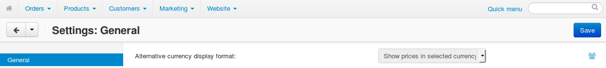
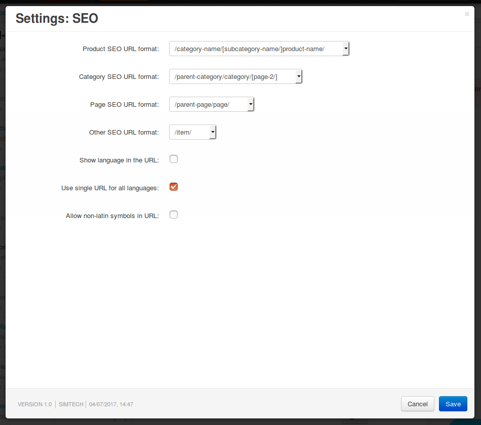
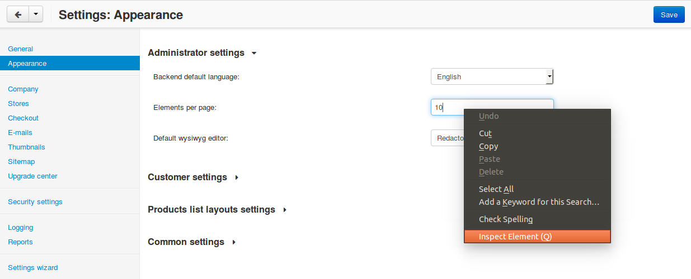
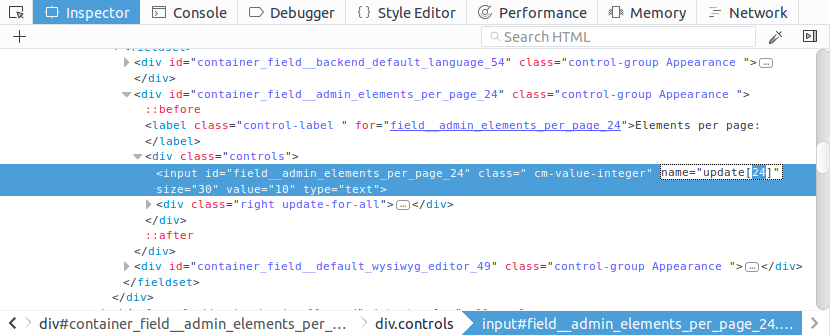
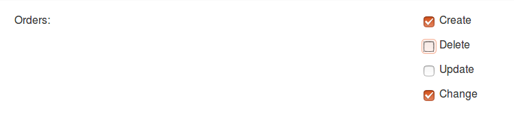

********
Settings
********

CS-Cart has 2 types of settings:

* **Core settings** affect CS-Cart in general and work regardless of what add-ons you have installed.

* **Add-on settings** affect the behavior of their respective add-ons.

Settings are managed via the ``Registry`` and ``Settings`` classes. The information about settings is stored in the database, in the tables with names that begin with ``settings_``. Administrators work with core and add-on settings in the administration panel.

.. contents::
    :local:
    :backlinks: none
    :depth: 2

=================================================
Working with Settings in the Administration Panel
=================================================

Core and add-on settings can be viewed and edited in the Administration panel. A setting has ``edition_type`` that determines when and where the setting appears (see :ref:`edition-type`):

* ``MVE`` (Multi-Vendor)—the setting will appear only in Multi-Vendor and only if the *All vendors* mode is selected in the dropdown list in the top left corner.

* ``ULT`` (СS-Cart and CS-Cart Ultimate)—the setting will appear both in the *All stores* mode and when a storefront is selected. Each storefront can have its own values for settings, depending on :ref:`edition_type <edition-type>`. Settings that aren't available when a storefront is selected will be hidden.

-------------
Core Settings
-------------

Core settings are located in the Administration panel on the **Settings** page (see the top menu). They are split into sections:

* General

* Appearance

* Company

* Stores

* Checkout

* E-mails

* Thumbnails

* Sitemap

* Vendors

* Upgrade center

* Security settings

* Image verification—this section was hidden starting with version 4.5.1

* Logging

* Reports

* Settings wizard

.. image:: img/tabs_with_settings.jpg
    :align: center
    :alt: Core settings in Multi-Vendor administration panel.   

A setting or a section with settings may or may not appear, depending on ``edition_type`` (see :ref:`edition-type`). A setting can have different values, depending on the storefront or vendor. Usually a core setting must belong to a section. If a setting doesn't belong to a section, the setting will be hidden.

For example, when there are multiple storefronts, the **Alternative currency display format** (``edition_type="ULT"``) will look like this:

---------------
Add-on Settings
---------------

Add-on settings are managed under **Add-ons → Manage add-ons** (see the top menu in the Administration panel). Most add-ons have their own settings. To open the settings of an add-on, use one of the two ways:

* Click the name of the add-on.

* Hover over the add-on. The gear button will appear on the right. Click it and choose **Settings**. Settings may not be available when a certain :ref:`edition_type <edition-type>` is set for them.

For example, here are the settings of the **SEO** add-on:

=================================
Working with Settings in the Code 
=================================

Settings are managed in the code via the ``Registry`` and ``Settings`` classes. These classes provide methods that add, change, and get the values of the settings.

------------------
The Registry Class
------------------

The ``Registry`` class allows to control settings from any part of the application. This class also performs caching of settings (see the *var/cache/registry* folder).

Here is how settings are controlled with the ``Registry`` class:

* Getting the value of a core/add-on setting::

    Registry::get('settings.SECTION_NAME.SETTING_NAME');
    Registry::get('addons.ADDON_NAME.SETTING_NAME');

* Changing the value of a core/add-on setting::

    Registry::set('settings.SECTION_NAME.SETTING_NAME', 'Some value');
    Registry::set('addons.ADDON_NAME.SETTING_NAME', 'Some value');

------------------
The Settings Class
------------------

The ``Settings`` class is an extended API that exists specifically to work with CS-Cart settings stored in the database. This class has many methods: checking the availability of settings; reading, changing, and removing the values of settings.

For example, here's how to manage the ``elements_per_page`` setting  (**Elements per page** from **Settings → Appearance**) with the ``Settings`` class:

* Checking the availability of the setting::

    Settings::instance()->isExists('elements_per_page', 'Appearance');

* Getting the value of the setting::

    Settings::instance()->getValue('elements_per_page', 'Appearance');

* Changing the value of the setting::

    Settings::instance()->updateValue('elements_per_page', $new_value, 'Appearance');

===============
Add-on Settings
===============

---------------------------------
Declaring Settings in *addon.xml*
---------------------------------

Settings of an add-on are declared in the **addon.xml** file located in the directory of that add-on. The list of settings is added to the ``<settings>`` section of **addon.xml**.

Here are the attributes of the ``<settings>`` section:

* ``layout``—determines the look of the window with the add-on's settings. By default, settings will appear in a pop-up window; if you specify ``layout="separate"``, settings will appear on a separate page.

* ``edition_type``—determines when and where the setting will be available (see :ref:`edition-type`).

.. note::

    Both of these parameters are optional.

For example, ``<settings layout="separate" edition_type="ROOT">`` means that the settings will appear on a separate page and will be available in the *All stores*/*All vendors* mode.

.. _settings-structure:

-------------------------------------
Structure of the *<settings>* Section
-------------------------------------

.. code-block:: xml

   <settings layout="separate" edition_type="ROOT,ULT:VENDOR">
           <sections> <!-- The list of tabs (sections) in add-on settings -->
               <section id="section1"> <!-- A section with settings has the following attributes:
                   id—an identifier by which a setting can be addressed: 
                      Registry::get('addons.[addon_id].[setting_id]')
                   edition_type—determines when and where the section is available;
                                this parameter is optional and supports 
                                multiple variants separated by commas.
               -->
                   <items> <!-- The list of settings in the section -->
                       <item id="header"> <!-- The settings
                           id—the identifier of the setting.
                           edition_type—determines when the setting is available;
                                        this parameter is optional and supports 
                                        multiple variants separated by commas.
                       -->
                           <type>header</type> <!-- see Attachment 2 for 
                               the description of possible values:
                                 input, textarea, password, checkbox, selectbox, 
                                 multiple select, multiple checkboxes, 
                                 countries list, states list,
                                 file, info, header, template
                           -->
                           <default_value>radio_1</default_value> <!-- The default 
                           value assigned to the setting. -->
                           <variants> <!-- The variants for the following types:
                           selectbox, multiple select, 
                           multiple checkboxes, combo select -->
                               <item id="radio_1"></item> <!-- id—the identifier of the variant-->
                           </variants>
                   </items>
               </section>
   </settings>

.. _function-types-for-settings:

-----------------------------------
Functions for Working with Settings
-----------------------------------

The variants of values for settings can be changed and added via 2 types of functions: **variants.functions** and **actions.functions**:

* **variants.functions** generate the list of possible variants without recording those variants to the database. The variants of values for a setting are generated dynamically every time when someone opens the page with that setting. 

  These functions must be in the **variants.functions.post.php** file in the *[addon_name]/schemas/settings* directory. The functions must be named as follows: ``fn_settings_variants_addons_[addon_name]_[setting_name]()``.

  Let's assume that the **my_changes** add-on has a setting with ``example`` as its ID. To generate the variants of values for this setting, create the **variants.functions.post.php** file in *my_changes/schemas/settings*. This file must contain a function called ``fn_settings_variants_addons_my_changes_example()``.

* **actions.functions** are called when add-ons are installed and uninstalled. For example, these functions generate fields for the add-on's settings in the database during add-on installation. They also remove those fields when the add-on is uninstalled.

  These functions must be located in the **actions.functions.post.php** file in the *[addon_name]/schemas/settings*. The functions must be named as follows: ``fn_settings_actions_addons_[addon_name]_[setting_name]()``.

  Let's assume that the **my_changes** add-on has a setting with ``example`` as its ID. To create a function for this setting, create the **actions.functions.post.php** file in *my_changes/schemas/settings*. This file must contain a function called ``function fn_settings_actions_addons_my_changes_example()``.

============================
Storing the Data of Settings
============================

The data about core and add-on settings is stored in the database. The names of the tables that contain this data begin with ``settings_``:

-------------------------
Table *settings_sections*
-------------------------

The ``settings_sections`` table contains the list of sections to which the settings may belong. This table has the following fields:

* ``section_id``—the identifier of the section.

* ``parent_id``—the identifier of the parent section.

* ``edition_type``—:ref:`the information on when and where the section will be available <edition-type>`; this field determines if the section will be available in CS-Cart/Multi-Vendor, and which level of access an administrator must have. This field may include one value or multiple values separated by commas (for example, ``ROOT,ULT:VENDOR``).

* ``name``—the name of the section.

* ``position``—the position of the section relative to other sections.

* ``type``—the type of the section:

  * ``CORE``—a section of the core settings. All the sections of this type are listed on the **Settings** page in the Administration panel (see the **settings.php** controller).

  * ``ADDON``—a section with the add-on settings. All sections of this type appear either in a pop-up window or on a separate page and include the settings of an add-on (see the **addons.php** controller).

  * ``TAB``—a subsection of settings (a tab). Core and add-on settings can both have tabs. Each subsection has the ID of its parent section in the ``parent_id`` field.

  * ``SEPARATE_TAB``—a subsection of settings (a tab). Core and add-on settings can both have tabs, but this tab is added as a separate container. Each subsection has the ID of its parent section in the ``parent_id`` field.

  .. note::

      Only sections with the ``CORE`` or ``ADDON`` type can have subsections.

Here is an example of the entry in the database—the ``Appearance`` section:

.. list-table::
    :header-rows: 1
    :widths: 15 15 25 25 10 5

    *   -   section_id
        -   parent_id
        -   edition_type
        -   name
        -   position
        -   type
    *   -   4
        -   0
        -   ROOT,VENDOR
        -   Appearance
        -   20
        -   CORE

Here is how to learn the ID of the section in the Administration panel:

* **Core settings**: go to the **Settings** page and select a section. The name of the section will be displayed in the browser's address bar as the ``section_id`` parameter in the URL.

  For example, the **Appearance** section will have ``Appearance`` as ``section_id``. The URL will look like this: *example.com/admin.php?dispatch=settings.manage&section_id=Appearance*

* **Add-on settings**: go to **Add-ons → Manage add-ons** and click the gear button of an add-on. If you hover over the **Uninstall** action, a URL should appear at the bottom of the browser window. The URL will include the ``addon`` parameter with the name by which the add-on can be referred to in the code.

  For example, **Customers also bought** add-on will have ``customers_also_bought`` as a name. The URL will look like this (note that this example only includes a part of the URL): *example.com/admin.php?dispatch=…&addon=customers_also_bought&…*

------------------------
Table *settings_objects*
------------------------

The ``settings_objects`` table contains the list of core settings and add-on settings, and their values. This table has the following primary fields:

* ``object_id``—the identifier of the setting.

* ``edition_type``—:ref:`the information on when and where the setting will be available <edition-type>`; this field determines if the setting will be available in CS-Cart/Multi-Vendor, and which level of access an administrator must have.

* ``name``—the name of the setting.

* ``section_id``—the identifier of the section to which the setting belongs.

* ``section_tab_id``—the identifier of the tab (if the setting is located in a tab).

* ``type``—the type of the setting.

* ``value``—the value of the setting.

* ``position``—the position of the setting relative to other settings.

Here is an example of the entry in the database—``company_name`` (**Company name** from **Settings → Company**):

.. list-table::
    :header-rows: 1
    :widths: 10 15 15 10 10 5 10 5

    *   -   object_id
        -   edition_type
        -   name
        -   section_id
        -   section_tab_id
        -   type
        -   value
        -   position
    *   -   1
        -   ROOT,ULT:VENDOR
        -   company_name
        -   5
        -   0
        -   I
        -   Simtech
        -   0

To learn the identifier of the setting, view the code of the page with the setting. For example, let's learn the identifier of the ``elements_per_page`` setting (**Elements per page** from **Settings → Appearance**).

To do this, go to **Settings → Appearance**, click the right mouse button on the setting and choose **Inspect element**. The identifier of the setting can be found in the square brackets [] in the ``name`` attribute.

-------------------------
Table *settings_variants*
-------------------------

The ``settings_variants`` table contains the list of variants (possible values) for the settings with the following types: ``selectbox``, ``multiple select``, and ``multiple checkboxes``. Administrators choose one of the predetermined variants as the value of the setting.

For example, there is a setting called **Orders** in the **Settings → Logging** section. The information about which variants are chosen is stored in the ``log_type_orders`` setting (see the ``settings_objects`` table). The list of all possible variants for this setting is stored in ``settings_variants``.

You can get the list of all the possible values of a setting by the ``object_id`` field. If the table doesn't have any variants for the setting, it means that they are formed dynamically via the :ref:`variants.functions <function-types-for-settings>`.

-----------------------------
Table *settings_descriptions*
-----------------------------

The ``settings_descriptions`` table contains the names of sections, settings and variants, and the tooltips for different languages. Here are the primary fields of the table:

* ``object_id``—the identifier of the setting.

* ``object_type``—one of the following types:

  * ``V``—the name of a variant of a setting value (see the ``settings_variants`` table).

  * ``O``—the name of a setting (see the ``settings_objects`` table).

  * ``S``—the name of a section (see the ``settings_sections`` table).

* ``lang_code``—the language code.

* ``value``—the name of a setting/section/value in the specified language.

* ``tooltip``—the tooltip of a setting/section/value.

This table contains the information for all the languages that are currently installed. When searching the database for a specific value, you need to consider ``lang_code`` as well as  ``object_id`` and ``object_type``.

.. _edition-type:

===============================================
Attachment 1: Possible Values of *edition_type*
===============================================

.. note::

    An add-on can have multiple values of ``edition_type`` separated by commas. If you don't specify any value, it will behave like ``ROOT``.

.. list-table::
    :header-rows: 1
    :widths: 5 20

    *   -   Value:
        -   Description:
    *   -   ``NONE``
        -   The setting won't appear in the interface and won't be editable.
    *   -   ``ROOT``
        -   The setting will appear in the interface and will be editable, but only in the *All stores*/*All vendors* mode.
    *   -   ``VENDOR``
        -   The setting will appear both in the *All stores*/*All vendors* mode and when a specific storefront/vendor is selected. If you add ``ULT:NONE`` after comma, the setting will only be editable when a storefront is selected.
    *   -   ``MVE:NONE``
        -   The setting won't appear in Multi-Vendor. To make the setting appear in CS-Cart, you'll need to add another value after comma, for example, ``ULT:ROOT``.
    *   -   ``MVE:ROOT``
        -   The setting will appear in Multi-Vendor, but only in the *All vendors* mode.
    *   -   ``ULT:NONE``
        -   The setting won't appear in CS-Cart. To make the setting appear in Multi-Vendor, you'll need to add another value after comma, for example, ``ROOT`` or ``MVE:ROOT``.
    *   -   ``ULT:ROOT``
        -   The setting will appear in CS-Cart, but only when the *All stores* mode is selected.
    *   -   ``ULT:VENDOR``
        -   The setting will appear both in the *All stores* mode and when a specific storefront is selected. If you add ``ULT:NONE`` after comma, the setting will only be editable when a storefront is selected.
    *   -   ``ULT:VENDORONLY``
        -   The setting won't appear in the interface, but can be edited for a specific storefront via the code.

======================================================
Attachment 2: Possible Values of *<type>* for Settings
======================================================

The types of settings are specified in the **addon.xml** file in the ``<type>`` parameter (see :ref:`settings-structure`).

For example, let's add a setting ``new_setting`` with the ``checkbox`` type and ``N`` (unticked checkbox) as the default value. This setting needs to be added to the **addon.xml** file of the add-on; here is what it looks like in the file::

  <settings edition_type="ROOT">
     <sections>
         <section id="general">
             <items>
                 <item id="new_setting">
                 <type>checkbox</type> // This parameter determines
                                       //  what the setting will look like. 
                 <default_value>N</default_value>
             </item>
         </section>
     </sections>
  </settings>

Here are the possible values of ``<type>`` (the letters in brackets are how these types are stored in the database):

* ``selectable_box`` (``B``)—a multiple select box that consists of two lists: one list with possible values, and the other list with selected values::

    <type>selectable_box</type>

  .. image:: img/selectable_box.png
      :align: center
      :alt: A setting with the "selectable_box" type in CS-Cart interface.

* ``сheckbox`` (``С``)—a checkbox::

    <type>checkbox</type>

  .. image:: img/selectable_box.png
      :align: center
      :alt: A setting with the "checkbox" type in CS-Cart interface.

* ``hidden`` (``D``)—a hidden setting that users won't see::

    <type>hidden</type>
 
* ``template`` (``E``)—a file with a custom template. Templates must be located in the *design/backend/templates/addons/[addon]/settings* directory. The content of the template will appear in place of the setting, but only if the add-on is active. For example::

    <type>template</type>
    <default_value>settings.tpl</default_value> // the name of the template to show.

  In this case the template with a field for category selection is loaded:

  .. image:: img/template.png
      :align: center
      :alt: A setting with the "template" type in CS-Cart interface.

* ``file`` (``F``)—a field for selecting a file::

    <type>file</type>

  .. image:: img/file.png
      :align: center
      :alt: A setting with the "template" type in CS-Cart interface.

* ``checkboxes`` (``G``)—a list of checkboxes with the ability to choose multiple variants; the variants are added via :ref:`variants.functions <function-types-for-settings>`::

    <type>checkboxes</type>

  This list can be used to create a list of variants for a ``selectbox`` (``K``) setting.

  .. image:: img/checkboxes.png
      :align: center
      :alt: A setting with the "checkboxes" type in CS-Cart interface.

* ``header`` (``H``)—a heading for a block with settings or for a piece of content::

    <type>header</type>

  .. image:: img/header.png
      :align: center
      :alt: A setting with the "header" type in CS-Cart interface.

* ``input`` (``I``)—an input field for entering any symbols. Entire texts can be entered there, but it's inconvenient to read them in that field::

    <type>input</type>

  .. image:: img/input.png
      :align: center
      :alt: A setting with the "input" type in CS-Cart interface.

* ``selectbox`` (``K``)—a dropdown list that allows choosing one of the variants::

    <type>selectbox</type>

  The variants that are available depend on the selected values of the ``checkboxes`` (``G``) setting.

  .. image:: img/selectbox_k.png
      :align: center
      :alt: A setting with the "selectbox" type in CS-Cart interface.

* ``multiple_select`` (``M``)—a list of possible values with scrolling and the ability to choose multiple variants. When adding this list, specify the possible values in the ``variants`` parameter::

    <item id="multiple_select">
       <type>multiple select</type>
       <variants>
           <item id="select_box_1"></item>
           <item id="select_box_2"></item>
           <item id="select_box_3"></item>
       </variants>
    </item>

  .. image:: img/multiple_select.png
      :align: center
      :alt: A setting with the "multiple_select" type in CS-Cart interface.

* ``multiple_checkboxes`` (``N``)—a list of checkboxes with the ability to tick multiple checkboxes. When adding the list, the checkboxes are specified in the ``variants`` parameter::

    <item id="multiple_checkboxes">
       <type>multiple checkboxes</type>
       <variants>
           <item id="select_box_1"></item>
           <item id="select_box_2"></item>
           <item id="select_box_3"></item>
       </variants>
       <default_value>select_box_2</default_value>
    </item>

  .. image:: img/multiple_checkboxes.png
      :align: center
      :alt: A setting with the "multiple_checkboxes" type in CS-Cart interface.

* ``info`` (``O``)—the results of the function that was passed in the ``<handler>`` parameter. Usually contains some sort of information. For example, let's show the output of a function called ``fn_get_information`` in the ``information`` setting::

    <item id="information">
       <type>info</type>
       <handler>fn_get_information</handler>
    </item>

  .. image:: img/info.png
      :align: center
      :alt: A setting with the "info" type in CS-Cart interface.

* ``password`` (``P``)—a field for entering the password. All the entered symbols are displayed as ``*``::

    <type>password</type>

  .. image:: img/password.png
      :align: center
      :alt: A setting with the "password" type in CS-Cart interface.

* ``radiogroup`` (``R``)—a group of radiobuttons; only one of them can be selected at a time. The button themselves are specified in the ``variants`` parameter::

    <item id="radiogroup">
       <type>radiogroup</type>
       <default_value>radio_2</default_value>
       <variants>
           <item id="radio_1"></item>
           <item id="radio_2"></item>
       </variants>
    </item>

  .. image:: img/radiogroup.png
      :align: center
      :alt: A setting with the "radiogroup" type in CS-Cart interface.

* ``selectbox`` (``S``)—a dropdown list with the ability to choose only one variant. When adding a list, specify the possible variants in the ``variants`` parameter::

    <item id="selectbox">
       <type>selectbox</type>
       <variants>
           <item id="select_box_1"></item>
           <item id="select_box_2"></item>
       </variants>
    </item>

  .. image:: img/selectbox_s.png
      :align: center
      :alt: A setting with the "selectbox" type in CS-Cart interface.

* ``textarea`` (``T``)—a field for entering texts::

    <type>textarea</type>

  .. image:: img/textarea.png
      :align: center
      :alt: A setting with the "textarea" type in CS-Cart interface.

* ``input`` (``U``)—a field for entering numbers only; all other symbols are removed::

    <type>input</type>

  .. image:: img/input_1.png
      :align: center
      :alt: A setting with the "input" type in CS-Cart interface.

* ``states_list`` (``W``)—a dropdown list for choosing a state or region::
 
    <item id="states_list">
       <type>states_list</type>
    </item>

  .. image:: img/states_list.png
      :alt: A setting with the "states_list" type in CS-Cart interface.

* ``countries_list`` (``X``)—a dropdown list for choosing a country::

    <item id="countries_list">
       <type>countries_list</type>
    </item>

  .. image:: img/countries_list.png
      :align: center
      :alt: A setting with the "countries_list" type in CS-Cart interface.

* ``permanent_template`` (``Z``)—a file with a custom template. It will always be available, even if the add-on is disabled. The file must be located in the *design/backend/templates/addons/[addon]/settings* directory.

  For example, let's add a ``permanent_template`` setting that shows the content of **permanent_template.tpl**:: 

    <item id="permanent_template">
        <type>permanent_template</type>
        <default_value>permanent_template.tpl</default_value>
    </item>
