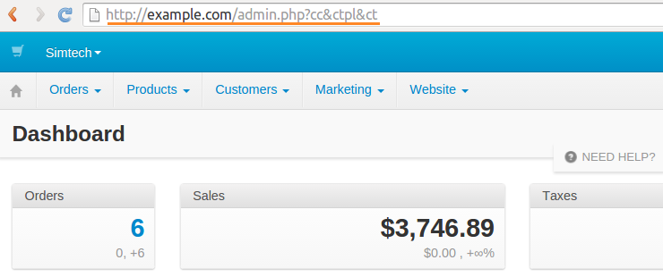

******************
Clearing the Cache
******************

CS-Cart caches scripts, styles, templates, etc. to increase page loading speed. If the changes you've made don't appear on the page, try clearing the cache.

By default, CS-Cart stores cache in the **var/cache** folder. There are several subfolders there:

* **templates**—cache of the compiled templates
* **registry**—Registry cache
* **static**—static cache
* **misc**—miscellaneous cache

==============================================
Automatic Template and Static Cache Rebuilding
==============================================

To make CS-Cart clear and rebuild template and static cache automatically, complete these steps:

1. Open the Administration Panel.

2. Go to **Design → Themes**.

3. Set the **Rebuild cache automatically** setting to **On**. This tracks the modified files in real time and disables block cache.

.. note::

    Your store may work slower as a result. We recommend to turn this setting off after you complete the development.

.. important::

    If you try to use a new hook (for example, you add it to the **init.php** of an addon), clear the cache manually. Automatic cache rebuilding doesn't add new hooks to the template hook cache.

.. image:: img/rebuild_cache.png
    :align: center
    :alt: You can configure CS-Cart to rebuild cache as soon as a file is modified.

===========================
Clearing Cache in a Browser
===========================

You can clear the cache by adding parameters to URLs in your browser:

1. Open the Administration Panel.

2. Add the ``cc`` parameter to the URL, so that it would look like this:

::

  http://example.com/admin.php?cc

or like this: 

::

  http://example.com/admin.php?dispatch=products.manage&cc

3. Press **Enter**.

.. hint::

    :doc:`Remember to rename admin.php for security reasons <../../install/security>`. Once you do it, use the new file name in the URL instead of **admin.php**. 

You can add one of the following parameters to your URLs:

* **ct**—delete all the thumbnails that were generated automatically
* **ctpl**—clear template cache
* **cc**—clear registry and miscellaneous cache

=====================
Manual Cache Clearing
=====================

You can clear the cache manually by deleting or renaming the **var/cache** folder in the CS-Cart installation directory. Use the command below:

::

  cd root/folder/of/your/store/var
  rm -r cache

.. hint::

    Replace **root/folder/of/your/store** with the path to your store on the server.

.. note::

    The **cache** folder will reappear and the cache will be generated again after someone opens your store in a browser.

.. meta::
   :description: Clearing cache in CS-Cart and Multi-Vendor sites is the first thing to do when you make changes to the looks and these changes have no effect.
