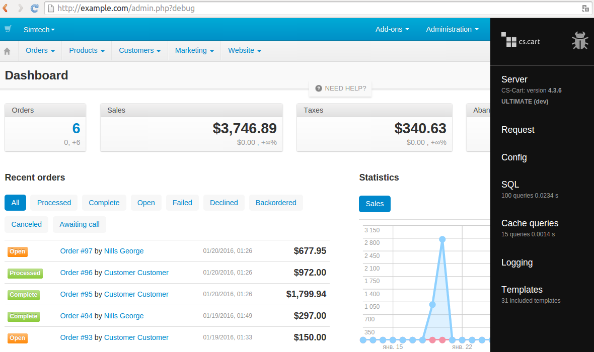

*******************
Configuring CS-Cart
*******************

==============================
Development Configuration File
==============================

CS-Cart allows you to create a separate configuration file where you can specify settings without modifying **config.local.php**. This file is called **local_conf.php**.

.. note::

    The settings specified in **local_conf.php** take priority over **config.local.php**.

To configure CS-Cart for development, complete the steps below: 

#. Create **local_conf.php** in the root directory of your installation. 

#. Open **local_conf.php** and add the following code to it:

   .. code-block:: php

       <?php

      // If you need to work on a live store, you can make the settings below apply to a certain IP only, so that the customers won't be affected. Specify your IP address instead of 127.0.0.1.
      if ($_SERVER['REMOTE_ADDR'] == '127.0.0.1') {

          // Turn on the Debug mode for the admin panel and the storefront
          // define('DEBUG_MODE', true);

          // Use the Development mode to display errors
          define('DEVELOPMENT', true);

          // Display SMARTY and PHP errors on the screen.
          error_reporting(E_ALL);
          ini_set('display_errors', 'on');
          ini_set('display_startup_errors', true);

          // Disable PHP block caching
          $config['tweaks']['disable_block_cache'] = true;

      }

      // You can change configuration without changing config.local.php.

      /*
      $config['db_host'] = '%DB_HOST%';
      $config['db_name'] = '%DB_NAME%';
      $config['db_user'] = '%DB_USER%';
      $config['db_password'] = '%DB_PASSWORD%';

      $config['http_host'] = '%HTTP_HOST%';
      $config['http_path'] = '%HOST_DIR%';

      $config['https_host'] = '%HTTPS_HOST%';
      $config['https_path'] = '%HOST_DIR%';
      */
  
      // You can also configure cache and storage backend
  
      /*
      // Cache backend
      // Available backends: file, sqlite, database, redis, xcache, apc
      // To use sqlite cache the "sqlite3" PHP module should be installed
      // To use xcache cache the "xcache" PHP module should be installed
      // To use apc cache the "apc" PHP module should be installed
      $config['cache_backend'] = 'file';
      $config['cache_redis_server'] = 'localhost';
      $config['cache_redis_global_ttl'] = 0; // set this if your cache size reaches Redis server memory size

      // Storage backend for sessions. Available backends: database, redis
      $config['session_backend'] = 'database';
      $config['session_redis_server'] = 'localhost';
      $config['cache_apc_global_ttl'] = 0;
      $config['cache_xcache_global_ttl'] = 0;
      */

=======================
Configuration Explained
=======================

---------------
IP Restrictions
---------------

You can limit the settings you specify in **local_conf.php** to a certain IP. That is useful if you work on a live store: that way only you would see the error messages and the debugger.

The IP restrictions are added with the following part of the code::

  if ($_SERVER['REMOTE_ADDR'] == '127.0.0.1')

.. hint::

    If you work on a live store, replace *127.0.0.1* with your IP address. If the store isn’t available to public yet, you can remove the condition.

----------
Debug Mode
----------

CS-Cart has a built-in :doc:`debugger </developer_guide/tools/debugger>` that shows:

* Server and PHP settings.

* The list of SQL queries during the opening of the current page.

* The templates that were used for building the page.

* Request parameters.

* The time and memory used for opening the page.

To access the debugger, go to the Administration panel and add the ``debug`` parameter to the URL, so that it would look like this::

  http://example.com/admin.php?debug

The **bug** icon will appear in the top right corner of the page. Click it to open and close the debugger sidebar. Alternatively, you can hit ``Ctrl + Alt + D``.

.. note::

    Using ``debug`` will also make the debugger available in the customer area for the current browser session.

To keep the debugger enabled both on the storefront and in the administration panel at all times, uncomment the following line in **local_conf.php**::

  define('DEBUG_MODE', true);

.. warning::

    Do not use ``define('DEBUG_MODE', true);`` on a live store. That way your store visitors may get access to your debug data, which is bad.

----------------
Development Mode
----------------

When you write PHP code, a Smarty template or an SQL query, mistakes might happen. Usually Smarty and PHP errors result in a blank page. A database error caused by a wrong SQL query will result in the following message: **SERVICE UNAVAILABLE. Sorry, service is temporarily unavailable.**

.. image:: img/error_db.png
    :align: center
    :alt: A wrong SQL query results in the SERVICE UNAVAILABLE page.

To see the actual error messages, use **Development Mode**. You can enable it in **local_conf.php** with the following line::

  define('DEVELOPMENT', true);

Now, if something goes wrong, you should see an error message with the path to the file that caused the error.

.. image:: img/error_message.png
    :align: center
    :alt: An error message in CS-Cart as it appears in the developer mode.

.. _design-and-themes-repository:

**Development Mode** has another useful feature for add-on developers.

CS-Cart stores the **CSS** and **TPL** files of the installed add-ons in the *design/themes* directory. Normally CS-Cart deletes these files when the add-on is uninstalled. If the add-on is installed again, these files are taken from *var/themes_repository*.

That way you may lose your changes if you modify the **.css** and **.tpl** files of an add-on in the *design/themes* directory and then uninstall that add-on in the Administration panel.

However, if you enable **Development Mode**, the files of the add-on in the *design/themes* directory won’t be deleted when you uninstall the add-on.

.. warning::

    If *var/themes_repository* has the **.css** or **.tpl** files of the add-on, they will still overwrite the files in *design/themes* when you install the add-on.

---------------------------------------
Display Smarty and PHP Errors on Screen
---------------------------------------

Sometimes you also need to redefine PHP and/or web server settings for the error messages to appear. That’s why we added the following code to **local_conf.php**::

  error_reporting(E_ALL);
  ini_set('display_errors', 'on');
  ini_set('display_startup_errors', true);

-------------------------
Disable PHP Block Caching
-------------------------

CS-Cart caches blocks to reduce page loading times. However, when you work on a project, you want to see the latest changes you’ve made. That’s why you may want to disable PHP block caching by adding the following code to **local_conf.php**::

  $config['tweaks']['disable_block_cache'] = true;

--------------------------
Database and Host Settings
--------------------------

You can redefine the database credentials and the HTTP host of your store. It is useful when you work on a local copy of an existing store and don’t want to change **config.local.php**.

Uncomment and specify these settings in **local_conf.php**::

  $config['db_host'] = '%DB_HOST%';
  $config['db_name'] = '%DB_NAME%';
  $config['db_user'] = '%DB_USER%';
  $config['db_password'] = '%DB_PASSWORD%';

  $config['http_host'] = '%HTTP_HOST%';
  $config['http_path'] = '%HOST_DIR%';

  $config['https_host'] = '%HTTPS_HOST%';
  $config['https_path'] = '%HOST_DIR%';

.. hint::

    Learn more about these settings in Step 3 of the :doc:`instruction about moving the store to a new server </install/moving_to_another_server>`.

-------------------------
Cache and Session Backend
-------------------------

You can use **local_conf.php** to redefine storage the cache backend. Uncomment the following code and specify the desired settings:: 

  $config['cache_backend'] = 'file';
  $config['cache_redis_server'] = 'localhost';
  $config['cache_redis_global_ttl'] = 0; // set this if your cache size reaches Redis server memory size

.. note::

    The *file*, *sqlite*, *database*, *redis*, *xcache*, and *apc* backends are available. *Sqlite*, *apc* and *xcache* require the corresponding PHP modules to be installed on your server.

You can also change the storage backend for sessions. Uncomment the following code and specify the desired settings::

  $config['session_backend'] = 'database';
  $config['session_redis_server'] = 'localhost';
  $config['cache_apc_global_ttl'] = 0;
  $config['cache_xcache_global_ttl'] = 0;

.. note::

    The *database* and *redis* backends are available for sessions.
