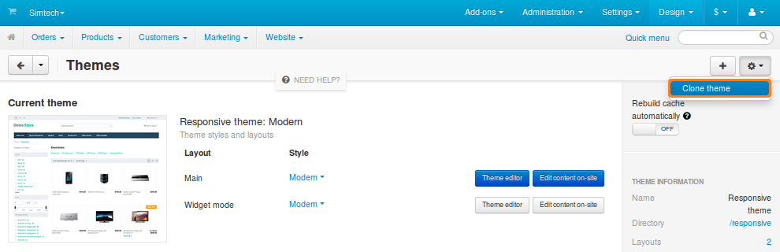
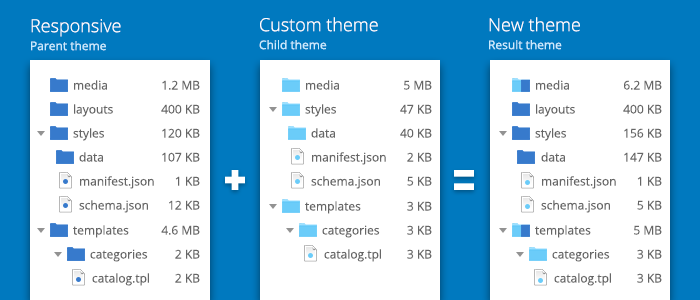

*******************************
DOs and DON’Ts for CS-Cart Devs
*******************************

.. note::

    Please try to follow the rules outlined below. We believe that it would make CS-Cart and Multi-Vendor more convenient to use and upgrade.

.. contents::
   :backlinks: none
   :local:

=======================
Don’t Change Core Files
=======================

CS-Cart and Multi-Vendor are open source software. It means that after you download CS-Cart and unpack the archive, you can open any file and see its inner workings. All the files that come with CS-Cart or Multi-Vendor by default are called **core files**.

Since the source code is open, you could make the system better suit your needs by modifying the core files... but you shouldn’t. Instead we suggest :ref:`making changes indirectly <right-way-to-customize-cart>` (for example, as separate add-ons).

.. important::

    This rule has some exceptions, even though they are few. For example, we do advise :doc:`renaming admin.php for security reasons <../../install/security>` right after you install CS-Cart or Multi-Vendor.

----------------------------------
Why Shouldn’t I Change Core Files?
----------------------------------

.. note::

    **Short answer:** Changing core files can result in issues with add-on compatibility. You can also lose your changes or have them cause a bug after an upgrade. Reverting the changes may get just as complicated as making them.

If you decide to upgrade a store with a modified core file to a new version of CS-Cart/Multi-Vendor, here’s what might happen during the upgrade:

* The core file gets overwritten and you lose your changes.

* Some other file gets changed, and that change affects your modification. It may result in a bug, which you’d be able to fix only by reverting the changes in the core file.

Things can get problematic even without an upgrade. Let’s assume that you have a modified core file, and a third-party add-on doesn’t work properly, although it should work on your version of CS-Cart.

Normally, the first suggestion is to disable other add-ons to make sure that the problem isn’t caused by them. But if you applied some modifications directly to core files, you’d have to revert them too, just to be sure. This can become a hassle, especially if some pieces of the default code were removed or replaced.

----------------------------------------------
How Can I Check if My Core Files Were Changed?
----------------------------------------------

In CS-Cart & Multi-Vendor 4.4.1 we introduced the **File Changes Detector**. It monitors changes in core files and notifies you about them. When you open the Administration panel of your store, you can check if any of your core files was modified:

1. Go to **Administration → File changes detector**.

2. Click **Scan for changed core files**.

.. image:: img/file_changes_detector.png
    :align: center
    :alt: Starting with version 4.4.1, CS-Cart and Multi-Vendor have a tool to detect changes in core files.

You can also configure your store to automatically check for modified core files every time you log in to the Administration panel. To do that:

1. Go to **Settings → General**.

2. Make sure that the **Monitor changes in core files** checkbox is ticked. 

3. Click the **Save** button in the top right corner.

Now, if any core file differs from the default file, the following notification will appear when you open the Administration panel:

.. important::

    Some of your core files were changed manually. That can lead to various problems, especially when upgrading to a new version of CS-Cart.

.. _right-way-to-customize-cart:

================================
Do Your Modifications Indirectly
================================

CS-Cart and Multi-Vendor offer ways to make changes without modifying the core files:

* Use hooks to create your own add-ons that extend functionality.

* Clone the themes and edit the clones instead of modifying the default themes directly.

---------------------
Use Add-ons and Hooks
---------------------

If you need to add or change functionality, you can implement it :doc:`as a separate add-on <../addons/index>`. When you :doc:`create an add-on <../addons/tutorials/advanced>`, you can use :doc:`hooks <../addons/hooking/index>` to add or modify the code in the core files indirectly.  Here are the benefits of this approach:

* All the files of the add-on are stored separately, in the folders with the add-on’s name. It’s easier to keep track of the changes you make, because you’re modifying only the files that you created.

* Changes can be reverted and added back in a few clicks, simply by disabling or enabling the add-on. This comes useful if you suspect that your changes may conflict with another add-on or upgrade.

.. important::

    You can request new hooks for future versions of CS-Cart `here <http://forum.cs-cart.com/topic/40547-your-add-on-needs-a-new-hook-in-cs-cart-post-it-here/>`_. Please check our :doc:`rules of hook creation <../core/coding_standards/hooks>` first—we may adjust your suggested hook to meet those requirements.

-----------------------
Edit Only Cloned Themes
-----------------------

If you need to change the look of the store, don’t modify the default **Responsive** theme. Instead you can :doc:`create a separate theme <../../designer_guide/theme_tutorial/index>`. The easiest way to do it is by cloning your current active theme. You can do it right in the Administration panel:

1. Go to **Design → Themes**.

2. Click the **gear** button in the top right corner.

3. Choose **Clone theme**.

Starting with CS-Cart 4.4.1, a cloned theme only includes the **manifest.json** file, logos, and the default style. The rest of the data is automatically taken from the theme specified in **manifest.json** as ``parent_theme``:

* The *css*, *media*, and *templates* folders will be merged for the clone theme and the parent theme in runtime:

  * Files missing in the clone theme will be taken from the parent theme.

  * Files exclusive to the clone theme will be taken into account.

  * If a file appears in both themes, the file from the clone theme will be preferred.

* The *layouts* and *styles* folders of a theme won't be merged. If the clone theme has layouts or styles, they will be used. Otherwise, the layouts and styles will be inherited from the parent theme.

To make any changes, just copy the corresponding files from the parent theme to the clone theme and edit those files there.

.. note::

    Learn more about the logic of theme functioning in CS-Cart 4.4.1 from `this forum post <http://forum.cs-cart.com/topic/45769-theme-functioning-in-cs-cart-441-new-upgrade-installation-and-cloning-logic/>`_.

