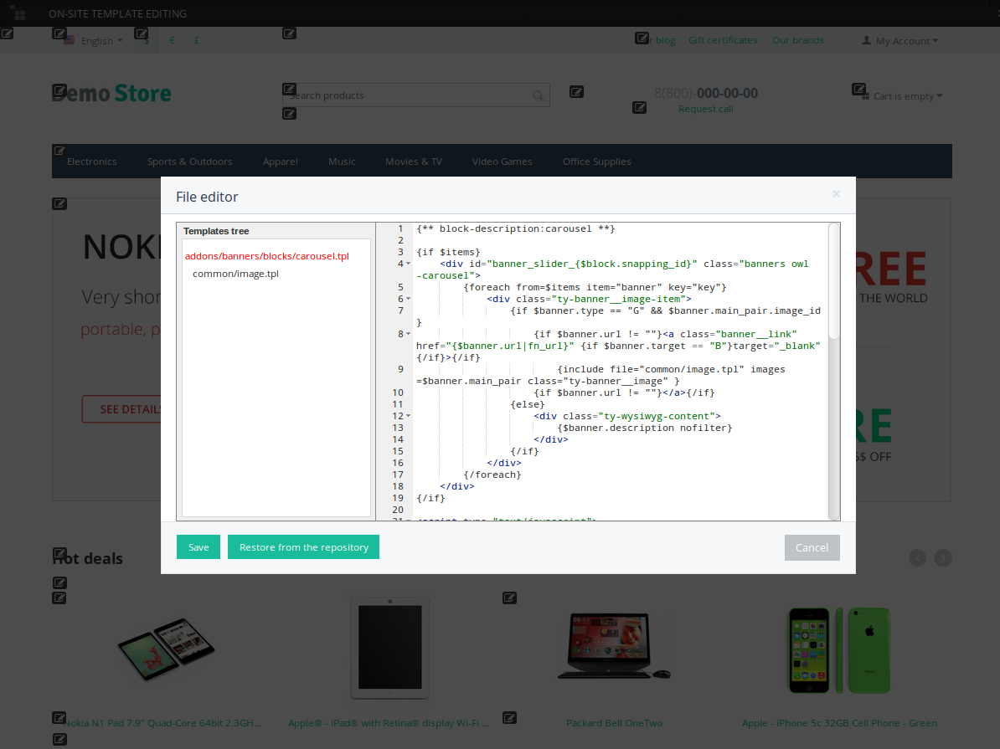

***************
Template Editor
***************

.. note::

    The editor is based on JavaScript, so make sure to enable JavaScript in your web browser.

The **Template editor** allows you to edit the source code of theme files directly from the administration panel. The editor can handle the files located in the *.../design/themes/* directory of your CS-Cart/Multi-Vendor installation.

To edit files:

1. In the Administration panel, go to **Design → Templates**.

2. Use the left panel to choose the desired directory and the file to edit. This panel represents the contents of the *.../design/themes/* directory.

3. Edit the desired part of code and click **Save changes**.

.. image:: img/template_editor.png
    :align: center
    :alt: Template editor in CS-Cart

========================
On-Site Template Editing
========================

The template editor also allows you to edit templates right on the storefront. To do it:

1. In the Administration panel, go to **Design → Templates**.

2. Click the **gear** button in the top right corner.

3. Choose **On-site template editing**.

.. image:: img/on_site_template_editing.png
    :align: center
    :alt: Opening the on-site template editor

4. You'll be taken to the storefront, but its elements will have **Edit** icons next to them. Click the icon of the element you'd like to edit, and choose the template.

.. image:: img/storefront_in_template_editing_mode.png
    :align: center
    :alt: CS-Cart storefront in the template editing mode

5. A pop-up window will open. You can edit the template code there.

6. Once you are done editing, click **Save**. You may have to :doc:`clear the cache <../getting_started/cache_clearing>` to see your changes take effect.

.. note::

    To make your changes appear right after you edit the template, go to **Design → Themes** and set the **Rebuild cache automatically** selector to *On*. This functionality affects performance, so we recommend using it only in development environment.

