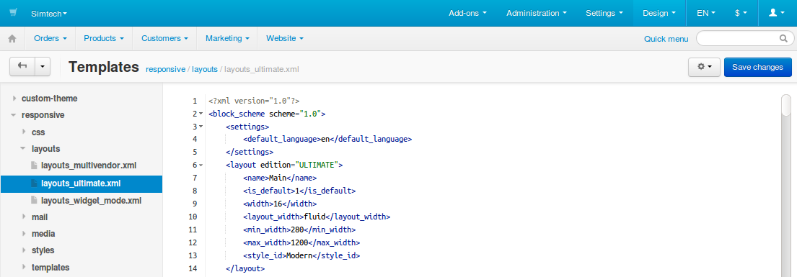

***************
Template Editor
***************

.. note::

    The editor is based on JavaScript, so make sure to enable JavaScript in your web browser.

The **Template editor** allows you to edit the source code of theme files directly from the administration panel. The editor can handle the files located in the *.../design/themes/* directory of your CS-Cart/Multi-Vendor installation.

.. important::

    Before you edit any files, please check :doc:`the basic rules of CS-Cart development. <../getting_started/guidelines>`

To edit files:

1. In the Administration panel, go to **Design → Templates**.

2. Use the left panel to choose the desired directory and the file to edit. This panel represents the contents of the *.../design/themes/* directory.

3. Edit the desired part of code and click **Save changes**.

