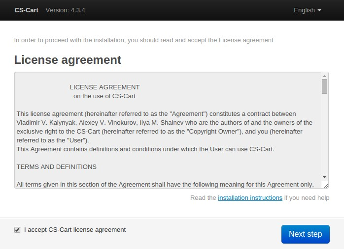
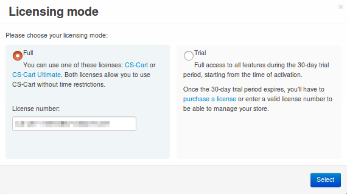
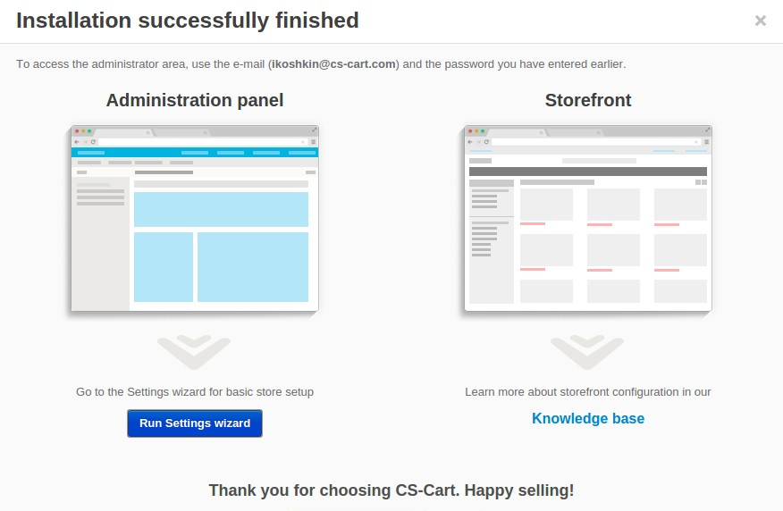

*************************************************************
How To: Install CS-Cart on a Server with Apache and \*\nix OS
*************************************************************

.. note::

    **Tutorial Difficulty: 3 / 3**

    Technical skills required.

In this tutorial, you will learn how to install CS-Cart on a virtual private or dedicated server that runs a \*\nix operating system and Apache.

.. note::

    We assume that you have registered a domain and linked it to a directory on your server. You will also need `Apache <http://httpd.apache.org/>`_, `PHP <http://www.php.net/>`_, `MySQL <https://www.mysql.com/>`_, and `phpMyAdmin <https://www.phpmyadmin.net/>`_ to create a database.

Step 1. Make the Preparations
=============================

1.1. `Download <https://www.cs-cart.com/download-cs-cart.html>`_ the latest version of CS-Cart.

1.2. Connect to the your server via `SSH <https://en.wikipedia.org/wiki/Secure_Shell>`_.

Windows users have to download and install PuTTY or any other SSH client. See `this guide <https://mediatemple.net/community/products/dv/204404604/using-ssh-in-putty->`_ if you want to learn about PuTTY.

If you use a \*\nix OS (for example, Linux, FreeBSD, Ubuntu, OS X, etc.), type the following command in the **Terminal** and press Enter. Don’t forget to replace **username** and **host** with your login details. If you don’t know your username and host, contact your hosting provider or server administrator.

.. code-block:: bash

    ssh username@host

Then you will be asked to enter your password. Type it and press Enter.

.. image:: img/apache/connect_ssh.png
    :align: center
    :alt: Connecting to remote server via SSH.

.. note::

    Your cursor won’t move and you won’t see any changes while you type your password. That is normal.

1.3. After you connect to the server, find out Apache document root. To do it, run one of the following commands (that depends on your Apache version):

.. code-block:: bash

    cat /etc/httpd/conf/httpd.conf | grep "DocumentRoot"

or

.. code-block:: bash

   cat /etc/apache2/httpd.conf | grep "DocumentRoot"

.. image:: img/apache/document_root.png
    :align: center
    :alt: Finding Apache Document Root in the terminal.

As you can see, in our case */var/www/html* is the document root. In the picture we marked it in red.

Step 2. Upload CS-Cart
======================

2.1. Upload the **cscart_v4.x.x.zip** archive you downloaded into your document root (*/var/www/html* in the example; it may also be */var/www* in some cases).
 
Connect to the server with your FTP server. You’ll need the name of the **host**, **username**, **password** and, in some cases, **port**. Contact your hosting provider or the server administrator for your FTP account details. 

2.2. In the Terminal/SSH Client switch to the directory associated with your domain. I used this command:

.. code-block:: bash

    cd /var/www/html

Your command may look different if your document root is different.

.. image:: img/apache/cd_ls_unzip.png
    :align: center
    :alt: Locating and extracting the CS-Cart archive.

2.3. Use the following command to see what’s inside the directory:

.. code-block:: bash

    ls

You should see the archive you uploaded, and any other files or directories you may have in your document root.

2.4. Unpack the archive:

.. code-block:: bash

    unzip cscart_v4.x.x.zip

In the example we have **cscart_v4.3.4.zip**. The name of your archive depends on the version of CS-Cart that you install.

Step 3. Change Permissions
==========================

3.1. Execute the following commands one by one:

.. code-block:: bash

    chmod 644 config.local.php
    chmod -R 755 design images var
    find design -type f -print0 | xargs -0 chmod 644
    find images -type f -print0 | xargs -0 chmod 644
    find var -type f -print0 | xargs -0 chmod 644

These commands set the right permissions for the files, so that CS-Cart can install properly. The 3 digits represent the **rights of the owner** of the file/directory, the **owner’s group**, and **other users** respectively.

For example,

.. code-block:: bash

    chmod 644 config.local.php 

means that the owner of **config.local.php** can read the file and write to it **(6)**; the group to which the owner belongs (e.g., administrators) can read the file **(4)**; all other users can also read the file **(4)**.

.. note::

    There are three types of things a user can do with a file: **read**, **write** and **execute**. The easy way to remember the numbers for the chmod command is this:

    **read = 4** 

    **write = 2**

    **execute = 1**

    A sum of the numbers represents a user’s set of rights, for example **read + write = 4 + 2 = 6**

    The types of rights for directories are the same. **Read** allows to get the list of the files and subdirectories; **write** allows to create, rename and delete files in the directory; **execute** allows to enter the directory and access files and directories inside.

Step 4. Create a Database
=========================

4.1. Open **phpMyAdmin** in your browser. In our case the link to it is located in the Document Root and is accessible by *http://xxxxxxxxxxx.net/myadm*. Contact your hosting provider or server administrator for phpMyAdmin login and password.

If you open it for the first time, the credentials may be as follows:

============  ===================================================
**Login**     root
**Password**  The MySQL password; it is also the password you enter during the installation of phpMyAdmin. The default password may be *mysql*, *root*, *password*, or empty field.
============  ===================================================

4.2. Switch to the **Databases** tab.

4.3. Enter the name of your database.

4.4. Press **Create**.

.. image:: img/apache/creating_database.png
    :align: center
    :alt: Creating a new database in phpMyAdmin.

Step 5. Install CS-Cart
=======================

5.1. Open your store’s URL in a browser. You’ll see a message that CS-Cart is not installed. Let's fix this by clicking the **[install]** link.

.. image:: img/apache/open_website.png
    :align: center
    :alt: Opening our store's main page in a browser.

5.2. Read and accept the **License Agreement** in order to proceed.

5.3. Fill in the form using the details below:

============================  ===========================================================================================================
**MySQL Server Host**         Enter the DNS name or IP address of your MySQL server. Usually it’s **localhost** (because the database and the website are stored on the same server).
**MySQL Database Name**       Enter the name of the database you created in Step 4.4. 
**MySQL User**                Enter the username from Step 4.1.
**MySQL Password**            Enter the password of the MySQL user.
**Administrator's Email**     Enter your email here. CS-Cart will use it to notify you about new orders, call requests, and other important events in your store.
**Administrator's Password**  Enter the password you will use to access the CS-Cart administration panel.
**Main Language**             English (or any language of your choice).
============================  ===========================================================================================================

.. image:: img/apache/installation_parameters.png
    :align: center
    :alt: Fill in the MySQL and administrator's data to proceed. 

.. note::
    Additional languages are available under the **Advanced** tab of **Administration settings**. You can enable or disable them now or later.

5.4. If this is your first time with CS-Cart and you want to see what your store will look like once you add the details about your products, fill your store with demo products, orders, and banners. 

To do that, tick the **Install demo data** checkbox. You can always `remove demo data <http://kb.cs-cart.com/removing-demo-info>`_ later. We’d appreciate it if you helped us make CS-Cart better. Tick the **Help us improve CS-Cart** checkbox to send anonymous usage statistics.

.. image:: img/cpanel/13_checkboxes.png
    :align: center
    :alt: Choose if you want to install demo data and send anonymous statistics to CS-Cart developers. 

5.5. After you press **Install** you’ll see the progress bar running. Please, don’t close the page during the installation. This is when CS-Cart settles in on your server and unpacks various themes and add-ons. Don’t worry, it won’t be long before your new store is good to go!

.. image:: img/cpanel/14_progress_bar.png
    :align: center
    :alt: Don't close the page, wait for the progress bar to fill. 

Step 6. Choose Your Licensing Mode
==================================

The next step is to choose your licensing mode. You have 3 options:

1. Enter your license number to enable the **Full Mode**, that gives you unrestricted access to all CS-Cart features, i.e. several dozens of add-ons, multiple languages and currencies, unlimited number of product filters on the storefront, and more. You can `purchase a license <http://www.cs-cart.com/cs-cart-license.html>`_ any time.

2. If you don’t have a license yet, we offer a **free 30-day trial** with full access to all CS-Cart features. After the end of your trial period you can purchase a license or switch to the Free Mode.

3. The **Free Mode** leaves some features unavailable, but has no time restrictions. You can use this mode from the start or switch to it once your trial period is over.

.. important::

   The **Free Mode** is not available in Multi-Vendor. Beginning with version 4.3.7, it was removed from CS-Cart as well. Once the trial period expires, enter your license number to continue managing your store.

Once you choose your licensing mode, your online store is all set! Now you can go to the **Storefront** to view your store, or to the **Administration panel** to manage it.

