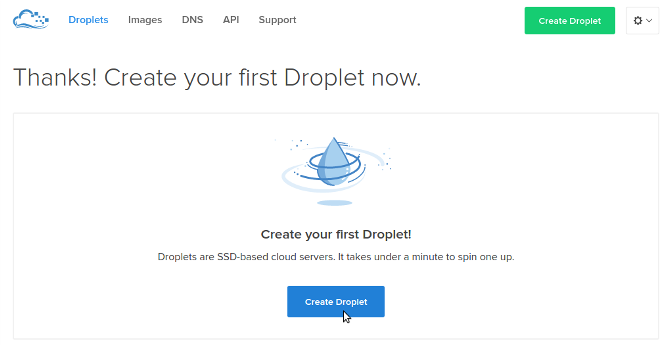
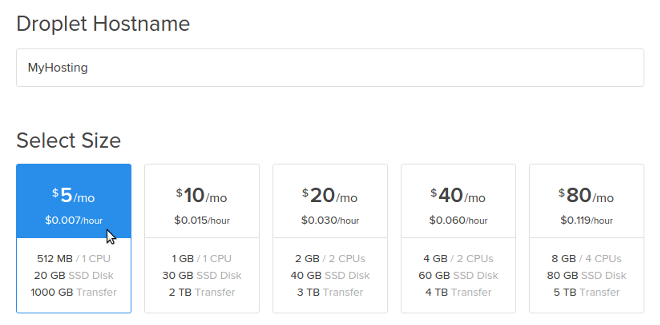
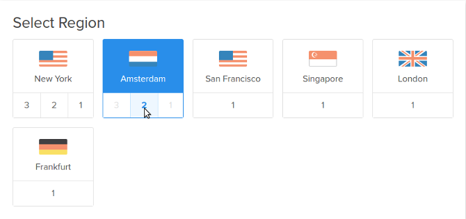
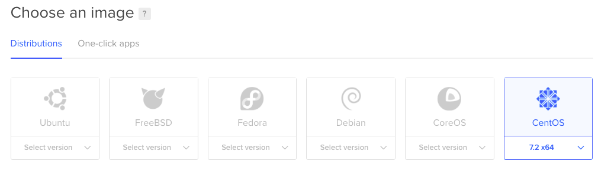
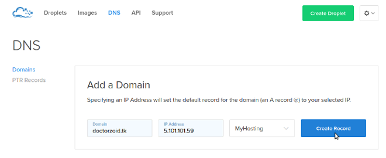
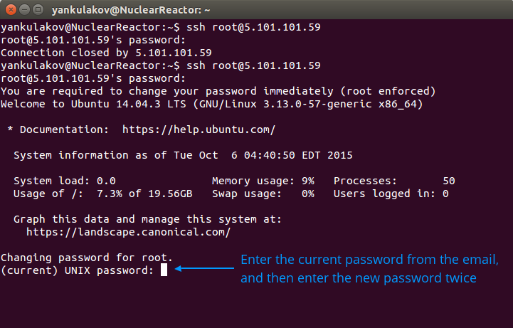
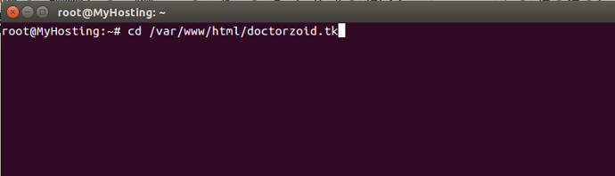
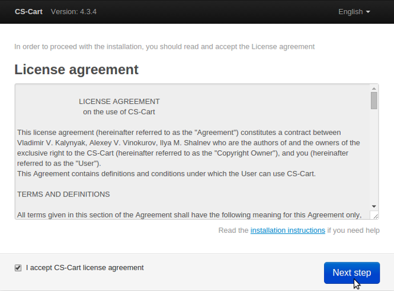
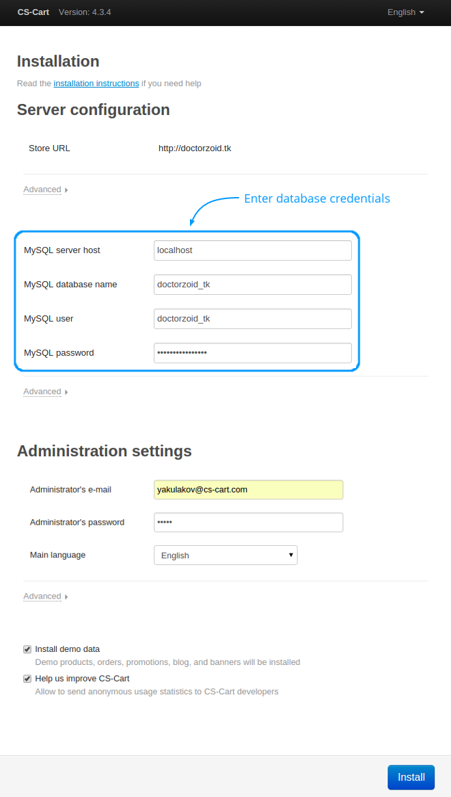

***********************************************
How To: Install CS-Cart on DigitalOcean Hosting
***********************************************

.. note::

    You'll need to use the command line and may have to install SSH and SFTP clients to follow this guide.

In this tutorial you will learn how to install CS-Cart on a DigitalOcean server. DigitalOcean is an SSD cloud hosting that offers virtual private servers. 

We will also use a script that will automatically configure the server on DigitalOcean cloud hosting `for maximum CS-Cart speed <http://blog.cs-cart.com/2015/06/01/five-server-tweaks-to-get-maximum-speed-out-of-cs-cart-4-3-1/>`_.

============================
Step 1. Prepare Your Hosting
============================

1.1. Go to DigitalOcean website and `register an account <https://cloud.digitalocean.com/registrations/new>`_.

1.2. After you log in to your account, hit the **Create Droplet** button:

1.3. Name your hosting and select the plan:

1.4. Choose the region of your server. We recommend that you choose the closest region to your location:

1.5. Select your server’s operating system. Choose either CentOS 6, or CentOS 7. We recommend a CentOS 7 x64.

1.6. Click the **Create Droplet** button at the bottom of the page.

Take a coffee break — your hosting will be ready in a couple of minutes.

1.7. Assign the domain name of your future store to your new droplet using `these official instructions <https://www.digitalocean.com/community/tutorials/how-to-set-up-a-host-name-with-digitalocean>`_.

.. note::

    To test this instruction, we temporarily registered a free domain in the TK zone: *doctorzoid.tk*. Naturally, as you follow this guide you'll need to replace mentions of *doctorzoid.tk* with the name of your domain.

=============================
Step 2. Configure Your Server
=============================

.. note::

    You’ll need an SSH client to connect to your server, execute the configuration script, and install CS-Cart. Here are free, commonly-used SSH clients:

    * Mac OS X: Terminal, iTerm 2
    * Linux: Terminal, KDE Konsole, XTerm
    * Windows: PuTTy

    We used the Linux Terminal in the instructions.

2.1. DigitalOcean has sent you an email with your server’s credentials to the address you had signed up with. Check your mailbox for the “Your New Droplet” email from support@support.digitalocean.com.

2.2. Open the SSH client on your computer and connect to your server using the username, IP address, and the password from the email:

.. image:: img/digitalocean/6_connect_ssh.png
    :align: center
    :alt: Connecting to your server via SSH.

2.3. After you connect to your server, reset the password.

You have to change the password only at the first connection to your server. Please use a strong password — it gives the full access to your server.

2.4. Execute the script for automatic server configuration :doc:`as described in this article </developer_guide/getting_started/server_ansible_playbooks>`.

.. note::

    In that article we advise modifying a text file via a command-line text editor (it's the quickest way). Instead you may want to use an SFTP client (like FileZilla) to download the file, change it on your machine, and then re-upload it to the droplet. For more information on how to use FileZilla with DigitalOcean, please refer to `this tutorial by DigitalOcean community <https://www.digitalocean.com/community/tutorials/how-to-use-filezilla-to-transfer-and-manage-files-securely-on-your-vps>`_.

2.5. When the script completes the server configuration, you will be able to install CS-Cart.

=======================
Step 3. Install CS-Cart
=======================

3.1. Go to the CS-Cart folder:

     .. code-block:: bash

         cd /var/www/html/[your domain name]

3.2. Download the CS-Cart installation package from our website:

     .. code-block:: bash

         wget "https://www.cs-cart.com/index.php?dispatch=pages.get_trial&page_id=297&edition=ultimate" -O cscart.zip

     .. note::

         If you see the **Command not found** message on CentOS, then install **wget** first by using this command: ``yum install wget``.

3.3. Unzip the CS-Cart installation package:

     .. code-block:: bash

         unzip cscart.zip

3.4. Change the owner and set file permissions for CS-Cart installation by executing these commands one by one:

     .. code-block:: bash

         chown -R service ./
         chmod 644 config.local.php
         chmod -R 755 design images var
         find design -type f -print0 | xargs -0 chmod 644
         find images -type f -print0 | xargs -0 chmod 644
         find var -type f -print0 | xargs -0 chmod 644

3.5. Open your store’s URL in your browser and click **[install]**:

.. image:: img/digitalocean/11_install_cscart.png
    :align: center
    :alt: CS-Cart browser installation.

3.6. Read and accept the CS-Cart License Agreement:

3.7. Enter your MySQL information (see Step 2.4), define admin credentials, and click **Install**:

3.8. Congratulations! Now you have a fast CS-Cart store on DigitalOcean hosting.
