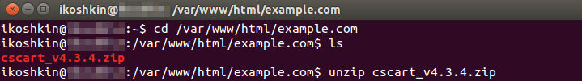

************************************************************
How To: Install CS-Cart on a Server with Nginx and \*\nix OS
************************************************************

.. note::

    **Tutorial Difficulty: 3 / 3**

    Technical skills required.

In this tutorial, you will learn how to install CS-Cart on a virtual private or dedicated server that runs a \*\nix operating system and nginx.

.. note::

   We assume that you have registered a domain and linked it to a directory on your server. You will also need `nginx <http://nginx.org/>`_, `PHP-FPM <http://www.php.net/>`_, `MySQL <https://www.mysql.com/>`_, and `phpMyAdmin <https://www.phpmyadmin.net/>`_ to create a database.

=======================
Step 1. Configure Nginx
=======================

1.1. Connect to the your server via `SSH <https://en.wikipedia.org/wiki/Secure_Shell>`_.

Windows users have to download and install PuTTY or any other SSH client. See `this guide <https://mediatemple.net/community/products/dv/204404604/using-ssh-in-putty->`_ if you want to learn about PuTTY.

If you use a \*\nix OS (for example, Linux, FreeBSD, Ubuntu, OS X, etc.), type the following command in the **Terminal** and press Enter. Don’t forget to replace **username** and **host** with your login details. If you don’t know your username and host, contact your hosting provider or server administrator.

.. code-block:: bash

    ssh username@host

Then you will be asked to enter your password. Type it and press Enter.

.. image:: img/apache/connect_ssh.png
    :align: center
    :alt: Connecting to remote server via SSH.

.. note::

    Your cursor won’t move and you won’t see any changes while you type your password. That is normal.

1.2. Stop nginx using this command:

.. code-block:: bash

    sudo service nginx stop

We will configure nginx while it is offline.

1.3. Find out the number of processors in the system. Use this command: 

.. code-block:: bash

    cat /proc/cpuinfo | grep processor | wc -l

You will see a number you’ll need for Step 1.4. In the picture we marked the number in red.

.. image:: img/nginx/processor_number.png
    :align: center
    :alt: Finding out the number of processors in the system.

1.4. On your server find the file */etc/nginx/nginx.conf* and open it in a text/code editor of your choice.

=====================================  ====================
**Find this line:**                    worker_processes  4; 
**Change the number (see Step 1.3):**  worker_processes  2;
=====================================  ====================

.. important::

    We'll be using ``example.com`` in many of the commands and configuration files below. Please replace *example.com* with your domain name.

1.5. Create a directory for your store. For your convenience we recommend using your domain name for your directory. In this tutorial we create a new folder called *example.com* with this command:

.. code-block:: bash

    mkdir -p /var/www/html/example.com

1.6. Open the */etc/nginx/sites-available/default* file. Delete its content and copy the following code to the file. Make sure to find and replace all instances of *example.com* with your actual folder name.

.. code-block:: nginx

    #######################################################################
    # A default configuration for domains and IP address.
    #######################################################################

    server {
        listen  80;
        server_name _;
        root /var/www/empty;

        # Redirecting to our store by default
        location / {
            return 301 $scheme://example.com$request_uri;
        }
    }

    #######################################################################
    # Description and configuration of the primary domain for the store.
    #######################################################################

    server {
       listen  80;
        #   The store’s domain
        server_name example.com;

        #   Default encoding
        charset utf-8;

        #   Location of the log files
        access_log  /var/log/nginx/access.log combined;
        error_log   /var/log/nginx/error.log;

        #   The main directory of your store
        root /var/www/html/example.com;

        #   Compression
        gzip on;
        gzip_disable "msie6";
        gzip_comp_level 6;
        gzip_min_length  1100;
        gzip_buffers 16 8k;
        gzip_proxied any;
        gzip_types text/plain application/xml
        application/javascript
        text/css
        text/js
        text/xml
        application/x-javascript
        text/javascript
        application/json
        application/xml+rss;

        #   Other settings
        client_max_body_size            100m;
        client_body_buffer_size         128k;
        client_header_timeout           3m;
        client_body_timeout             3m;
        send_timeout                    3m;
        client_header_buffer_size       1k;
        large_client_header_buffers     4 16k;

        error_page 598 = @backend;

        ############################################################################
    #   Processing PHP scripts
        location @backend {
            try_files $uri $uri/ /$1/$3 /$2/$3 $3 /index.php =404;
            proxy_read_timeout 61;
            fastcgi_read_timeout 61;
            #   The path to the PHP-FPM daemon socket
            fastcgi_pass unix:/var/run/php5-fpm.sock;
            fastcgi_index index.php;
            fastcgi_param SCRIPT_FILENAME $document_root$fastcgi_script_name;
            include fastcgi_params;
        }

    #   Rewrite rules for the SEO module 
        location @fallback {
            rewrite  ^/(\w+/)?(\w+/)?(.*)$ /$1/index.php?$args last;
            rewrite  ^/(\w+/)?(\w+/)?(.*)$ /index.php?$args last;
        }

    #   The rule for searching static files of the storefront. For example, when you have 2 storefronts in different directories: example.com and example.com/shop/
        location @statics {
            rewrite ^/(\w+/)?(\w+/)?(.*)$ /$1/$3 break;
            access_log off;
            try_files $uri $uri/ /$1/$3 /$2/$3 $3 @fallback;
            rewrite_log off;
            expires max;
            add_header Cache-Control public;
            add_header Access-Control-Allow-Origin *;
        }

    #   The entry point of your store
        location / {
        #   The main script
            index  index.php index.html index.htm;

        #   For API
            rewrite ^/(\w+/)?(\w+/)?api/(.*)$ /$1/api.php?_d=$3&ajax_custom=1&$args last;

        #   The script search logic uses the following order: file, directory, script
            try_files $uri $uri/ /$1/$3 /$2/$3 $3 @fallback;

        #   The first rule for searching static files
            location ~* /(\w+/)?(\w+/)?(.+\.(jpe?g|ico|gif|png|css|js|pdf|txt|tar|wof|woff|svg|ttf|csv|zip|xml|yml)) {
                access_log off;
            #   The rule for searching static files. If the server can’t find the file in the store folder, it will use the @statics rule.
            #   For example, if your store is located at example.com/shop/            
                try_files $uri $uri/ /$1/$3 /$2/$3 $3 @statics;
                expires max;
                add_header Access-Control-Allow-Origin *;
                add_header Cache-Control public;
            }

        #
        #  Denying the ability to run PHP in the directories for security reasons.
        #

            location ~ ^/(\w+/)?(\w+/)?app/ {
                return 404;
            }
    #   Allowing to run the payment methods scripts.
            location ~ ^/(\w+/)?(\w+/)?app/payments/ {
                return 404;
                location ~ \.php$ {
                    return 598;
                }
            }

        #   Allowing to run the payment methods scripts.
            location ~ ^/(\w+/)?(\w+/)?app/addons/paypal/payments/ {
                return 404;
                location ~ \.php$ {
                    return 598;
                }
            }

        #   Allowing to run the script for 1C data exchange.
            location ~ ^/(\w+/)?(\w+/)?app/addons/rus_exim_1c/ {
                return 404;
                location ~ \.php$ {
                    return 598;
                }
            }

        #   Forbidding PHP in the /design directory.
            location ~ ^/(\w+/)?(\w+/)?design/ {
                allow all;
                location ~* \.([tT][pP][lL]|[pP][hH][pP].?)$ {
                    return 404;
                }
            }

        #   Allowing static files only in the /var directory
            location ~ ^/(\w+/)?(\w+/)?var/ {
                return 404;
                location ~* \.(jpe?g|ico|gif|png|css|js|pdf|txt|tar|wof|woff|svg|ttf|csv|zip|xml|yml)$ {
                    allow all;
                    expires 1M;
                    add_header Cache-Control public;
                    add_header Access-Control-Allow-Origin *;
                }
            }

        #   Denying access to the template backups.
            location ~ ^/(\w+/)?(\w+/)?var/themes_repository/ {
                allow all;
                location ~* \.([tT][pP][lL]|[pP][hH][pP].?)$ {
                    return 404;
                }
            }

        #   Forbidding PHP in the /images directory.
            location ~ ^/(\w+/)?(\w+/)?images/ {
                allow all;
                location ~* \.([pP][hH][pP].?)$ {
                    return 404;
                }
            }

        #   Denying access to init.php
            location ~ ^/(\w+/)?(\w+/)?init.php {
                return 404;
            }

        #   Blocking outside access to the store’s database backups (/var/backups).
            location ~ ^/(\w+/)?(\w+/)?var/backups/ {
                return 404;
            }

        #   Denying access to .tpl
            location ~* \.([tT][pP][lL].?)$ {
                return 404;
            }

        #   Denying access to .htaccess, .htpasswd and git
            location ~ /\.(ht|git) {
                return 404;
            }

            location ~* /(\w+/)?(\w+/)?(.+\.php)$ {
                return 598 ;
            }

            location ~* \.php$ {
                return 598 ;
            }

        }
    }

1.7. Use this command to restart nginx:

.. code-block:: bash

    sudo service nginx restart

1.8. Make sure you install **PHP-FPM**. If you don’t have it, nginx may give you **Error 502**, when you try to view your site. Use this command:

.. code-block:: bash

    sudo apt-get install php5-fpm php5-mysql php5-curl php5-gd php-mail -y

You can install and use any version of PHP that meets :doc:`the system requirements </install/system_requirements>`. But in that case you'll also need to adjust nginx configuration (*/etc/nginx/sites-available/default*) accordingly. For example, if you install PHP7-FPM, you'll need to change the path to the PHP-FPM daemon socket to ``/var/run/php/php7.0-fpm.sock``.

1.9. Let’s configure nginx for **phpMyAdmin**. We want it to open when we go to *pma.example.com*. Open the file */etc/nginx/sites-available/default* and add the following code to the end of the file. Again, replace all instances of *example.com* with your actual folder name.

.. code-block:: nginx

    #######################################################################
    # pma.example.com
    #######################################################################

    server {
        listen  80;

        #   A subdomain for phpMyAdmin
        server_name pma.example.com www.pma.example.com;

        charset utf-8;

        #   The location of the log files
        access_log  /var/log/nginx/pma.example.com_access.log combined;
        error_log   /var/log/nginx/pma.example.com_error.log;

        #   The path for the subdomain to refer to
        root /usr/share/phpmyadmin;
        index index.php index.html index.htm;

        location / {
            try_files $uri $uri/ =404;
        }

        location ~ \.php$ {
            root /usr/share/phpmyadmin;
            proxy_read_timeout 61;
            fastcgi_read_timeout 61;
            try_files $uri $uri/ =404;
            #   The path to the PHP-FPM daemon socket
            fastcgi_pass unix:/var/run/php5-fpm.sock;
            fastcgi_index index.php;
            fastcgi_param SCRIPT_FILENAME $document_root$fastcgi_script_name;
            include fastcgi_params;
        }
    }

1.10. Restart nginx once more:

.. code-block:: bash

    sudo service nginx restart

======================
Step 2. Upload CS-Cart
======================

2.1. `Download <https://www.cs-cart.com/download-cs-cart.html>`_ the latest version of CS-Cart.

2.2. Upload the **cscart_vx.x.x.zip** archive you downloaded to the directory you created in Step 1.5 (*/var/www/html/example.com* in the example).
 
To do that, connect to the server with your FTP client. You’ll need the name of the **host**, **username**, **password** and, in some cases, **port**. Contact your hosting provider or the server administrator for your FTP account details. 

2.3. In the Terminal/SSH Client switch to the directory of your site. Use this command, and replace *example.com* with the name of the directory you created in Step 1.5:

.. code-block:: bash

    cd /var/www/html/example.com

Your command may look different if your document root is different.

2.3. Use the following command to see what’s inside the directory:

.. code-block:: bash

    ls

You should see the archive you uploaded, and any other files or directories you may have in your Document Root.

2.4. Unpack the archive:

.. code-block:: bash

    unzip cscart_vx.x.x.zip

In the example we have **cscart_v4.3.4.zip**. The name of your archive depends on the version of CS-Cart that you install.

========================================
Step 3. Change Ownership and Permissions
========================================

.. important::

    Some commands in this step may require root (superuser) privileges. If a command doesn't work, try adding the ``sudo`` prefix before it. Learn more about ``sudo`` at `Linux Academy Blog <https://linuxacademy.com/blog/linux/linux-commands-for-beginners-sudo/>`_.

3.1. Execute the following commands one by one:

.. code-block:: bash

    chmod 644 config.local.php
    chmod -R 755 design images var
    find design -type f -print0 | xargs -0 chmod 644
    find images -type f -print0 | xargs -0 chmod 644
    find var -type f -print0 | xargs -0 chmod 644

These commands set the right permissions for the files, so that CS-Cart can install properly. The 3 digits represent the **rights of the owner** of the file/directory, the **owner’s group**, and **other users** respectively.

For example, ``chmod 644 config.local.php`` means that:

* The owner of **config.local.php** can read the file and write to it **(6)**. 

* The group to which the owner belongs (e.g., administrators) can read the file **(4)**.

* All other users can also read the file **(4)**.

.. note::

    There are three types of things a user can do with a file: **read**, **write** and **execute**. The easy way to remember the numbers for the chmod command is this:

    **read = 4** 

    **write = 2**

    **execute = 1**

    A sum of the numbers represents a user’s set of rights, for example **read + write = 4 + 2 = 6**

    The types of rights for directories are the same. **Read** allows to get the list of the files and subdirectories; **write** allows to create, rename and delete files in the directory; **execute** allows to enter the directory and access files and directories inside.

3.2. Set the Nginx user as the owner of your CS-Cart files. For example, on Ubuntu the default Nginx user is usually ``www-data``, and its group is ``www-data`` as well. In this case, this is the command you need to use::

  chown -R www-data:www-data .

.. warning::

    Before running ``chown``, please use the ``ls`` command to double-check that you're it the Document Root. When you run ``chown`` as described above, all the files and folders you see, as well as and their subfolders and files, will be given to the specified user.

=========================
Step 4. Create a Database
=========================

4.1. Open **phpMyAdmin** in your browser. In our case the link to it is located in the Document Root and is accessible by *http://pma.example.com*. Contact your hosting provider or server administrator for phpMyAdmin login and password.

If you open it for the first time, the credentials may be as follows:

============  ===================================================
**Login**     root
**Password**  The MySQL password; it is also the password you enter during the installation of phpMyAdmin. The default password may be *mysql*, *root*, *password*, or empty field.
============  ===================================================

4.2. Switch to the **Databases** tab.

4.3. Enter the name of your database.

4.4. Press **Create**.

.. image:: img/apache/creating_database.png
    :align: center
    :alt: Creating a new database in phpMyAdmin.

=======================
Step 5. Install CS-Cart
=======================

5.1. Open your store’s URL in a browser. You’ll see a message that CS-Cart is not installed. Let's fix this by clicking the **[install]** link.

.. image:: img/apache/open_website.png
    :align: center
    :alt: Opening our store's main page in a browser.

5.2. Read and accept the **License Agreement** in order to proceed.

.. image:: img/cpanel/11_license_agreement.png
    :align: center
    :alt: Tick the checkbox to accept the License Agreement. 

5.3. Fill in the form using the details below:

============================  ===========================================================================================================
**MySQL Server Host**         Enter the DNS name or IP address of your MySQL server. Usually it’s **localhost** (because the database and the website are stored on the same server).
**MySQL Database Name**       Enter the name of the database you created in Step 4.4. 
**MySQL User**                Enter the username from Step 4.1.
**MySQL Password**            Enter the password of the MySQL user.
**Administrator's Email**     Enter your email here. CS-Cart will use it to notify you about new orders, call requests, and other important events in your store.
**Administrator's Password**  Enter the password you will use to access the CS-Cart administration panel.
**Main Language**             English (or any language of your choice).
============================  ===========================================================================================================

.. image:: img/apache/installation_parameters.png
    :align: center
    :alt: Fill in the MySQL and administrator's data to proceed. 

.. note::
    Additional languages are available under the **Advanced** tab of **Administration settings**. You can enable or disable them now or later.

5.4. If this is your first time with CS-Cart and you want to see what your store will look like once you add the details about your products, fill your store with demo products, orders, and banners. 

To do that, tick the **Install demo data** checkbox. You can always :doc:`remove demo data </install/useful_info/remove_demo_data>` later. We’d appreciate it if you helped us make CS-Cart better. Tick the **Help us improve CS-Cart** checkbox to send anonymous usage statistics.

.. image:: img/cpanel/13_checkboxes.png
    :align: center
    :alt: Choose if you want to install demo data and send anonymous statistics to CS-Cart developers. 

5.5. After you press **Install** you’ll see the progress bar running. Please, don’t close the page during the installation. This is when CS-Cart settles in on your server and unpacks various themes and add-ons. Don’t worry, it won’t be long before your new store is good to go!

.. image:: img/cpanel/14_progress_bar.png
    :align: center
    :alt: Don't close the page, wait for the progress bar to fill. 

==================================
Step 6. Choose Your Licensing Mode
==================================

The next step is to choose your licensing mode. You have 3 options:

* Enter your license number to enable the **Full Mode**, that gives you unrestricted access to all CS-Cart features, i.e. several dozens of add-ons, multiple languages and currencies, unlimited number of product filters on the storefront, and more. You can `purchase a license <http://www.cs-cart.com/cs-cart-license.html>`_ any time.

* If you don’t have a license yet, we offer a **free 30-day trial** with full access to all CS-Cart features. After the end of your trial period you can purchase a license or switch to the Free Mode.

* The **Free Mode** leaves some features unavailable, but has no time restrictions. You can use this mode from the start or switch to it once your trial period is over.

  .. important::

      The **Free Mode** is not available in Multi-Vendor. Beginning with version 4.3.7, it was removed from CS-Cart as well. Once the trial period expires, enter your license number to continue managing your store.

.. image:: img/cpanel/15_licensing_mode.png
    :align: center
    :alt: Enter your CS-Cart license number, get a 30-day trial or use the free version. 

Once you choose your licensing mode, your online store is all set! Now you can go to the **Storefront** to view your store, or to the **Administration panel** to manage it.

.. image:: img/cpanel/16_complete.png
    :align: center
    :alt: After the installation you can view the store and manage it.
