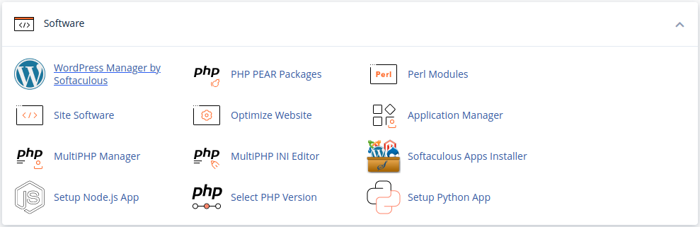
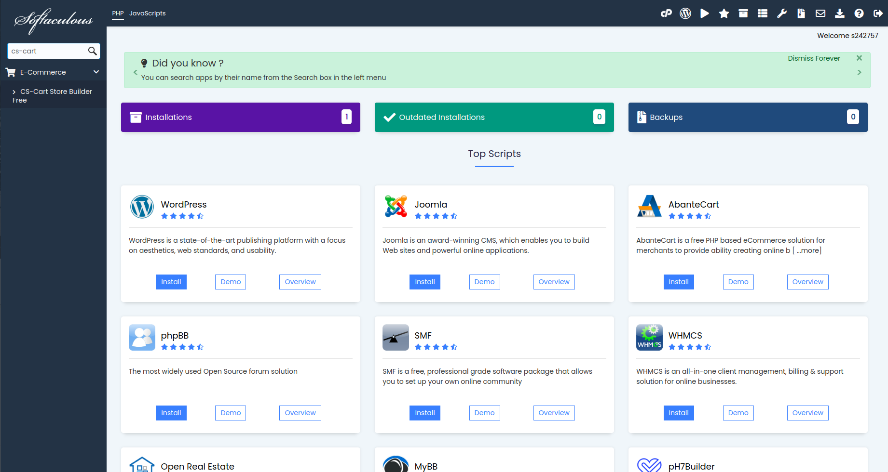
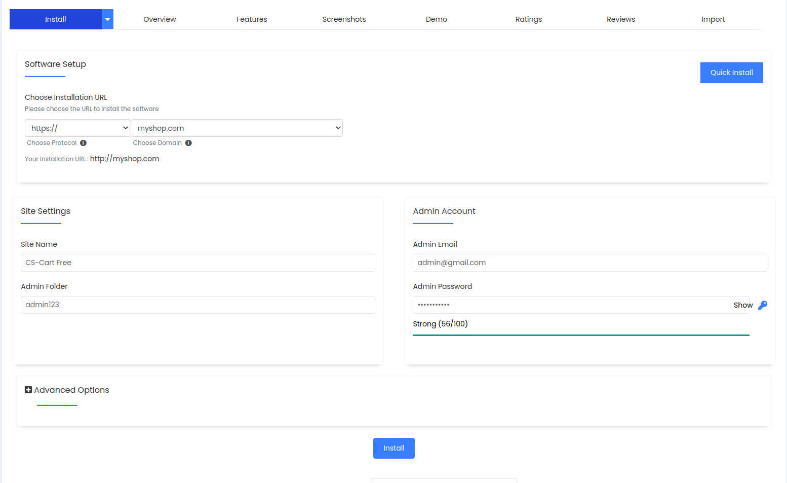
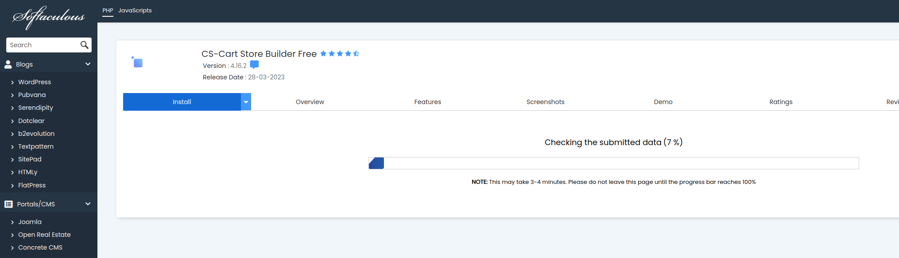
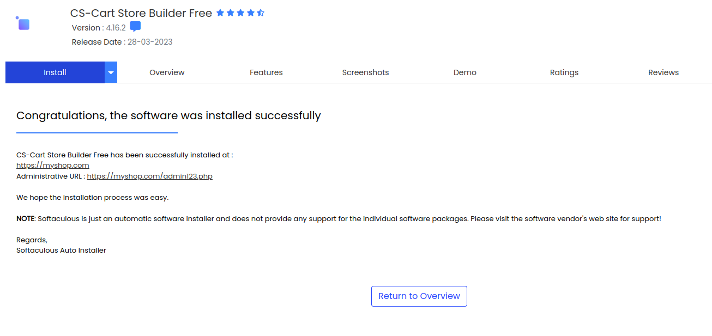

**********************************************
Way 1. Softaculous is Installed on Your Server
**********************************************
.. note::

    This article applies only to `CS-Cart Store Builder <https://www.cs-cart.com/store-builder.html>`_ because Softaculous doesn't support paid versions of software.
    
.. note::

    You can see the full installation guide in `this article <https://docs.cs-cart.com/latest/install/softaculous.html>`_.
    
Step 1. Login to your control panel and find Softaculous
========================================================

1.1. Log into your control panel and find Softaculous in the list of software. For example, in cPanel go to **Software → Softaculous Apps Installer**.

1.2. Enter *cs-cart* in the search box in the top left corner of the page below the Softaculous logo and you will find CS-Cart Store Builder Free.
 

.. important::
    First, associate a domain name with your host’s IP: find out what name servers your host uses for your domain, then use your domain registrar’s control panel to associate your domain name with the name servers. We suggest you read `this article <http://www.thesitewizard.com/domain/point-domain-name-website.shtml>`_ to learn more.
    
Step 2. Install Store Builder
=============================

2.1. Switch to the **Install** tab, and you’ll see a form. Fill it in:

=================================  ==============================================
**Choose Protocol**                \http:// (choose \https:// if your site has SSL).
**Choose Domain**                  Select your domain from the dropdown menu. It’s *myshop.com* in the example.
**In Directory**                   If you want to access your store by the original URL, such as *myshop.com*, leave the field empty. 
                                   Or you can enter the name of a new directory to be created. For example, if you type *dir*, Softaculous will create *myshop.com/dir* and install Store Builder Free there.
**Table Prefix**                   Leave it as is.
**Admin Email**                    Enter your email here. It will be used to log in to your Admin panel. Store Builder will use it to notify you about new orders, call requests, and other important events in your store. 
**Admin Password**                 Enter the password you will use to access the Store Builder administration panel.
**CS-Cart License Agreement**      Tick the checkbox to accept the СS-Cart License Agreement. Hover your mouse over the grey **i** icon to find the link to the license agreement in Softaculous.
**Database Name**                  Leave it as is or enter another name for the database.
**Disable Update Notifications**   Tick the checkbox, if you don’t want to receive the notifications about Store Builder updates.
**Email installation details to**  Enter the email where Softaculous will send the installation details, such as Store Builder admin credentials, MySQL database name, user and password, and other data. You may leave the field empty, but **we highly recommend you to enter your e-mail**.
=================================  ==============================================

2.2. After you press **Install**, you’ll see the progress bar running. Please, don’t close the page during the installation.

2.3. When the installation is complete you’ll see a message with 2 links to your store: use the first link to view the storefront, and the second link to enter the administrator panel.

