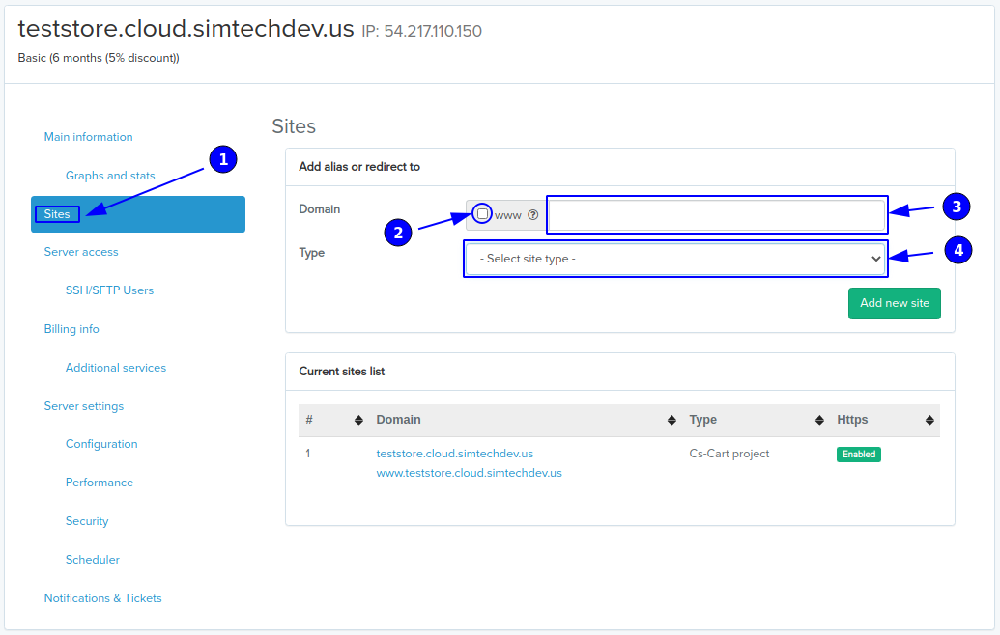
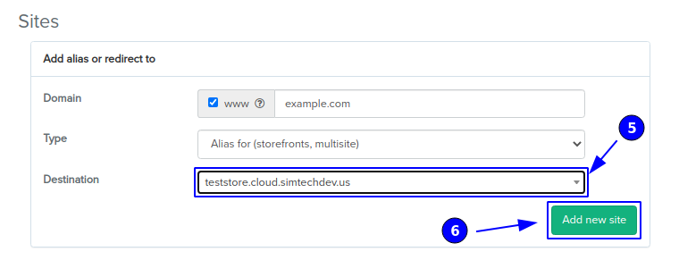

***************************************************************
How To: Configure Multiple Storefronts on CS-Cart Cloud Hosting
***************************************************************

.. note::

    Here is :doc:`more information about storefronts </user_guide/stores/index>` in CS-Cart and Multi-Vendor. You only need one CS-Cart or Multi-Vendor installation to manage all your storefronts.

This article describes how to configure multiple storefronts on `CS-Cart cloud hosting <https://www.cs-cart.com/cloud-hosting.html>`_.

===============================
Step 1. Configure Cloud Hosting
===============================

MyCloud interface includes the possibility to add sites or redirects to your server's configuration.

To add an alias or a redirect:

#. Go to the **Sites** section in your MyCloud account.

#. Check the **www** checkbox if you need to add the *www.subdomain*.

#. Type the domain of an alias or a redirect in the **Domain** field.

#. Select the **Type** of the site you need to add.

There are two types of sites you can add via MyCloud — aliases and redirects:

* An **alias** domain is an alternate name for another existing domain. When we talk about marketplace platforms, alias usually means an additional storefront to your project.

* A **redirect** changes the site's URL to the required one and moves visitors to the site where the content is actually located.

Let's add an alias to the server configuration and see how it works (the process is the same for a redirect). When you select the type you need from the list, the **Destination** (5) field, where you need to choose a project to which the alias will be added from the list, will arise. When the **Destination** project is selected, click **Add new site** (6). Done, the *example.com* alias is added to the server configuration.

=====================================================
Step 2. Create New Storefront in CS-Cart/Multi-Vendor
=====================================================

Open the administration panel of CS-Cart or Multi-Vendor. In our case that will be CS-Cart project that we have chosen in the **Destination** field. Create a new storefront and assign it to its respective subdomain.

#. Go to the **Administration → Stores** page and click the **+** button.

#. Fill in the **Storefront URL** field with the subdomain you have entered in the **Domain** field when configuring hosting on Step 1.

#. Specify other properties and click **Create**.

#. Now the new storefront should be listed on the **Stores** page.