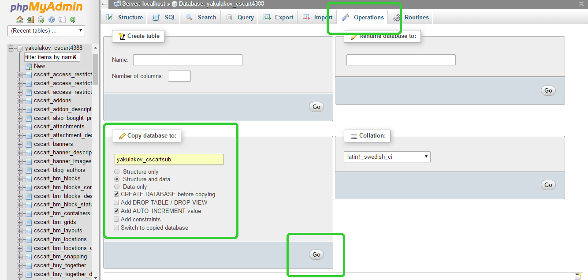
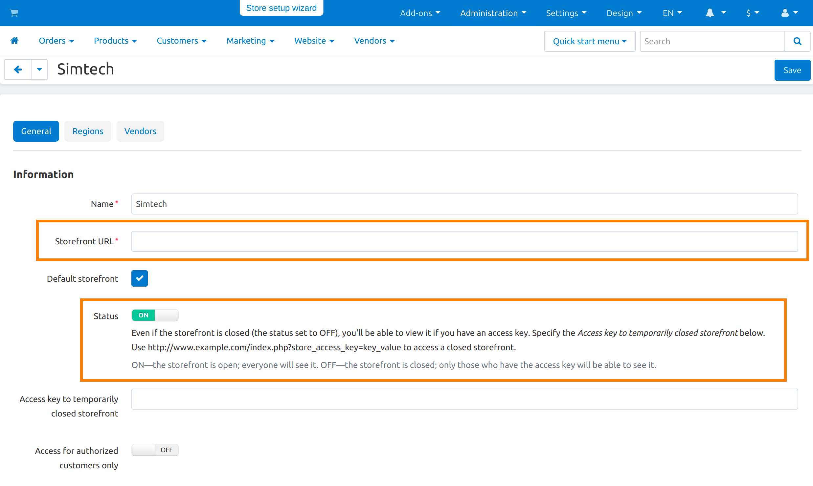
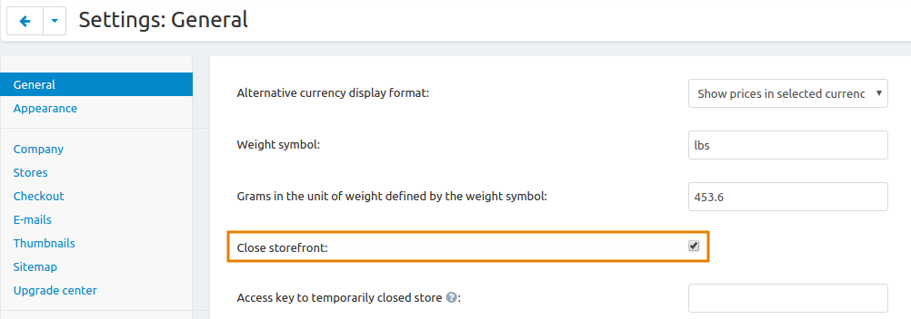

************************************************************
How To: Make a Dev Copy of Your Live Store in a Subdirectory
************************************************************

Having a live copy of your store in a subdirectory is useful: you can test upgrades on it or modify files with no risks. You can freely make a copy of your store with the same license, but **you have to close the storefront of the copied store**.

.. note::

    **Tutorial Difficulty: 2 / 3**

======================================================
Step 1. Copy the Files of Your Store to a Subdirectory
======================================================

1.1. Make an archive with all the files of your store. The way you make an archive depends on your installation:

* If your current store is installed on a host with **cPanel**, go to **cPanel → Files → File Manager**, select all the files of your store, and click **Compress**. Then select the newly created archive and click **Download**.

.. important::

    cPanel File Manager may not show hidden files such as **.htaccess**. Before you create an archive, go to **Settings** (top right corner of the screen) and tick the **Show hidden files (.dotfiles)** checkbox. This ensures all files of your store are in the archive.

* If your store is installed on a local machine, find the installation directory and make an archive with your favourite file archiver.

1.2. Create an empty subdirectory in your CS-Cart installation directory.

1.3. Copy the archive to that subdirectory and extract all the files. Don’t forget to delete the archive once you unpacked it.

==============================================
Step 2. Create a Database for the Copied Store
==============================================

So that the copy of your store works fine, you need a separate database for it. You have two ways to create a database for the copied store: *via phpMyAdmin* or *via SSH and MySQL*.

---------------------------------------
Way 1. Copy the Database via phpMyAdmin
---------------------------------------

1. Log in to **phpMyAdmin**.

.. important::

    If your server uses **cPanel**, you can find **phpMyAdmin under** **Databases → phpMyAdmin**. Some servers may require you to enter your login and password. Contact your hosting provider or server administrator for details.

2. On the upper panel, click the **Databases** tab and select the database of your main store.

3. On the upper panel, click the **Operations** tab.

4. In the **Copy database to** section, enter the name of the new database, check the options as shown on the screenshot, and then hit **Go**:

------------------------------------------
Way 2. Copy the Database via SSH and MySQL
------------------------------------------

You can also copy the database through the command line. This method is for more experienced users and the preferred one. 

Before you proceed, make sure you know your **username**, **password**, and **host** credentials to connect to your server via SSH. You will also need your **MySQL username and password**. Contact your hosting provider or system administrator for this information.

To copy the database, do this:

1. Open the console and connect to your server via SSH:

.. code-block:: bash

    ssh username@host

2. Enter your SSH password

.. note::

    Your cursor won’t move and you won’t see any changes while you type your password. That is normal.

3. Dump your original database to an .sql file:

.. code-block:: bash

    mysqldump -u[your mysql username] -p[your mysql password] [your original database name] > dbcopy.sql

4. Create a new empty database:

.. code-block:: bash

    mysqladmin -u[your mysql username] -p[your mysql password] create [your new database name]

5. Import data from the dumped file to the new empty database:

.. code-block:: bash

    mysql -u[your mysql username] -p[your mysql password] [your new database name] < dbcopy.sql

======================================
Step 3. Edit the config.local.php File
======================================

The **config.local.php** file defines the path to your store installation, database name, and other information. Since your copy is in the new folder and the copied database has a different name, you have to edit config.local.php so the store works:

3.1. Go to the copy’s folder and open **config.local.php** in an FTP client or the file manager of your host’s control panel. If you connect to your server via SSH, open this file via any command line text editor (Nano, for example).

3.2. Edit these lines in the **config.local.php** file:

::

  * Database connection options
  */
  $config['db_host'] = 'localhost';
  $config['db_name'] = 'enter the name of the new copied database';
  $config['db_user'] = 'your mysql username'; (username stays the same)
  $config['db_password'] = 'your mysql password'; (password stays the same)

  // Host and directory where software is installed on no-secure server
  $config['http_host'] = 'your domain'; (stays the same)
  $config['http_path'] = '/enter the directory of the copied store';

  // Host and directory where software is installed on secure server
  $config['https_host'] = 'your domain'; (stays the same)
  $config['https_path'] = '/enter the directory of the copied store';

=========================
Step 4. Finishing Touches
=========================

4.1. Clear cache of the copied store by deleting the **cache** folder in the **var** directory of your new CS-Cart copy. You can also clear cache in the administration panel in **Administration → Storage → Clear cache**.

4.2. Update the storefront URLs of the copied store. To do that, log in to the administration panel, which is now located at *yourdomain/subdirectory/admin.php*. On the **Administration → Stores page**, click your store. On the store editing page, change the storefront URL:

Don’t forget to close the storefront on the **Settings → General** page:

4.3. If you use the SEO add-on, you might need to edit the **.htaccess** file too. This file is in the root directory of your copied store. Open the file and edit this line:

::

  RewriteBase /[enter the full path to your copied store]

Well done! Now you have a live copy of your store in the subdirectory. You can now safely test upgrades on it and modify functionality.

