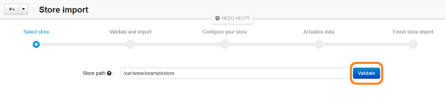

********************************************
How To: Upgrade Your Store with Store Import
********************************************

.. important::

    Before you attempt to upgrade your store, make sure you have enough space on your server hard drive.

================================================
Step 1. Install CS-Cart You'd Like to Upgrade To
================================================

1.1. Download a newer version of CS-Cart/Multi-Vendor that you'd like to upgrade to (let's call it the new version). Check if this version of CS-Cart/Multi-Vendor supports the Store Import. Then make sure that Store Import can import data from your current version. You can find this information :doc:`here <about_store_import>`.

1.2. :doc:`Install the new CS-Cart/Multi-Vendor <../install/index>` in a separate subdirectory of your old installation. 

     For example, if your original store is available at *example.com*, create the ``/store`` directory in the root of *example.com*. Then unpack the installation archive of your new store in that directory. You should then be able to install the new CS-Cart/Multi-Vendor by using this URL: *example.com/store*.

.. important::

    Store Import can't transfer data between CS-Cart and Multi-Vendor and can't import CS-Cart Community stores directly.

.. note::

    If your old store used several languages, you may want to choose the same languages for the newly installed CS-Cart. You can change the languages in the **Administration → Languages → Manage languages** section of the Administration panel.

============================
Step 2. Install Store Import
============================

.. important::

    The **Store Import** add-on comes by default with CS-Cart/Multi-Vendor 4.3.1 and 4.3.2. If you'd like to import your data to a later version of CS-Cart, please `get the free Store Import add-on from the CS-Cart Marketplace <http://marketplace.cs-cart.com/add-ons/store-import.html>`_.

2.1. In your Administration panel, go to **Add-ons → Manage add-ons** and click the **+** button at the top right.

2.2. Upload the **.zip archive** containing the Store Import add-on.

2.3. Click **Upload & install**.

2.4. Switch to the **Browse all available add-ons** tab.

2.5. Find **Store Import** and click the **Install** button next to it.

.. image:: img/store_import_install.png
    :align: center
    :alt: Install the Store Import add-on in your new store.

===================
Step 3. Import Data
===================

3.1. Go to **Add-ons → Store Import**. 

3.2. On the opened page enter the server path to the old store. 

     It is the path where your existing store is installed on the server. For example, on UNIX-based systems it should look something similar to */var/www/examplestore*, and on Windows it will be something like *C:/examplestore*.

3.3. Click the **Validate** button. If the path you entered was correct, the button will take you to the next step called **Validate and import**. 

3.4. You will see two tables with the information about the imported store and the store where you want to import data. Press the **Import data** button to start the importing process.

.. image:: img/validate_and_import.png
    :align: center
    :alt: Once you're ready to improt the database, click the Import Data button.

3.5. You'll see the import progress bar running. The time it takes to import the data depends on the size of your database: it can take a couple of minutes or a couple of hours.

.. important::

     The add-on imports all data from 3.0.x, but doesn't import some settings and most of the layouts from 2.2.4/2.2.5. :doc:`Learn more about imported data <about_store_import>`. 

================================
Step 4. Configure Your New Store
================================

You've reached the **Configure your store** step. Now you can to leave the Store Import page and configure your new store. It can take you some time to modify the CSS styles, layouts, locations, etc. In the meantime your old CS-Cart store can continue working as usual.

**Steps 5 and 6 are optional.** You don't have to keep your old store open while you configure your new store. Then there's no need to import any more data, and you can go straight to Step 7.

.. note::

    CS-Cart users should go to **Administration → Stores**, click the name of the storefront and set the correct **Storefront URL**.

.. important::

    Don't use both the old and the new store at the same time with one license. Keep the new store closed (**Settings → General → Close storefront**) while you configure it. Close the storefront of the old store right after you go live with your new store. :doc:`Learn more about closing your storefront <../user_guide/look_and_feel/changing_attributes/store_closed>`.

.. image:: img/actualize_data.png
    :align: center
    :alt: You can leave the Store Import page and configure your store before you proceed to actualizing data.
        
=================================
Step 5. Actualize Data (Optional)
=================================

When your new store is ready to go live, you can import the data that accumulated in your old store while you worked on the new one.

5.1. Go to **Add-ons → Store Import**.

5.2. Click **Proceed to actualizing data**. You will see the information about the latest store import. 

5.3. Click the **Actualize data** button to import the data from the old store.

.. important::

    This step overwrites all the data, but doesn't import settings and layouts. If you want to exclude some other data from import, see :doc:`the corresponding article <store_import_technical_details>`.

To skip the actualization step, click the **Complete store import** button.

======================================
Step 6. Finish Store Import (Optional)
======================================

After the successful data import you proceed to the **Finish store import** step. Now you can go live with your new store. You can always return to the **Configure your store** and **Actualize data** steps by clicking the corresponding links.

.. image:: img/store_import_complete.png
    :align: center
    :alt: You can leave the Store Import page and configure your store before you proceed to actualizing data.

If you want to launch the import process again, click the **Start new store import** button.

===============
Step 7. Go Live
===============

Once you've imported the data and configured your new store, you can replace your old store with it.

7.1. Back up the files and database of your old store. Learn more about `backing up the database in older versions of CS-Cart/Multi-Vendor <http://kb.cs-cart.com/backup>`_.

7.2. Delete every file in the root directory of your old store on the server. Keep only the folder with your new store (in our case it's */examplestore*).
 
7.3. Move your new store from the */examplestore* folder to the root directory of your old store. Learn more about :doc:`moving your store to a different folder <../install/useful_info/moving_to_different_folder>`.
