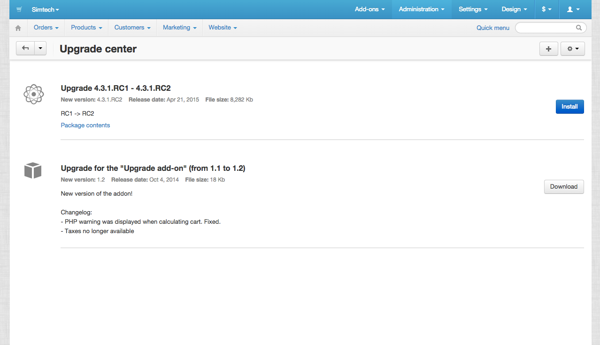

****************************
Upgrade Center: How it Works
****************************

Here are the main features of the new Upgrade Center:

*	SQL files are no more used. All work with DB is being done with Migrations.
*	Now it is possible to define upgrade servers and upload upgrade packages for add-ons.

Interface
+++++++++

On the Upgrade Center page you can see available packages. They can be of the two types:

* core
* add-on

Core packages are downloaded through ``$config['resources']['updates_server']`` (`http://updates.cs-cart.com <http://updates.cs-cart.com>`_).
Add-ons packages are downloaded through add-on connectors and from servers defined in these connectors.

It is also possible to upload an upgrade package manually using the form on the Upgrade Center page (the + button in the picture above).

.. toctree::
    :maxdepth: 1
    :hidden:

    upgrade_package

Checking for updates
********************

Checking for updates is started in two cases:

*	When logging to the administration panel.
*	When switching to the Upgrade Center page.

Upgrade scheme
++++++++++++++

.. image:: img/uc_connectors.png
    :align: center
    :alt: Connectors

Upgrade Center App sends a request on checking for updates. Connector manager gets the list of all available connectors. Each connector (implementing IConnector interface) returns an array with information about connecting to its upgrade server (each connector can add any data to be sent to a server).

Example:

.. code-block:: none

	return array(
	    'method' => 'get',
	    'url' => 'http://example.com/uc/index.php',
	    'data' => array(
	        'dispatch' => 'product_updates.get_available',
	        'ver' => PRODUCT_VERSION,
	        'edition' => PRODUCT_EDITION,
	        'product_build' => PRODUCT_BUILD,
	        'lang' => CART_LANGUAGE,
	        'my_license_number' => 'ABC-123-XYZ',
	        'weather' => 'windy',
	    ),
	    'headers' => array(
	        'Content-type: text/xml'
	    )
	)

After receiving information about upgrade servers, Connector manager simultaniously sends requests to all of them. Received answers will also be passed to connectors for further processing.

Connector receives an ansver from the server and returns either an empty array (if the update is not available) or information about a package (a package is not downloaded). A returned scheme (array) contains the following mandatory fields:

*	``file`` - file name (*some_upgrade_1.2.3.tgz*).
*	``name`` - upgrade package title (*Marketplace add-on upgrade*, for example).
*	``description`` - description of a package: what issues are resolved and improvements are added.
*	``from_version`` - from what version does an add-on/core uprade.
*	``to_version`` - to what version does an add-on/core uprade.
*	``timestamp`` - time of a package creation.
*	``size`` -  size of a package in bytes.
*	``type`` - type of a package (core/add-on). It is set automatically.

And any optional fields that can be used after downloading a package, for example:

*	``example_md5`` - *68e109f0f40ca72a15e05cc22786f8e6*. It can be the file md5 hash that will be checked after downloading from a server (to avoid substitution, broken files, etc.)

Example of the returned data:

.. code-block:: none

	$data = simplexml_load_string($response);

	return array(
	    'file' => (string) $data->package->file,
	    'name' => (string) $data->package->name,
	    'description' => (string) $data->package->description,
	    'from_version' => (string) $data->package->from_version,
	    'to_version' => (string) $data->package->to_version,
	    'timestamp' => (int) $data->package->timestamp,
	    'size' => (int) $data->package->size,
	    'my_very_important_field' => (string) $data->package->my_sha_key,
	    'custom_field' => (string) $data->package->custom_field,
	);

If the upgrade scheme passes the verification, the following scheme is created: */path/to/store/var/upgrade/packages/NAME/schema.json*. Where **NAME**- the name of an add-on or *core*.

Downloading upgrades
********************

After obtaining the package scheme it is possible to get the package itself (it is not done automatically because the package size can be very big). When clicking the **Download** button Upgrade Center App uses this package connector and passes the previously saved scheme and a path (where to save the downloaded file) to it.

The connector communicates with its upgrade server, passes the necessary data to it, gets the package content, and saves it according to the given path. In case of the successful saving the connector returns ``array(true, '');``. If there was an error, (could not connect to a server, save, etc.) it returns the following: ``array(false, __('text_uc_cant_download_package'))``.

After receiving a file, Upgrade Center App unpacks and checks it:

*	Checks if there is the *package.json* scheme (description and structure).
*	Checks if the *package.json* scheme description contains information about all files of the package. If there are additional files in the package, it will not pass validation.
*	If there is an add-on upgrade package, it makes sure that this package does not try to rewrite Core files. Pathes available for the add-on files:
	
	.. code-block:: none

		'app/addons/' . $addon_id,
		'js/addons/' . $addon_id,
		'images/',

		'design/backend/css/addons/' . $addon_id,
		'design/backend/mail/templates/addons/' . $addon_id,
		'design/backend/media/fonts/addons/' . $addon_id,
		'design/backend/media/images/addons/' . $addon_id,
		'design/backend/templates/addons/' . $addon_id,

		'var/themes_repository/[^/]+/css/addons/' . $addon_id,
		'var/themes_repository/[^/]+/mail/media/',
		'var/themes_repository/[^/]+/mail/templates/addons/' . $addon_id,
		'var/themes_repository/[^/]+/media/fonts/',
		'var/themes_repository/[^/]+/media/images/addons/' . $addon_id,
		'var/themes_repository/[^/]+/media/images/addons/' . $addon_id,
		'var/themes_repository/[^/]+/styles/data/',
		'var/themes_repository/[^/]+/templates/addons/' . $addon_id,

		'var/langs/',

Package structure
+++++++++++++++++

.. _upgrade-package-structure:

Here is the approximate package structure:

.. code-block:: none

	├── languages
	│   └── en
	│       ├── addons
	│       │   ├── access_restrictions.po
	│       │   └── age_verification.po
	│       ├── core.po
	│       └── editions
	│           └── mve.po
	├── migrations
	│   └── 20141230084721_core_ult_logos_linked_to_styles.php
	├── package
	│   ├── changelog.txt
	│   ├── config.php
	│   └── js
	│       └── tygh
	│           └── core.js
	├── package.json
	└── scripts
	│   └── pre_create_folder.php
	└── validators
	    └── CheckFileValidator.php

*	The **languages** directory contains languages in the Crowdin package format (`http://translate.cs-cart.com <http://translate.cs-cart.com>`_).

	.. important:: When installing languages from the Upgrade package, only new language variables will be installed. The existing ones will not be updated. If you want to update the existing language variable, use a new name or create a migration.

*	The **migrations** directory contains phinx `migrations <https://github.com/cakephp/phinx/blob/v0.4.3/docs/migrations.rst>`_. They are applied in the file name *TIMESTAMP* order. Conceptually, migrations should work only with DB. But in fact they work in the cart environment and can play different roles. However, use the *PRE/POST* scripts to work with files.

*	The **scripts** directory contains the *PRE/POST* scripts. Scripts running depends on the file name. They are selected according to the ``pre_`` and ``post_`` prefixes. ``PRE`` scripts are launched before starting the update (but after Validators). ``POST`` scripts - after the update is over.

*	The **validators** directory contains additional checking functions that return *true* before the update beginning. For example, checking the availability to write in *.htaccess*, checking the domain name, etc.

*	The **package** directory contains new files. This directory is fully copied to the store core.

*	The **package.json** file describes the full package structure: files, upadated files hashes, migrations, languages, etc.

Example of the **package.json** file

.. code-block:: none

	{
	    "files": {
	        "app/addons/upgrade/addon.xml": {"status": "changed", "hash": "b0911a0d64453ab06b0872c9eb6fbc34"},
	        "app/addons/upgrade/func.php": {"status": "changed", "hash": "4fefb0fed1496f179a14b7e872eb16d9"},
	        "app/addons/upgrade/robots.txt": {"status": "deleted", "hash": "df32e836628b51af570dd2425cb3e97e"},
	        "js/addons/upgrade/up.js": {"status": "new"},
	        "var/themes_repository/responsive/templates/addons/upgrade/hooks/products/image_wrap.post.tpl": {"status": "new"}
	    },
	    "migrations": [
	        "20141022083711_addon_update_version.php"
	    ],
	    "languages": [
	        "en"
	    ],
	    "validators": [
	        "CheckFileValidator"
	    ],
	    "scripts": {
	        "pre": "hello_world.php",
	        "post": "clear_cache.php"
	    }
	}

Update processing order
***********************

.. image:: img/uc_workflow.png
    :align: center
    :alt: Workflow

Logging
*******

Every step of the update process is logged in the following file: *var/upgrade/[NAME]_log.txt*, where **NAME** - *core* or the add-on name. It is always possible to find out the reason of an emergency update stop from there.

Example of a log file:

.. code-block:: none

	2015-03-27 12:01:13: Start installation of the "core" upgrade package
	2015-03-27 12:01:13: ================================================
	2015-03-27 12:01:13: Get all available validators
	2015-03-27 12:01:13: Execute "collisions" validator
	2015-03-27 12:01:13: Upgrade stopped: Awaiting resolving validation errors: collisions
	2015-03-27 12:01:21: 
	2015-03-27 12:01:56: Start installation of the "core" upgrade package
	2015-03-27 12:01:56: ================================================
	2015-03-27 12:01:56: Get all available validators
	2015-03-27 12:01:56: Execute "collisions" validator
	2015-03-27 12:01:56: Execute "permissions" validator
	2015-03-27 12:01:56: Execute "restore" validator
	2015-03-27 12:01:56: Backup files and Database
	2015-03-27 12:01:56: Copy package files
	2015-03-27 12:01:56: Run migrations
	2015-03-27 12:01:56: Phinx by Rob Morgan - http://phinx.org. version 0.3.7
	2015-03-27 12:01:56: 
	2015-03-27 12:01:56: using config file ./app/Tygh/UpgradeCenter/Migrations/config.migrations.php
	2015-03-27 12:01:56: using config parser php
	2015-03-27 12:01:56: using migration path /Users/alexions/www/git/work/var/upgrade/packages/core/content/migrations
	2015-03-27 12:01:56: using environment development
	2015-03-27 12:01:56: using adapter mysql
	2015-03-27 12:01:56: using database alexions_staging
	2015-03-27 12:01:56: 
	2015-03-27 12:01:56:  == 20150317072105 CoreChangePrivelegeName: migrating
	2015-03-27 12:01:56:  == 20150317072105 CoreChangePrivelegeName: migrated 0.0034s
	2015-03-27 12:01:56: 
	2015-03-27 12:01:56: All Done. Took 0.1739s
	2015-03-27 12:01:56: Install langauges from the upgrade package
	2015-03-27 12:01:56: Install the \"en\" language
	2015-03-27 12:01:56: Upgrade completed

Example
*******

As an example let's see the *Upgrade* add-on that updates itself to the new version: `Upgrade add-on <https://github.com/cscart/sample-upgrade-addon>`_
