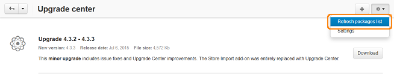
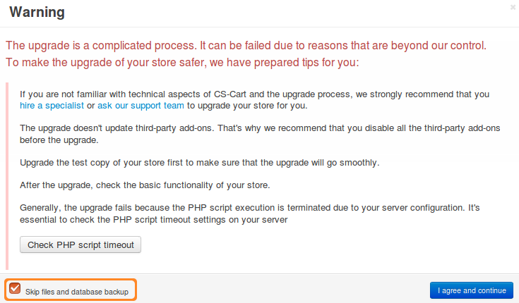
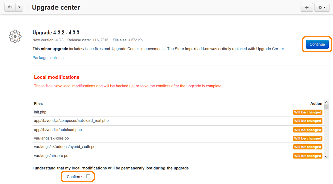

**********************************************
How To: Upgrade CS-Cart via the Upgrade Center
**********************************************

The Upgrade Center automatically retrieves the information about all available updates from the CS-Cart server and notifies the administrators, so that they can upgrade their CS-Cart installations to the latest version.

If you are not familiar with the technical aspects of CS-Cart and the upgrade process, you can ask other people to upgrade the store for you:

* `Hire a specialist. <http://marketplace.cs-cart.com/developers-catalog.html?services=M>`_

* `Contact our support team. <https://www.cs-cart.com/index.php?dispatch=communication.tickets&submit_ticket=Y>`_

================================
Step 1. Configure Upgrade Center
================================

1.1. Open the administration panel of your store.

1.2. Go to **Settings → Upgrade Center**.

1.3. Fill in the following fields:

     * **License number**—the license key associated with your domain name. You can see it on the **Licenses** page in your `Customer Help Desk account <https://www.cs-cart.com/helpdesk>`_. You can't upgrade a store while using the trial mode.

     If a web user does not have permissions to update files on your server, fill in your FTP account details:

     * **Hostname**—hostname of your FTP server

     * **Username**—FTP username

     * **Password**—FTP password

     * **Directory**—the directory on the FTP server where CS-Cart is located

1.4. Click the **Save** button to save the changes.

.. image:: img/upgrade_settings.png
    :align: center
    :alt: Before you can perform an upgrade, you need a valid license number. You may also need to specify the FTP credentials.

=======================
Step 2. Upgrade CS-Cart
=======================

.. important::

    Upgrading a store is a complicated process, so upgrade :doc:`the test copy of your store <../install/useful_info/copying_store_to_subdirectory>` first to make sure the upgrade will go smoothly. 

.. note::

    The upgrade doesn't update third-party add-ons. That's why we recommend that you disable all the third-party add-ons before the upgrade.

2.1. Go to **Administration → Upgrade center**.

2.2. Click the **gear** button and choose **Refresh packages list** from the drop-down menu to see all upgrade packages available at the moment. In the center of the page you can see information about currently available upgrade.

2.3. Click the **Download** button to download the upgrade package.

2.4. When the package is ready to be installed, you will see a corresponding notice. 

2.5. Click the **Install** button to start the upgrade process. If you want to look through the list of changes in the upgrade package first, click the **Package contents** link.

.. image:: img/install_package.png
    :align: center
    :alt: Click Package Contents to view the list of changes before installing the upgrade.

2.6. By default, the database and files of your store are backed up to the *var/backups* directory of your CS-Cart installation before the upgrade. The backup archive includes the entire database and all files, **except for images**.

You can choose to skip the backup. This is useful if the automatic backup won't work on your server because of the PHP script timeout. 

.. warning::

    If you skip the backup, make sure to **back up your the database and files manually** before the upgrade. Otherwise you may lose your data if something goes wrong.

To skip the backup:

* :doc:`Enable the development mode <../developer_guide/getting_started/configuring_cscart>` before you start an upgrade.

* Tick the **Skip files and database backup** checkbox in the pop-up window that appears after step 2.5.

2.7. If you have any modified files that are going to be replaced with new versions, they will be displayed on the same page. These files will be backed up and you will need to :doc:`resolve conflicts after the upgrade manually <resolve_conflicts>`. 

Tick the **Confirm** checkbox and click the **Continue** button.

2.8. If you have any files that require the *write* permissions to be set, they will be displayed at this step too. To set the permissions, click the **Auto-set permissions via FTP** button.

2.9. If the upgrade is successful, you will see the corresponding notification. You will also receive an e-mail with the store upgrade summary. If you cannot access your administration panel after the upgrade, use the link provided in that email to restore the latest backup of your store.

=========================
Step 3. Reopen Your Store
=========================

.. important::

    :doc:`The store is closed <../user_guide/look_and_feel/changing_attributes/store_closed>` automatically during the upgrade. After the upgrade you'll need to reopen it manually.

Before you reopen the store, we recommend that you check whether or not the upgrade has gone well:

* Open the storefront and look through the most important sections, like product pages, checkout, contacts, etc.

* Try to make a test purchase on behalf of a test customer.

* Check the data in the administration panel: products, orders, etc.
