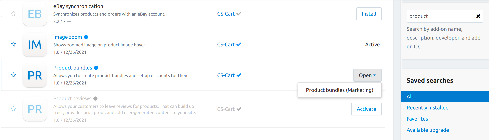
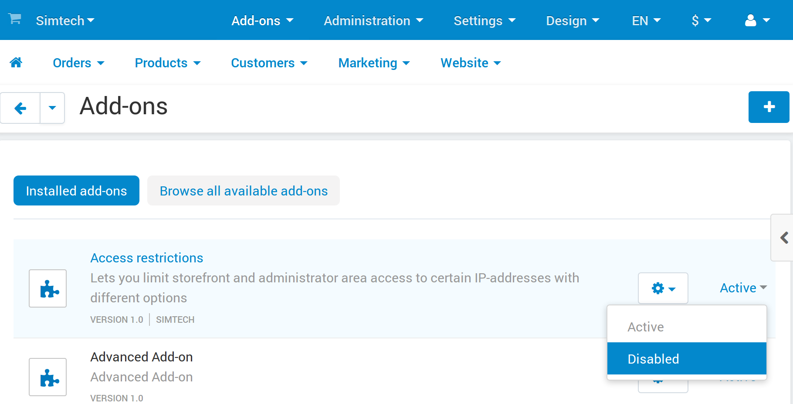
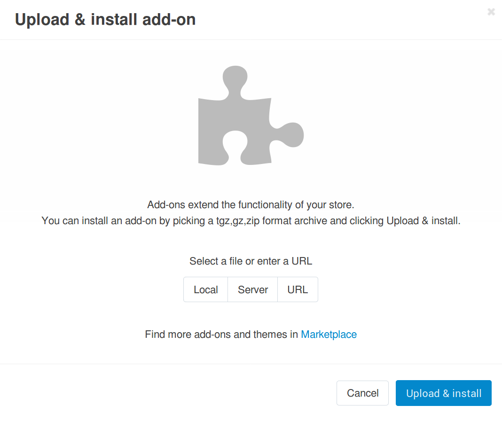

**********************
How To: Manage Add-ons
**********************

The **Addons → Manage add-ons** page contains the list of add-ons that are installed or available for installation. The page also has a few control elements to manage add-ons.

Enabling/Disabling Add-ons
**************************

To turn an add-on on or off, click on the current add-on status to expand a list of applicable statuses and select the required one.

.. _configure-addon:

Configuring Add-ons
*******************

For some add-ons you can adjust specific options and preferences.

.. note ::

    Add-ons that cannot be highlighted with a mouse do not have editable parameters and cannot be configured.

To configure an add-on:

#. Click the **gear** button near the add-on status and choose **Settings**. This will open a form containing editable parameters.

#. Edit the values of the fields in the form.

#. Click **Save** to apply the changes.

.. _install-addon-from-archive:

Uploading Add-ons from Archive
******************************

.. note::

    Only the root administrator can upload add-ons from archive. The **+** button is not displayed for other types of administrators.

.. note::

    The root administrator is the default administrator that is created by the system after the CS-Cart installation process has finished. You can check whether you administrator account is root or not. Find the ``cscart_users`` table in the database and make sure that the ``is_root`` field for your administrator account is set to **Y**.

To upload a new add-on:

#. Click the **+** button in the right upper corner of the page.

#. In the opened pop-up window choose whether to upload a file from the local computer (**Local**) or the server file system (**Server**). You can also specify **URL** to a remote location, where the required archive is physically located. Pay attention, that the add-on archive must be in *tgz*, *gz* or *zip* format.

#. Click **Upload & install**.

    
.. important ::

    Before uploading an add-on from archive make sure that there is no such an add-on among the add-ons available for installation.

Installing Add-ons Manually
***************************

An add-on is an archive with files and folders that match the structure of a CS-Cart/Multi-Vendor installation. That's why an add-on's archive can be unpacked in the root directory of your store. This will allow you to install the add-on even if you don't have the **+** button in the admin panel (for example, when you use an older version of CS-Cart).

#. Copy the archive with the add-on into the root directory of your CS-Cart store.

   .. image:: img/root_directory.png
       :align: center
       :alt: The files and folders of the root directory of CS-Cart.

#. Unpack the archive. Alternatively, move all the files from the archive into the root directory, preserving the structure.

   .. important::

       For example, if the add-on's archive has a folder called *app* inside, its content must be put in the *app* folder of your CS-Cart or Multi-Vendor installation, and so on.

#. Go to **Add-ons → Manage add-ons** in the admin panel of your store.

#. Find the new add-on and click **Install**.