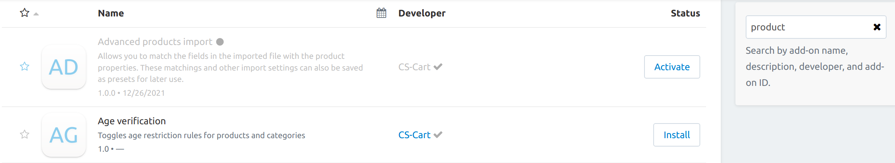

**********************
How To: Manage Add-ons
**********************

You can install add-ons automatically or manually by uploading the add-on files.

.. contents::
    :backlinks: none
    :local:

.. _install-addon-from-archive:

Manual Installation
===================

Only the root administrator can upload add-ons.

.. note::

    The root administrator is the default administrator that is created by the system after the CS-Cart installation has finished. You can check whether your administrator account is root or not. Find the ``cscart_users`` table in the database and make sure that the ``is_root`` field for your administrator account is set to **Y**.

#. Go to the **Add-ons → Manage add-ons** page in the admin panel. Click on the gear button and select **Manual installation**.

   .. image:: img/manual_install.png
       :align: center
       :alt: Upload an add-on

#. In the opened pop-up window select the add-on file. Upload a file in zip format from the local computer (**Local**) or the server file system (**Server**). You can also specify a **URL** to a remote location, where the required archive is located.

   Then click **Upload & Install**.

   .. image:: img/choose_file.png
       :align: center
       :alt: Сhoosing file

#. The add-on installer will check the write permissions for files and folders.

   If you do not have enough rights, you will receive a notification. Set write permissions to the specified folders on the web server, or grant FTP write access to these folders.

#. If you bought an add-on on `Marketplace <http://marketplace.cs-cart.com/add-ons.html>`_, then after installation you may need to enter a license key.

   .. note::

       Starting from version 4.12.2, the license key is entered automatically.

#. The add-on is installed.

Automatic Installation
======================

CS-Cart provides over 60 add-ons out of the box. Some of them are immediately installed—we suggest that these add-ons are necessary for any online store. Some add-ons are not installed in order not to overload the store with functionality that is unnecessary at the moment.

It is easy to get the add-on you need. For this:

#. Go to the **Add-ons → Manage add-ons** page.

#. Use the search bar to find the add-on you need.

#. Click **Install** to the right of the add-on name to install the add-on.

#. If the add-on was installed but disabled, then click **Activate** to the right of the add-on name.

Now you can go to the add-on settings.

      
.. _configure-addon:

Manage Add-ons Page and Add-on Settings
=======================================

The **Manage add-ons** page contains information about the add-ons of your online store. On this page you can:

* install/uninstall and enable/disable add-ons;

* see the **Available upgrade** for add-ons and apply it;

* view the list of the **Recently installed** add-ons, fill the **Favorites** section with specific add-ons;

* search for add-ons and filter them by different criteria;

* open the add-on editing page.

.. hint ::

    If you use multiple CS-Cart storefronts, then add-on settings can be either individual for each storefront, or global for all storefronts.

Configure your add-ons on the *Settings* tab of the page that opens by clicking on the add-on name. Add-ons may have no settings.

After installation, some add-ons create new pages with additional working tools in the admin panel. Open additional pages created by the add-on in any way:

* Click **Open** to the right of the add-on name. In the drop-down list, click on the name of the page created by the add-on.

* Click on the name of the add-on, go to the *General* tab. The **Where to access this add-on** section contains links to additional pages.

.. image:: img/manage_addons.png
    :align: center
    :alt: Searching, installation, enabling the add-on, going to the add-on settings.
