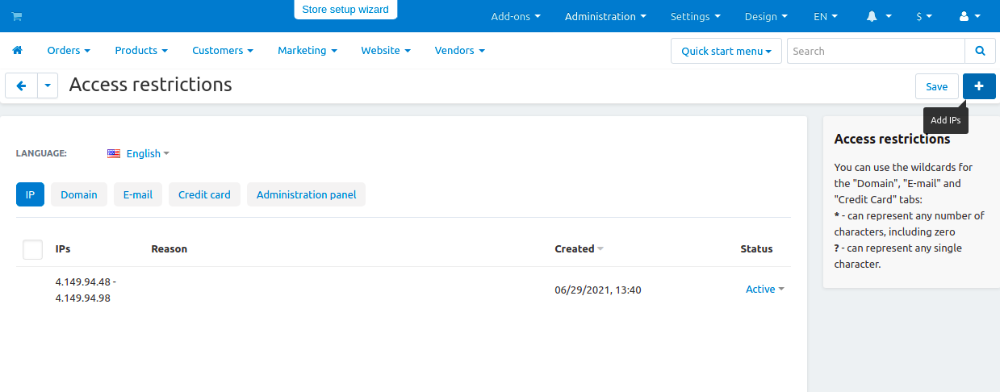

*********************************************************************
How To: Restrict Access to Store for Customers from Certain Countries
*********************************************************************

*   In the Administration panel, go to **Add-ons → Manage add-ons**.
*   Enable the **Access restrictions** add-on (change its status to *Active*).
*   Refresh the page and go to **Add-ons → Access restrictions**.
*   On the opened page in the **IP** or **Domain** sections add the IPs or domain names, for which you want to restrict access to your store. To do it, click the **+** button on the right and fill in the information in the opened window.
*   Click **Create**.

    
.. hint::
    For geolocation, we use GeoLite2 databases created by MaxMind, available from `https://www.maxmind.com <https://www.maxmind.com/>`_.