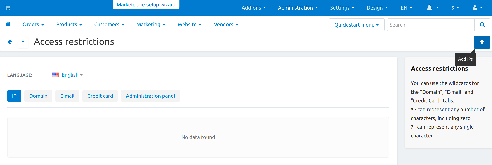

*********************************************************************
How To: Restrict Access to Store for Customers from Certain Countries
*********************************************************************

.. hint::

    For geolocation, you can use `GeoLite2 databases created by MaxMind <https://www.maxmind.com/>`_.

#.   In the admin panel go to **Add-ons → Manage add-ons**.

#.   Enable the **Access restrictions** add-on (change its status to *Active*).

#.   Go to **Administration → Access restrictions**.

#.   On the opened page in the *IP* or *Domain* tabs add the IPs or domain names, for which you want to restrict access to your store. To do it, click the **+** button on the right and fill in the information in the opened window.

#.   Set the **Status** field to *Disable* if you want to restrict access to the store for the specified IPs or domain names.

#.   Click **Create**.

