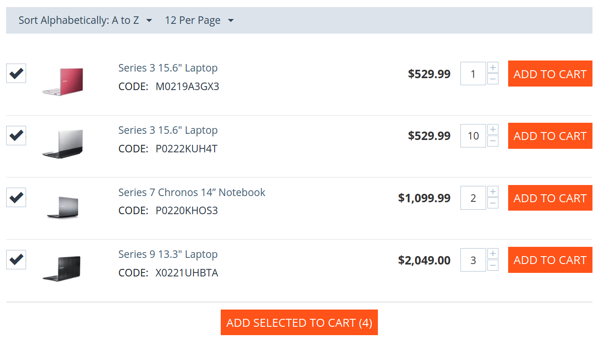

****************************
Add Products to Cart in Bulk
****************************

.. important::

    This functionality is available in our B2B products.

Businesses buy more than individuals. A single order can include a dozen of products, with a different quantity for each. An organization needs a convenient way to place large orders. This is what **Add Products to Cart in Bulk** is about.

The add-on allows you to select the desired quantities on the product list and add them to cart with one click. Since customers don't have to go to the page of each product, they will be able to place large orders faster.

.. note::

     The add-on sets the value of **Product list default view** in **Settings → Appearance** to *Compact list*. It is best suited for adding products to cart in bulk.

.. meta::
   :description: An add-on for letting customers quickly add multiple products to cart in CS-Cart B2B ecommerce platform.
