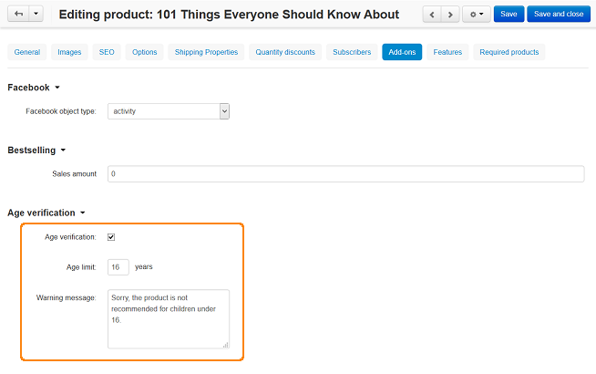

**************************************
How To: Set up Age Verification Add-on
**************************************

The **Age verification** add-on allows the administrator to limit the access to the categories and products by customer's age.

To set up the add-on:

*   In the Administration panel, go to **Add-ons → Manage add-ons**.
*   Find the **Age verification** add-on and click **Install**.

If you have it installed, change its status to *Active*.

Now you can specify age access for particular products or categories:

*   Go to **Products → Products** or **Products → Categories**.
*   Click on the product or category for which you want to define the age access. Open the **Add-ons** tab.
*   Fill in the following fields in the **Age verification** section:

    *   **Age verification** — tick the check box to enable the add-on.
    *   **Age limit** — specify the age after which a customer can see the category (product).
    *   **Warning message** — type the text that a customer will see if his or her age is less than the limit.

*   Click the **Save** button.

Now if a customer tries to open this category (product), he or she will need to verify his/her age first.

.. note ::

	Also the **Birthday** field is added to the customer profile. If a customer is logged in, his/her age will be automatically read from his/her profile.