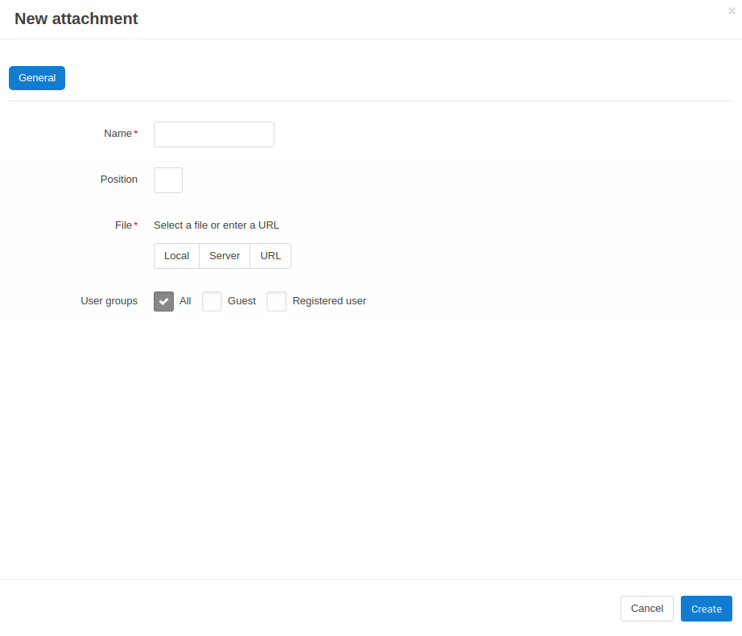

********************************
How To: Attach Files to Products
********************************

To set up the **Attachments** add-on:

*   In the Administration panel, go to **Add-ons → Manage add-ons**.
*   Find the **Attachments** add-on and make sure that its status is *Active*.

To attach a file to a product:

*   Go to **Products → Products**.
*   Click on the name of the product for which you want to attach a file.
*   Switch to the **Attachments** tab and click the **Add attachment** button.
*   In the opened window in the **Name** input field type the name of the attached file.
*	In the **File** option choose the way to upload a file: *Local* - from the local computer; *Server* -  from the server file system. You can also specify *URL* to a remote location, where the required file is physically located.
*   You can also choose **User groups**, who will see the attached file.
*   Click **Create**.

.. note ::

	A customer will be able to download this file in the **Attachments** tab on the product details page in the storefront.

