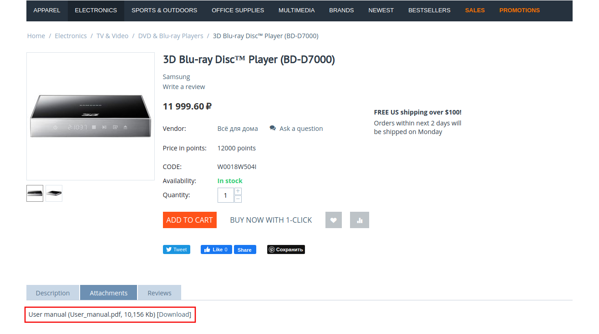

***********
Attachments
***********

The **Attachments** add-on allows you to attach files to regular products in your catalog. Attach any files that may be useful to your customers, for example, diagrams or user manuals. Customers can download those files from the **Attachments** tab on the product page.

Related Articles
================

* :doc:`/user_guide/addons/attachments/attach_files`

* :doc:`/user_guide/addons/attachments/file_not_uploaded`

.. toctree::
    :hidden:

    attach_files
    file_not_uploaded
    
   
