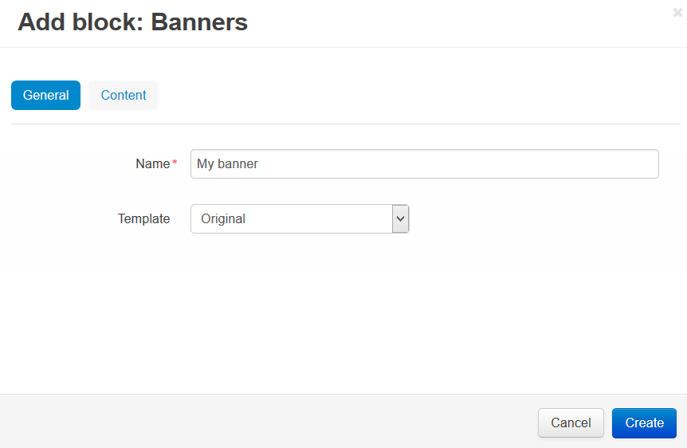
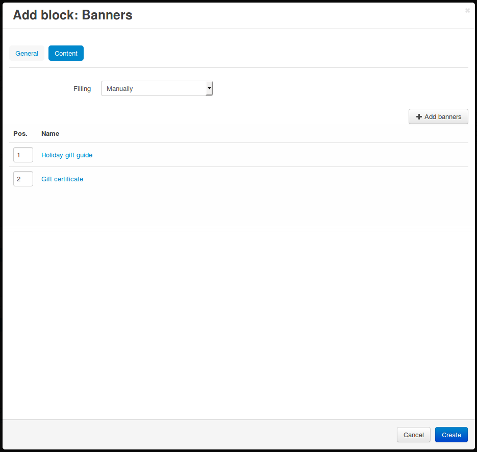

**************************************
How To: Add a Banner to the Storefront
**************************************

=======================
Step 1. Create a Banner
=======================

1.1. In the Administration panel, go to **Marketing → Banners**.

.. note::

    If there is no such section, go to **Add-ons → Manage add-ons** and make sure that the **Banners management** add-on is installed and has the *Active* status.

1.2. Click the **+** button on the right. This will open the banner creation page.

1.3. Type the name of the new banner in the **Name** input field.

1.4. Select the **Type** of the banner:

     * If you choose a *Text banner*, type the text of that banner in the **Description** field.

     * If you choose a *Graphic banner*, upload an image and specify the URL of the page to which the banner will lead. You can also choose whether or not to display that page in a new window.

1.5. Click **Create**.

.. image:: img/add_banner_01.png
    :align: center
    :alt: Creating a graphic banner in CS-Cart.

=================================================
Step 2. Add the Banner to the Pages of Your Store
=================================================

2.1. Go to **Design → Layouts**.

2.2. Choose a :doc:`layout page </user_guide/look_and_feel/layouts/layout_pages/index>` for your banner by switching to the corresponding tab. For example, to add the banner to the cart page, switch to the **Cart** tab.

2.3. Find the container where you want to place the new banner, then click the **+** button of that container and choose **Add block**. 

2.4. The block creation page will open. Switch to the **Create New Block** tab and choose **Banners**.

2.5. Enter the name of the block the **Name** input field (for example, *My banner*).

2.6. Switch to the **Content** tab, set **Filling** to *Manually*, and click the **Add banners** button to choose the banners that will be displayed in this block.

.. hint::

    If you have many banners, and your version of CS-Cart or Multi-Vendor is 4.7.1 or newer, you'll be able to use the built-in search to find the banners you need.

2.7. Once you have added all the banners you need, you can change the positions of banners (the order in which they appear). This functionality first appeared in CS-Cart and Multi-Vendor 4.7.1. 

2.8. Click **Create** to add the block with the banners to the store.

.. important::

    After the block is created or changed, make sure it is displayed correctly on the storefront. Not all wrappers are suitable for the blocks.
