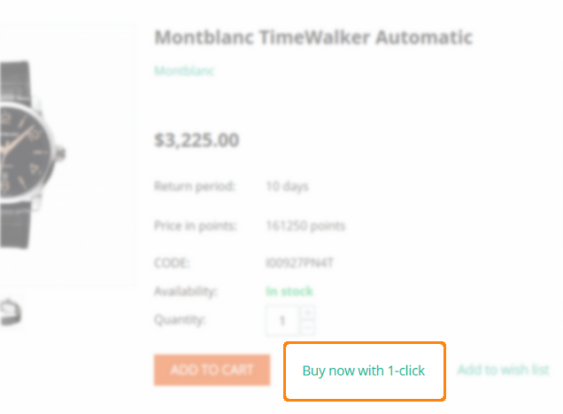

*************
Call Requests
*************

This add-on adds a **Buy now with 1-click** button on a product details page in the storefront. When a customer clicks the button, a popup window with a short contact form appears. As a store admin, you will see the list of call requests in the `Orders → Call requests <http://docs.cs-cart.com/4.3.x/user_guide/orders/call_requests/index.html>`_ section of the administration panel with detailed information about each request.

Also, you can add the **Call requests** block to the storefront in the **Design → Layouts** section. When clicking the **Request call** link on the storefront, customers will also see a form where they can type their name, phone, and a period of time convenient for a call.

Products added to a customer's cart will be mentioned in the created call request in the **Orders → Call requests** section.

.. image:: img/call_request_02.png
	:align: center
	:alt: Request a call

Settings
********

To manage these settings, go to the **Add-ons → Manage add-ons** section and click on the name of the **Call requests** add-on.

*	**Phone from settings** - Phone number defined in the **Company phone** field in **Settings → Company**.
*	**Rewrite phone** - Replace the **Phone from settings** number with the one given in this field.
*	**Highlight first chars** - Number of symbols in the phone number to be highlighted as country code, area code, or phone prefix.
*	**Phone mask** - Leave empty to use automatic country-based phone pattern, or type in a custom pattern. You can use spaces, commas, +, -, and digits. Note that 9 represents any digit; if you need a 9, type \\9.

.. note ::

	**Examples:** +9 (999) 999 99 99, 99999999, 999 999 99, or +99-99-9999-9999.

*	**Enable the "Buy now with one click" option** - If selected, a **Buy now with 1-click** button will be displayed on a product details page in the storefront.
*	**Order status** - Status of the newly created order, when a customer sends a call request.