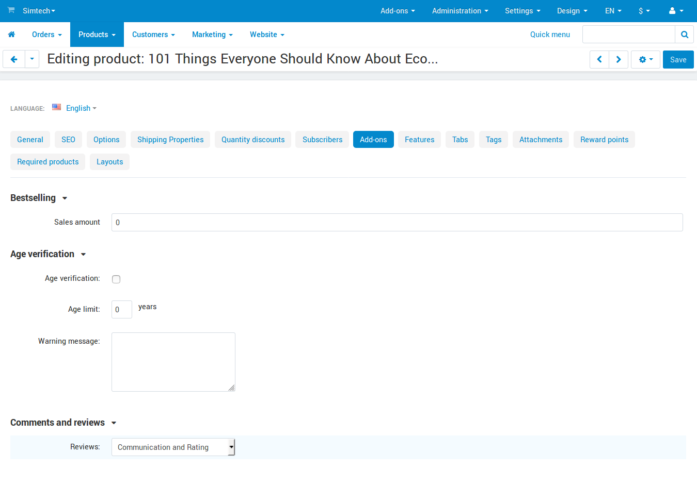
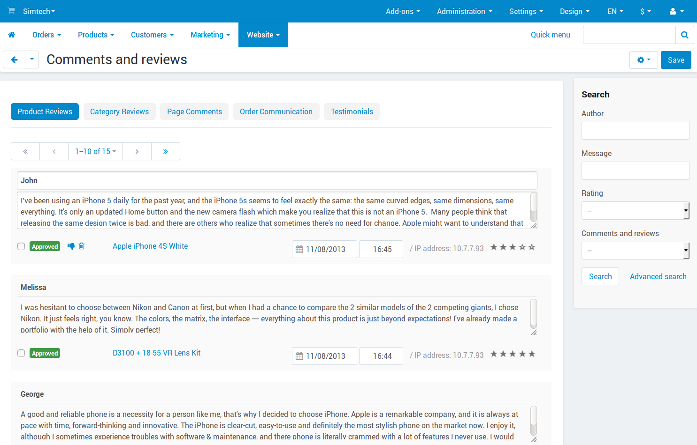

**********************************************
How To: Enable the Comments and Reviews Add-on
**********************************************

To allow a customer to write comments:

*   In the Administration panel, go to **Add-ons → Manage add-ons**. 
*   Make sure that the **Comments and reviews** add-on has an *Active* status.
*   Go to **Products → Products** or **Products → Categories** and click on the name of the product or category, for which you want to allow comments.
*   Go to the **Add-ons** tab.

.. note ::

	You are able to allow comments for products, categories, orders, blog, pages, and testimonials.

*   In the **Comments and reviews** section in the **Reviews** drop-down menu choose the type of reviews: *Communication and rating*, *Communication* or *Rating*.

To view and manage comments:

*   Go to **Website → Comments and reviews**.
*   Open the tab with comments or reviews that you want to read.
*   If necessary, edit comments and click **Save**.

