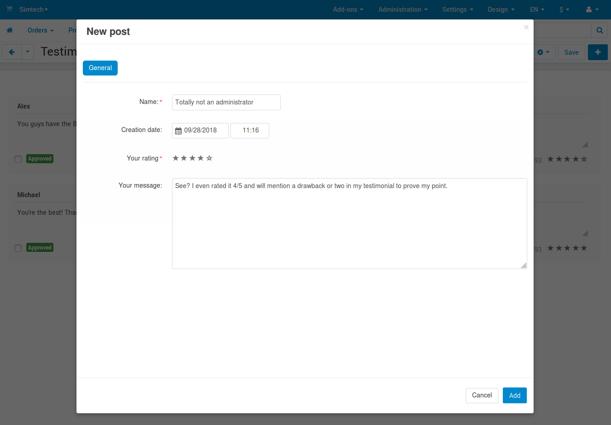
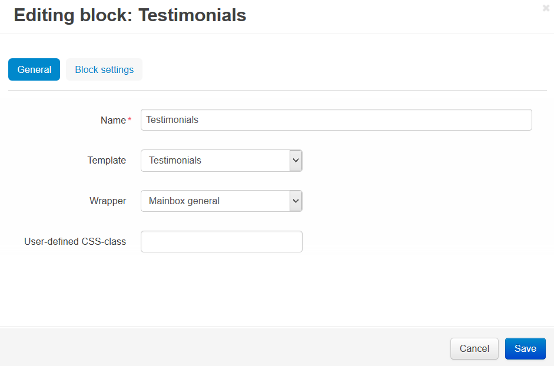

************************************
How To: Create and Edit Testimonials
************************************

To set up testimonials:

*   In the Administration panel, go to **Add-ons → Manage add-ons**.
*   Click on the name of the **Comments and reviews** add-on and open the **Testimonials** tab.
*	Configure the :doc:`settings <../comments_and_reviews/comments_settings>`.
*   Click **Save**.

.. image:: img/testimonials_01.png
	:align: center
	:alt: Comments and reviews

To create testimonials:

*   Go to **Website → Testimonials**.
*   Click the **+** button.
*   In the **Name** input field type the name of the user to whom the testimonial belongs, in the **Your rating** option select the desired value, in the **Your message** text field type the testimonial.
*   Click the **Add** button.

To edit testimonials:

*	Go to **Website → Testimonials**.
*   Edit the desired testimonials and click **Save**.

To display a block with testimonials on the storefront:

*   Go to **Design → Layouts**.
*   Select the page where testimonials will be displayed by clicking on the corresponding tab at the top. For example, click **Homepage** at the top to show a block on the homepage.
*   In the container where you want to display testimonials, click the **+** button and choose **Add block**. Open the **Create New Block** tab and choose **Testimonials**.
*   In the opened window specify the name of the block (e.g. *Testimonials*), select **Testimonials** in the **Template** select box, and click the **Create** button.
*   Click on the gear icon of the created block and select:

    *   Select the desired wrapper in the **Wrapper** select box.
    *   Specify the desired css-class in the **User-defined CSS-class** input field, if needed.

*   Open the **Block settings** tab and manage `settings <http://docs.cs-cart.com/4.4.x/user_guide/look_and_feel/layouts/blocks/block_settings.html>`_ if needed.
*   Click the **Save** button.

.. note ::

	After the block is created or changed, make sure it is displayed correctly. Sometimes not all wrappers are suitable for the blocks.
