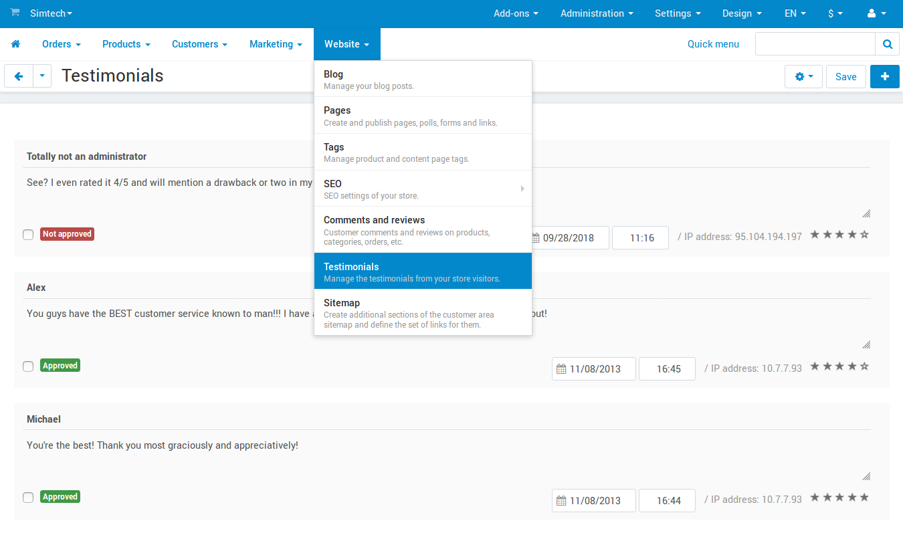

************************************
How To: Create and Edit Testimonials
************************************

=================================
Enable Testimonials in Your Store
=================================

Before you can work with testimonials, you'll need to enable them in your store.

#. In the Administration panel, go to **Add-ons → Manage add-ons**.

#. Click on the name of the **Comments and reviews** add-on and open the **Testimonials** tab.

#. Configure the :doc:`settings </user_guide/addons/comments_and_reviews/comments_settings>`.

#. Click **Save**.

   .. image:: img/testimonials_01.png
       :align: center
       :alt: Comments and reviews

===================
Manage Testimonials
===================

Go to **Website → Testimonials**. Here you'll be able to view, edit, hide, or delete the existing testimonials left by yourself or your customers. After you edit the testimonials, click **Save**.

If you'd like to add a testimonial, click the **+** button. A window will open, where you'll be able to configure the testimonial. Once you are done, click the **Add** button, and your new testimonial will appear on the list.

.. image:: img/testimonials_02.png
    :align: center
    :alt: Adding testimonials in CS-Cart

===================================================
Display a Block with Testimonials on the Storefront
===================================================

If you want your customers to see or give testimonials, you'll need to :doc:`add a new block to the storefront </user_guide/look_and_feel/layouts/blocks/actions_on_blocks>` (for example, to the homepage). Choose the block that is called **Testimonials**.

.. note::

    Once you have added the block, you can click its gear icon to see more settings. Whenever you add a block or change its settings, it's always a good idea to check how the block looks on the storefront.

.. image:: img/testimonials_03.png
    :align: center
    :alt: Block with testimonials
