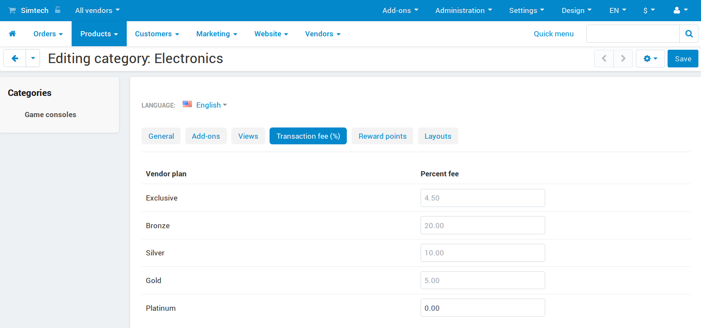
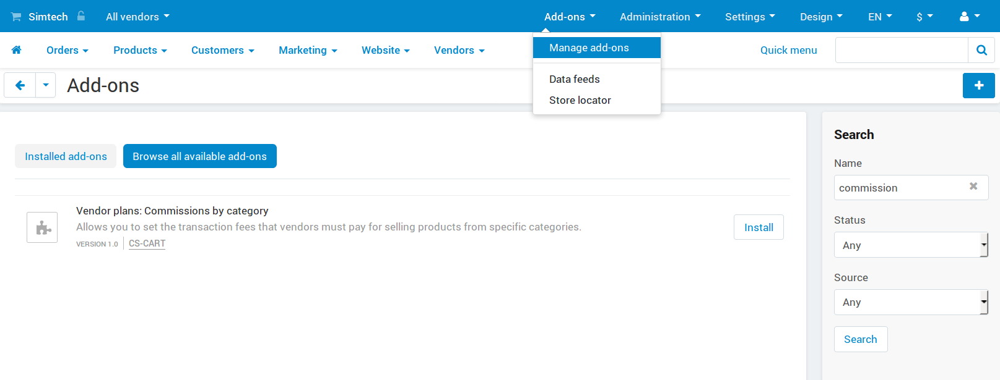

*************************************
Vendor Plans: Commissions by Category
*************************************

.. note::

    This add-on first appeared in Multi-Vendor 4.9.1. It is available only in Multi-Vendor Plus.

=============
Functionality
=============

The commissions set by the :doc:`/user_guide/addons/vendor_plans/index` add-on apply to all products, regardless of their category. If you'd like to set different commissions for selling products from particular categories, use the **Vendor plans: Commissions by category** add-on.

Here's how it works:

#. By default, every category has the same commissions as a vendor plan.

#. Any commission you specify for a category will override the commission from the :doc:`vendor plan settings </user_guide/users/vendors/manage_vendor_plans>`, but only for that particular category and plan.

   .. important::

       A child category will inherit commissions from its parent category, unless you manually set the commission for the child category.

#. The commission for each product is determined by its primary category. You'll find the primary category on the product editing page: it is the first category in the list and is highlighted in bold.

#. Before calculating commission for an order, Multi-Vendor calculates how much each of the products in the order contributes to the sum based on which the commission will be calculated. That way we can address the situations when shipping cost is included in vendor commission, or when there is a discount that affects order total.

   For example, we have an order for Product 1 ($100) and Product 2 ($300), but there's a discount of $300 for the entire order. The subtotal is now $100. Product 1 makes up 25% of the original sum, and and Product 2 makes up 75%. That's why the commission calculation for Product 1 will be based on $25, and Product 2 will have its commission calculated based on $75.

   .. note::

       This doesn't affect absolute commissions; they are applied to orders after the commissions for the categories have been calculated.

============
Installation
============

The **Vendor plans: Commissions by category** add-on is installed :doc:`like any other add-on </user_guide/addons/1manage_addons>`. Please note that you'll only be able to install this add-on if you have Multi-Vendor Plus. Otherwise you'll be asked to upgrade your license.

