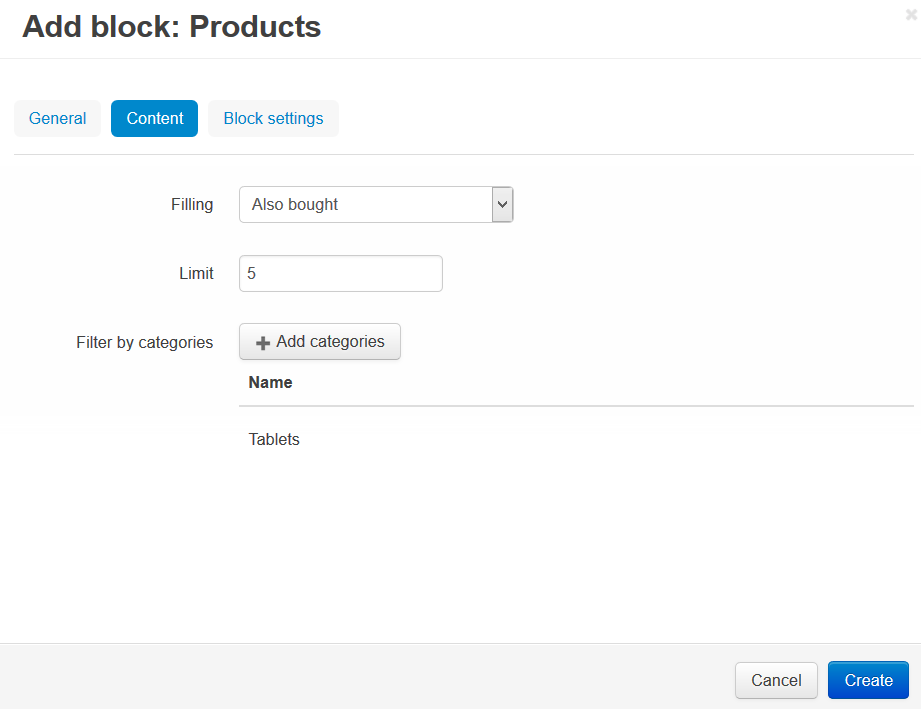
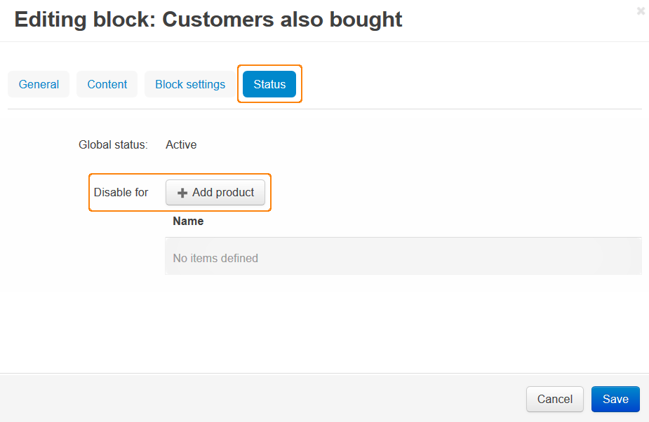

************************************
How To: Display Also Bought Products
************************************

.. note ::

    Make sure, that the **Customers also bought** add-on is installed and activated in the **Add-ons → Manage add-ons** section.

To display products which were also bought on the product details page:

*   In the Administration panel, go to **Design → Layouts → Products**.
*   In the container where you want to display *also bought* products, click the **+** button and choose **Add block**. In the opened window:

    *   Open the **Create New Block** tab and choose **Products**.
    *   In the **Name** input field type the name of the new block (e.g., *Customers also bought*).
    *   Open the **Content** tab and in the **Filling** select box select *Also bought*. Define the **Limit** — how many *also bought* products will be displayed on a page. If necessary, specify the **Filter by category** option.
    *   Click **Create**.

To disable this section for some product pages:

*   Go to **Design → Layouts → Products**.
*   Click on the **gear** icon on the created block (e.g., *Customers also bought*).
*   Open the **Status** tab, in the **Disable for** section click the **Add Product** button, and select products for which you want to disable *also bought* products.
*   Click **Save**.

