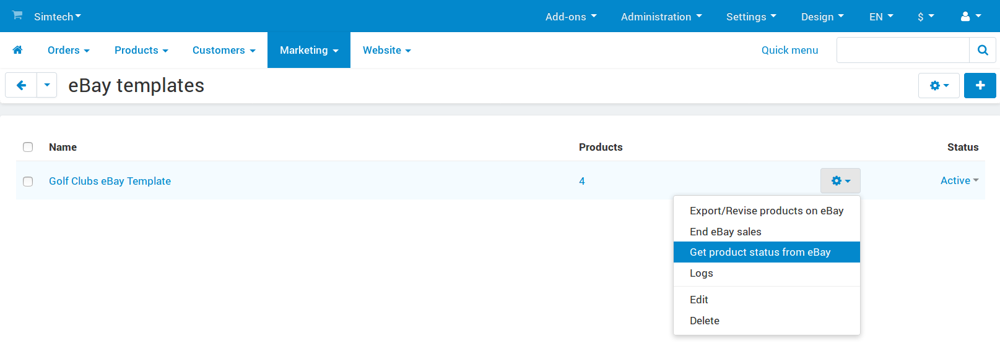
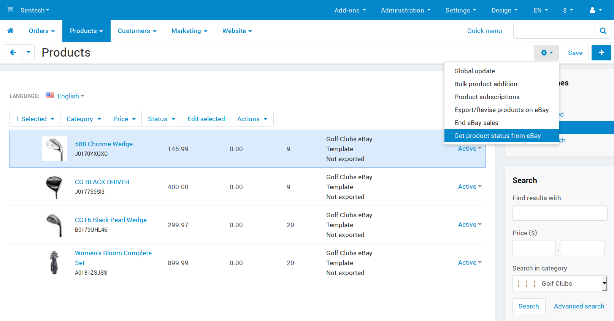

************************************
How To: Get Product Status from eBay
************************************

.. note::

    **Tutorial Difficulty: 1 / 3**

When the status of a product changes on eBay, it won't change in CS-Cart automatically. However, you can retrieve the product statuses from eBay for specific products or eBay templates.

.. important::

    **If you used the eBay Synchronization add-on** and then upgraded to CS-Cart 4.3.5 or installed the upgrade package with the new version of the add-on, **retrieve the statuses of your products for all your eBay templates** before you continue to use the add-on.

===========================================
Getting Product Status for an eBay Template
===========================================

1. Go to **Marketing → eBay → eBay templates**

2. Hover over an eBay template

3. Click the **gear button**

4. Select **Get product status from eBay**

==============================================
Getting Product Statuses for Specific Products
==============================================

1. Go to **Products → Products** or **Marketing → eBay → Products**

2. Tick the checkboxes near the products that need statu

3. Click the **gear button**

4. Select **Get product status from eBay**

