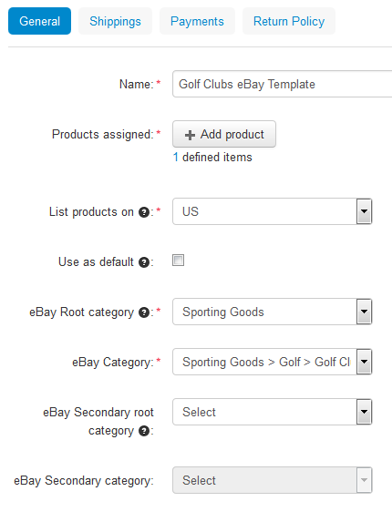
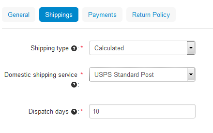
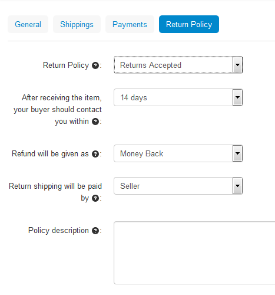

*****************************
How To: Create eBay Templates
*****************************

.. note::

    **Tutorial Difficulty: 1 / 3**

To export your products to eBay, you’ll need an eBay template. These templates serve to group your products by specific parameters such as shipping and payment methods, categories, etc.

To create and configure a template, complete the following steps: 

1. Open your store’s Administration panel and go to **Marketing → eBay → eBay templates** (or **Marketing → eBay templates** for the versions older than CS-Cart 4.3.5)

2. Click the **+ button**

.. hint::

   When you create a template, make sure to fill in the mandatory fields marked with *****.

3. Fill in the fields in the **General** tab:

*   Name your template

*   Use the **Add Products** button and select the products from your store that you want to apply this template to

.. important::

     The **Add Products** button is available since **CS-Cart 4.3.5** or in the eBay Synchronization add-on upgrade package for **CS-Cart 4.3.4**. If you use an older version, apply your eBay templates under **Products → Products**.

*   Choose your region

.. important::

     Before **CS-Cart 4.3.5** the region of the eBay template had to match the **Default site** setting of the eBay synchronization add-on. The **Default site** setting was removed in the new version of the add-on. 

If you change the eBay region in the template's setting, make sure to change the company address, primary currency, and weight unit in your store to meet the requirements of the selected eBay region.

*   Tick the **Use as default** checkbox if you want your to assign this eBay template to products with no other template selected

.. note::

     If you set several templates as default, the latest template you set as default will be applied to products.

*   Specify the **eBay category** and **Root Category**; there is also an option to `specify two eBay categories <http://pages.ebay.com/help/sell/two-categories.html>`_.

4. Configure your shipping settings on the **Shippings** tab:

*   Choose the **Shipping type**:

 *   **Calculated**—calculated shipping fee according to customer’s ZIP address, the weight of the package, and the type of shipping services you offer

 *   **Flat**—use a fixed shipping rate

*   Select your **domestic shipping service** from the drop-down menu.

    .. important::

        The value of the **International shipping service** setting isn't exported to eBay. Please specify international shipping service directly on eBay.

*   Specify the time it will take to deliver a product to customer in the **Dispatch days** field

5. Choose the eBay payment methods on the **Payments** tab:

.. image:: img/templates/payments.png
    :align: center
    :alt: Select the payment method, condition of your products and listing duration on the Payments tab.

*   Select the **payment method** you want to use on eBay

.. important::

     If you choose PayPal as your payment method, enter the email of your PayPal account.

*   Choose the **condition of the products** you intend to sell on eBay

*   Select **listing duration** (GTC means Good ‘Til Cancelled)

6. Specify your return policy on the **Return Policy** tab:

*   Choose whether you **accept returns or not**

*   Specify within what time period a buyer should contact you after receiving the item

*   Select the preferred **way of refund**

*   Choose who should pay for the return shipping

*   Describe your return policy

7. Click **Create** to save your changes

