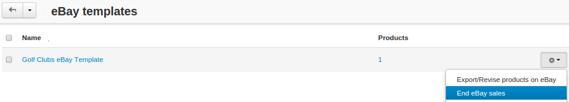
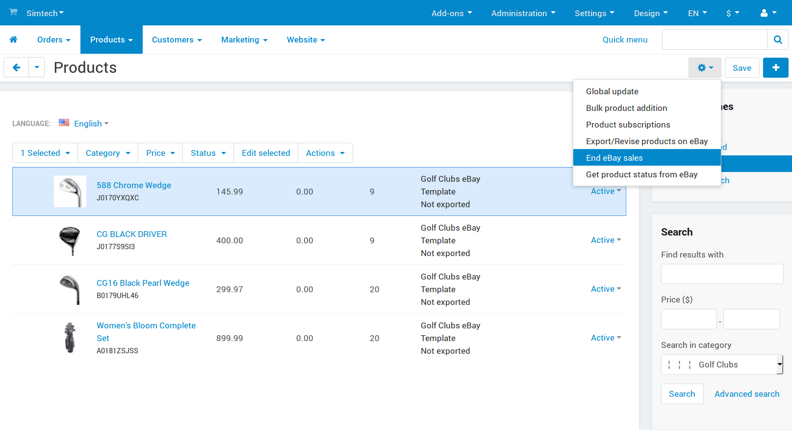

**********************
How To: End eBay Sales
**********************

.. note::

    **Tutorial Difficulty: 1 / 3**

.. important::

    This option appeared **since CS-Cart 4.3.5**. It is also available in the eBay Synchronization add-on upgrade package for **CS-Cart 4.3.4**.

.. warning::

   If you want to resume selling a product or several products after you end their eBay sales, you'll have to `relist them <http://pages.ebay.com/help/sell/relist.html>`_.

======================================
Ending eBay Sales for an eBay Template
======================================

1. Go to **Marketing → eBay templates → Manage**

2. Press the **gear button** next to the template

3. Choose **End eBay sales**

=======================================
Ending eBay Sales for Specific Products
=======================================

1. Go to **Marketing → eBay → eBay products**

2. Tick the checkboxes next to the products you want to edit

3. Click the **gear button**

4. Choose **End eBay sales**

===================
Resuming eBay Sales
===================

To resume the eBay sales after you ended them, :doc:`revise the desired eBay templates or particular products on eBay <export_to_ebay>`. This resets the listing duration of the products.

.. important::

    Using the **Export/Revise products on eBay** button for the products or templates after you ended their eBay sales will `relist those products/templates <http://pages.ebay.com/help/sell/relist.html>`_.
    
