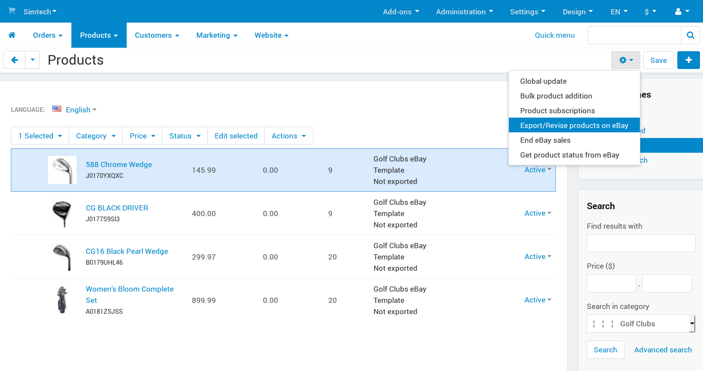
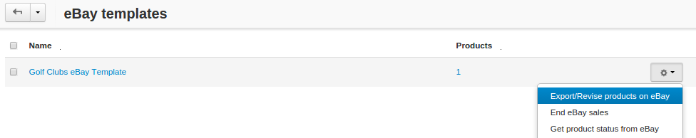
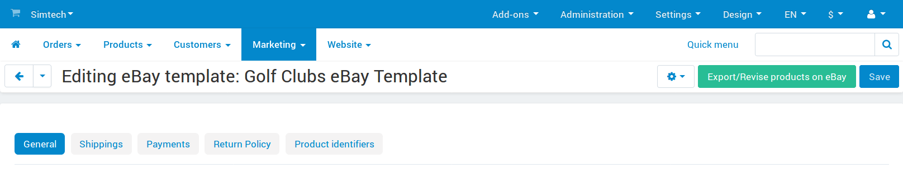
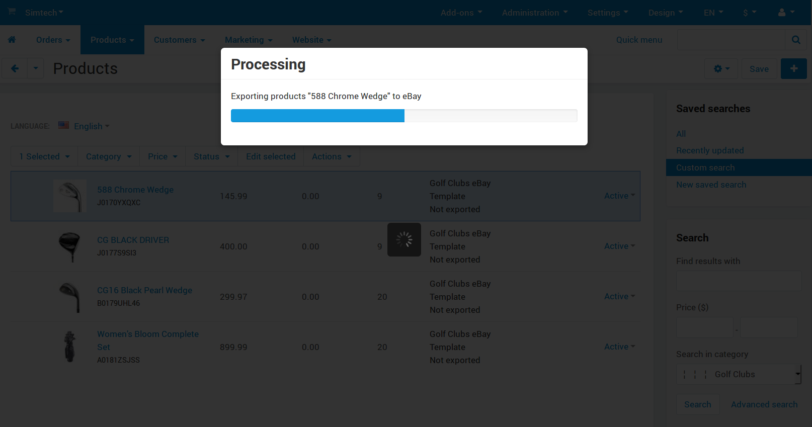
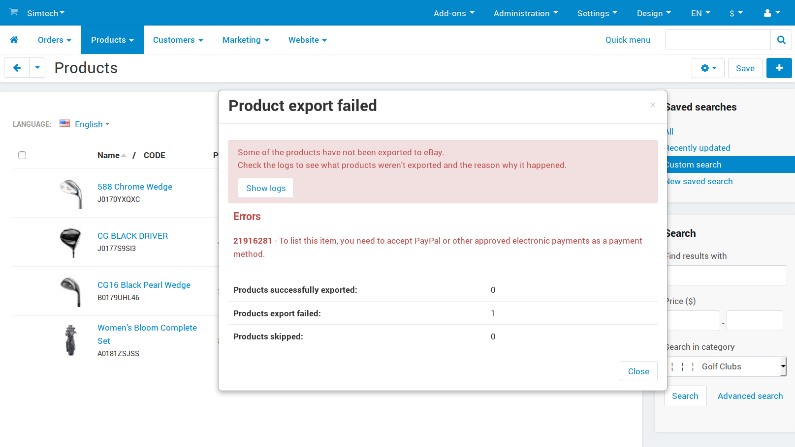
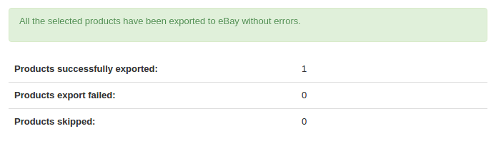
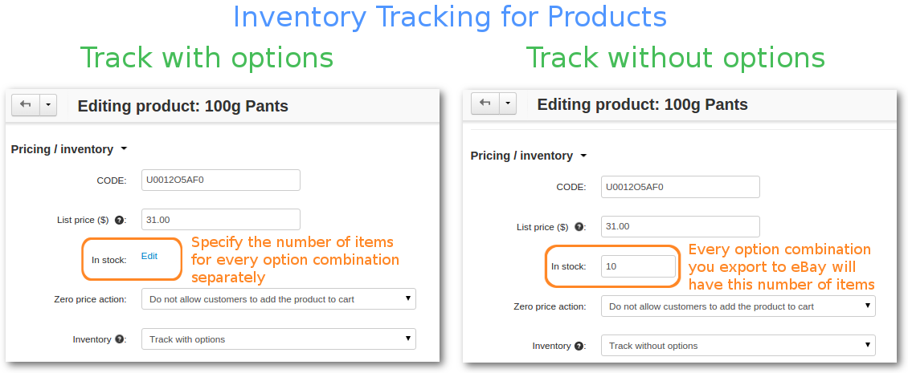

**************************************
How To: Export/Revise Products on eBay
**************************************

Once you :doc:`create an eBay template <ebay_templates>` and :doc:`specify product settings <ebay_products>`, you can export your products to eBay.

If you export your products to eBay and later edit them in CS-Cart, those changes won't show up on eBay until you revise those products. The procedure for exporting and revising products is the same.

.. important::

    If you :doc:`ended the eBay sales <end_ebay_sales>` of some products or templates, using the **Export/Revise products on eBay** button for those products/templates will `relist them <http://pages.ebay.com/help/sell/relist.html>`_.

===============================================
Way 1. Exporting and Revising Specific Products
===============================================

1. In the Administration panel go to **Products → Products**.

2. Tick the checkboxes near the products you want to export or revise.

3. Click the gear button and choose **Export/Revise products on eBay**.

.. hint::

    You can find the products with an assigned eBay template under **Marketing → eBay → eBay products**.

.. note::

    If you didn’t apply an eBay template to some of the selected products, default eBay template will be used.

===================================================
Way 2. Exporting and Revising Entire eBay Templates
===================================================

1. In the administration panel go to **Marketing → eBay → eBay templates**.

2. Hover over the eBay template you want to export.

3. Click the **gear button** and select **Export/Revise products on eBay**.

Or you can click on the eBay template itself to edit it, and then press the green **Export/Revise products on eBay** button.

=====================
Export Outcome Pop-Up
=====================

When you click **Export/Revise products on eBay**, you’ll see a progress bar running.

It shouldn’t be long before you see a pop-up window with export results. If something goes wrong during the export, you’ll see it in the window.

For example, in this case we didn’t specify the **package weight** on the product’s **Shipping Properties** tab. 

To reach the product that caused the problem fast, press the **Show logs** button. The logs include the links to products that caused errors.

Once all the errors are fixed, you can export the product again. This time the export procedure should be successful, and the pop-up window will look like this:

===============================
Exporting Products With Options
===============================

To export a product with options, you must group these options under **Option Combinations**. 

.. important::

    Option combinations are treated as `listing variations <http://pages.ebay.com/help/sell/listing-variations.html>`_ by eBay. Please keep in mind that eBay allows listing variations only in specific categories. 

To create an option combination for a product, do this: 

1. Go to to **Products → Products → <Desired Product>**.

2. Switch to the **Options** tab and choose an option.

3. Tick the **Inventory** checkbox and save the changes.

4. Click the **Option combinations** button and click the **+** button to create a combination.

.. important::

      eBay allows no more than 200 product combinations.

When you export a product with to eBay, all the option combinations of the product are exported, except for those combinations that aren't in stock. Here are the possible situations, depending on the **Inventory** setting of the product:

* **Track with options:** the number of items is tracked for every specific option combination. Those numbers are exported to eBay. If a combination doesn't have a number of items specified, it is considered out of stock. That combination won't appear on eBay.

* **Track without options:** for eBay export purposes it is assumed that you have the same number of items for every single option combination. During the export the number is taken from the product's **In stock** field.

  .. hint::

      For example, if you have red and blue T-shirts as option combinations and specify *10* in the **In stock** field, you'll have 20 T-shirts (10 red ones and 10 blue ones) listed on eBay.

* **Do not track:** works the same way as **Track without options**.

