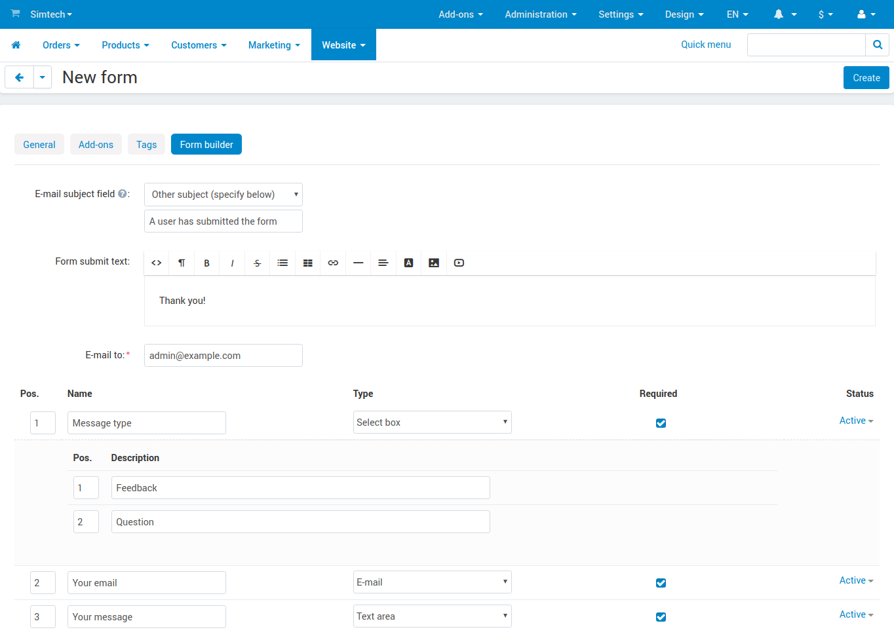
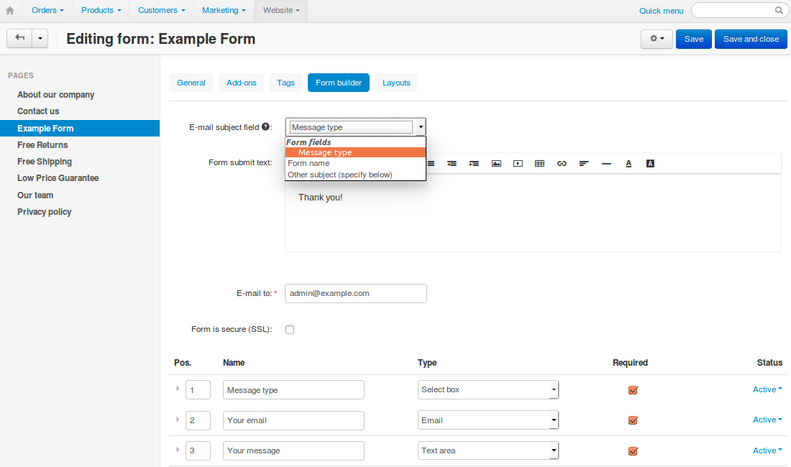

****************************
How To: Create a Custom Form
****************************

========================================
Step 1. Activate the Form Builder Add-on
========================================

1.1. In the Administration panel, go to **Add-ons → Manage add-ons**.

1.2. Make sure the **Form Builder** add-on has an *Active* status.

=====================
Step 2. Create a Form
=====================

2.1. Go to **Website → Pages**.

2.2. Click the **+** button and choose **Add form**.

2.3. Configure the form settings on the **General** tab:

     * **Parent page**—choose the parent page for the form.

     * **Name**—enter the name of the form (e.g., *Contact us*).

     * Speсify other fields, if necessary.

.. image:: img/form_builder_01.png
	:align: center
	:alt: Enter the name of the form and select the parent page on the general tab.

2.4. Configure the settings on the **Form builder** tab:

     * **Email subject field**—a completed form is sent to a specific email address. Here you can specify the subject of the email:

       * **Form name**—the name of the form will serve as the email subject.

       * **Other subject**—a text field will appear below, and you'll be able to enter the subject manually.

     * **Form submit text**—enter the text that customers will see after submitting the form.

     * **E-mail to**—enter the e-mail address where the notifications will be sent to.

     * Add fields to your form. There are **standard fields** (*select box*, *text area*, *radio group*, etc.) and **special fields** (*date*, *e-mail*, *number*, *phone*, etc.).

.. hint::

   You can allow users to attach files to the form—create a field and set its **Type** to *File*.
	
2.5. Click **Create**.

==========================================
Step 3. Set a Form Field as Email Subject
==========================================

.. note::

    This is an optional step available since version 4.3.7.

When you edit a form that already exists, you can select one of the existing fields as **Email subject field**. This field must have one of the following types:

* Input field

* Select box

.. hint::

    Remember to click **Save** once you've changed the form as you like.

