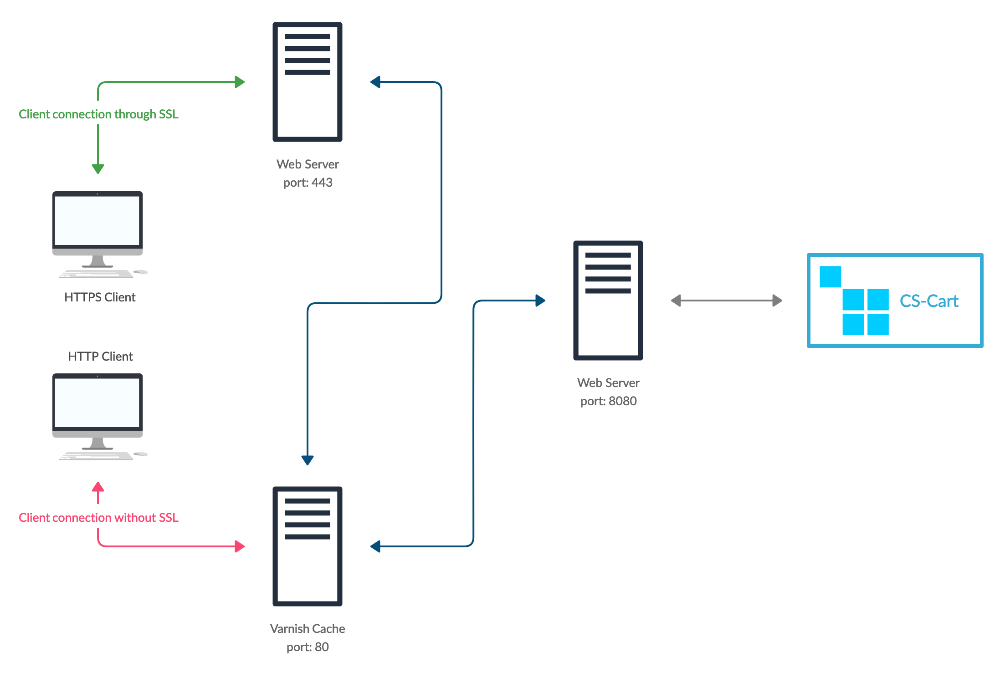

************************************************
How To: Set Up Full-Page Caching in Multi-Vendor
************************************************

.. important::

    This add-on doesn't come with CS-Cart and Multi-Vendor by default. You can `buy it separately in our Marketplace <https://marketplace.cs-cart.com/add-ons/integrations/marketplace-performance-booster.html>`_.

The Marketplace Performance Booster add-on works in combination with `Varnish Cache <https://varnish-cache.org/>`_—free software that serves as caching reverse proxy. Learn more about Varnish here:

* `Wikipedia <https://en.wikipedia.org/wiki/Varnish_%28software%29>`_

* `The Big Varnish Picture <https://varnish-cache.org/docs/trunk/users-guide/intro.html>`_

* `Varnish Startup Options <https://varnish-cache.org/docs/trunk/reference/varnishd.html#ref-varnishd-options>`_

* `Varnish and Website Performance <https://varnish-cache.org/docs/trunk/users-guide/performance.html#users-performance>`_

.. contents::
    :backlinks: none
    :local:

.. important::

    Configuring Varnish Cache requires experience and involves a lot of steps. It's best to leave it to a server administrator. That's why this article provides links rather than step-by-step instructions.

=======================
Step 1. Install Varnish
=======================

The add-on supports Varnish 4.1 and newer versions, such as 6.2. To install Varnish, refer to the following articles:

* `Official Varnish Documentation <https://varnish-cache.org/docs/trunk/installation/install.html>`_

* `Put Varnish on Port 80 <https://varnish-cache.org/docs/trunk/tutorial/putting_varnish_on_port_80.html>`_

* `Install Varnish 4.1 on Ubuntu <https://www.varnish-software.com/wiki/content/tutorials/varnish/varnish_ubuntu.html>`_

* `How to Install Varnish (Tecmint) <https://www.tecmint.com/install-varnish-cache-web-accelerator/>`_

Varnish must listen to port ``80`` and process all HTTP connections.

========================================
Step 2. Configure Varnish and Web Server
========================================

---------------------------------------------
2.1. Configure Reverse Proxy Server for HTTPS
---------------------------------------------
 
Varnish `doesn't support HTTPS <https://varnish-cache.org/docs/trunk/phk/ssl_again.html>`_, so if your store uses SSL certificate, it will need a reverse proxy server to work with Varnish. Any web-server can work as a reverse proxy, but we recommend **nginx**.

The reverse proxy server must listen to port ``443`` and redirect traffic to port ``80`` of the Varnish server. Here is an example configuration for nginx::

  server {
      listen              443 ssl;
      server_name         example.com; 
      server_name         www.example.com;

      ssl_certificate     /etc/nginx/certs/example.com.crt;
      ssl_certificate_key /etc/nginx/certs/example.com.key;
    
      location / {
          proxy_set_header Host $host;
          proxy_set_header X-Real-IP $remote_addr;
          proxy_set_header X-Forwarded-For $proxy_add_x_forwarded_for;
          proxy_set_header X-Forwarded-Proto $scheme;
          proxy_pass http://127.0.0.1; 
          proxy_read_timeout 90;
      }
  }

---------------------------------
2.2. Configure Backend Web Server
---------------------------------

The job of the backend web server is to process the requests from the Varnish server. For that purpose, the backend server must listen to port ``8080``. To configure the backend web-server, use the following articles:

* `from Apache official documentation <https://httpd.apache.org/docs/current/bind.html>`_;

* `from Nginx official documentation <https://nginx.org/en/docs/http/ngx_http_core_module.html#listen>`_.

----------------------
2.3. Configure Varnish
----------------------

Now we need to teach Varnish to react properly to the responses from the backend server. To do that, modify the `default.vcl <https://varnish-cache.org/docs/trunk/tutorial/backend_servers.html>`_ file. Depending on how Varnish was installed, *default.vcl* might be located in different places:

* */etc/varnish/default.vcl*

* */usr/local/etc/varnish/default.vcl*

Replace that file with :download:`our default.vcl for Multi-Vendor <files/default.vcl>`.

If the backend server and Varnish are on different physical servers or use the ports different from those we listed above, please change the configuration accordingly:

* **Backend server address**::

    backend default {
        .host = "127.0.0.1";
        .port = "8080";
    }

  * ``host``—the IP address of the backend server in the internal network.

  * ``port``—the port that the backend server listens to.

* **Security settings**::

    acl internal {
        "127.0.0.1";
    }

  This section lists the IP addresses in the internal network that Varnish will consider safe. These IP addresses will be able to send cache invalidation requests.

  .. important::

      Cache invalidation requests are sent by a PHP script. If you process PHP on a separate server, then its IP address must be added to this list.

====================================================
Step 3. Install and Configure Full-Page Cache Add-on
====================================================

Download the add-on and :doc:`install it from the archive </user_guide/addons/1manage_addons>`.

By default, the add-on is already configured. It expects that Varnish is installed on the same server as CS-Cart or Multi-Vendor. If this isn't the case, then open the add-on's settings and specify the IP address of the Varnish server in the **Host** field.

To enable full-page caching, just activate the add-on.
 
.. note::

    During activation, the add-on will attempt to invalidate the cache. If everything works, the add-on will activate. Otherwise, you'll need to check the settings of the add-on and Varnish Cache.

.. meta::
   :description: How to configure Varnish Cache and ESI to work with Multi-Vendor marketplace platform?
